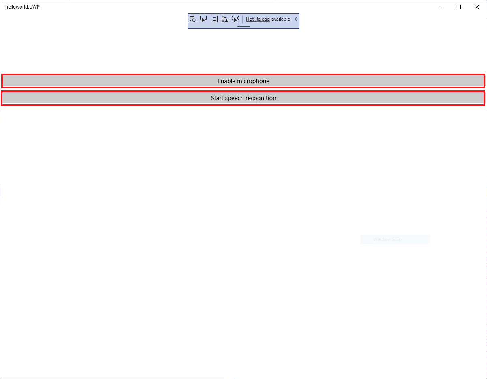
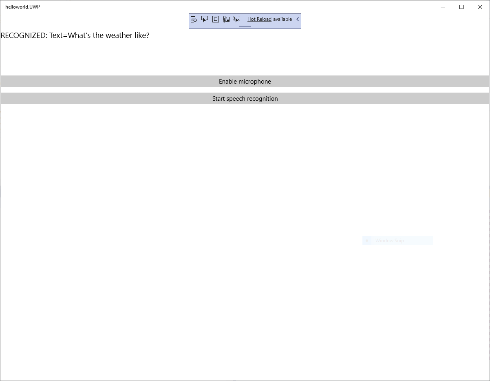

## Prerequisites

Before you get started, make sure to:

1. [Create a Speech resource and get a subscription key]().
2. [Setup your development environment](../../../quickstart-platform-csharp-unity.md). Use this quickstart to install and configure Unity.

If you've already done this, great. Let's keep going.

## Add sample code for the common `helloworld` project

The common `helloworld` project contains platform independent implementations for your cross-platform application.
Now add the XAML code that defines the user interface of the application, and add the C# code behind implementation.

1. In **Solution Explorer**, under the common `helloworld` project open `MainPage.xaml`.

1. In the designer's XAML view, insert the following XAML snippet into the **Grid** tag (between `<StackLayout>` and `</StackLayout>`):

   [!code-xml[UI elements](~/samples-cognitive-services-speech-sdk/quickstart/csharp-xamarin/helloworld/helloworld/MainPage.xaml)]

1. In **Solution Explorer**, open the code-behind source file `MainPage.xaml.cs`. (It's grouped under `MainPage.xaml`.)

1. Replace all the code in it with the following snippet:

   [!code-csharp[Quickstart Code](~/samples-cognitive-services-speech-sdk/quickstart/csharp-xamarin/helloworld/helloworld/MainPage.xaml.cs)]

1. In the source file's `OnRecognitionButtonClicked` handler, find the string `YourSubscriptionKey`, and replace it with your subscription key.

1. In the `OnRecognitionButtonClicked` handler, find the string `YourServiceRegion`, and replace it with the [region](../../../regions.md) associated with your subscription. (For example, use `westus` for the free trial subscription.)

1. Next you need to create a [Xamarin Service](https://docs.microsoft.com/xamarin/android/app-fundamentals/services/creating-a-service/), which is used to query microphone permissions from different platform projects (UWP, Android and iOS). To do that add new folder `Services` under the `helloworld` project and create new C# source file under it (Right click `Services` folder and **Add** > **New Item** > **Code File**) and rename it to `IMicrophoneService.cs` and place all code from the following snippet in that file:

[!code-csharp[Quickstart Code](~/samples-cognitive-services-speech-sdk/quickstart/csharp-xamarin/helloworld/helloworld/Services/IMicrophoneService.cs)]

#### [Android](#tab/android)
## Add sample code for the `helloworld.Android` project

Now add the C# code that defines the Android specific part of the application.

1. In **Solution Explorer**, under the `helloworld.Android` project open `MainActivity.cs`.

1. Replace all the code in it with the following snippet:

   [!code-csharp[Quickstart Code](~/samples-cognitive-services-speech-sdk/quickstart/csharp-xamarin/helloworld/helloworld.Android/MainActivity.cs)]

1. Next add Android specific implementation for `MicrophoneService` by creating new folder `Services` under the `helloworld.Android` project. After that create new C# source file under it and rename it to `MicrophoneService.cs` and copy paste following code snippet into that file.

   [!code-csharp[Quickstart Code](~/samples-cognitive-services-speech-sdk/quickstart/csharp-xamarin/helloworld/helloworld.Android/Services/MicrophoneService.cs)]

1. After that open `AndroidManifest.xml` under `Properties` folder and add the following uses-permission setting for the microphone between `<manifest>` and `</manifest>`.
```xml
   <uses-permission android:name="android.permission.RECORD_AUDIO" />
```
#### [iOS](#tab/ios)
## Add sample code for the `helloworld.iOS` project

Now add the C# code that defines the iOS specific part of the application and also create Apple device specific configurations to the helloworld.iOS project.

1. In **Solution Explorer**, under the `helloworld.iOS` project open `AppDelegate.cs`.

1. Replace all the code in it with the following snippet:

   [!code-csharp[Quickstart Code](~/samples-cognitive-services-speech-sdk/quickstart/csharp-xamarin/helloworld/helloworld.iOS/AppDelegate.cs)]

1. Next add iOS specific implementation for `MicrophoneService` by creating new folder `Services` under the `helloworld.iOS` project. After that create new C# source file under it and rename it to `MicrophoneService.cs` and copy paste following code snippet into that file.

   [!code-csharp[Quickstart Code](~/samples-cognitive-services-speech-sdk/quickstart/csharp-xamarin/helloworld/helloworld.iOS/Services/MicrophoneService.cs)]

1. Open Info.plist under the `helloworld.iOS` project to text editor and add following key value pair under the dict section
   <key>NSMicrophoneUsageDescription</key>
   <string>This sample app requires microphone access</string>
   > Note: In case you are targeting to build for iPhone device, ensure that `Bundle Identifier` matches with your device's provisioning profile app ID otherwise build will fail. With iPhoneSimulator you can leave it as is.

1. In case you are building on Windows PC, you need to establish connection to Mac device for building via **Tools** > **iOS** > **Pair to Mac**. Follow the instruction wizard provided by Visual Studio to enable connection to the Mac device.

#### [UWP](#tab/helloworlduwp)
## Add sample code for the `helloworld.UWP` project

Now add the C# code that defines the UWP specific part of the application.

1. In **Solution Explorer**, under the `helloworld.UWP` project open `MainPage.xaml.cs`.

1. Replace all the code in it with the following snippet:

   [!code-csharp[Quickstart Code](~/samples-cognitive-services-speech-sdk/quickstart/csharp-xamarin/helloworld/helloworld.UWP/MainPage.xaml.cs)]

1. Next add UWP specific implementation for `MicrophoneService` by creating new folder `Services` under the `helloworld.UWP` project. After that create new C# source file under it and rename it to `MicrophoneService.cs` and copy paste following code snippet into that file.

   [!code-csharp[Quickstart Code](~/samples-cognitive-services-speech-sdk/quickstart/csharp-xamarin/helloworld/helloworld.UWP/Services/MicrophoneService.cs)]

1. Next double click `Package.appxmanifest` file under the `helloworld.UWP` project inside Visual Studio and under **Capabilities** > **Microphone** is checked and save the file.
   > Note: In case you see warning : Certificate file does not exist: helloworld.UWP_TemporaryKey.pfx, please check [speech to text](../../../quickstart-csharp-uwp.md) sample for more information.

1. From the menu bar, choose **File** > **Save All** to save your changes.

## Build and run the UWP application

1. Set `helloworld.UWP` as start-up project and right-click using mouse on `helloworld.UWP` project and choose **Build** to build the application. 

1. Choose **Debug** > **Start Debugging** (or press **F5**) to start the application. The **helloworld** window appears.

   

1. Select **Enable Microphone**, and when the access permission request pops up, select **Yes**.

   

1. Select **Start Speech recognition**, and speak an English phrase or sentence into your device's microphone. Your speech is transmitted to the Speech Services and transcribed to text, which appears in the window.

   
* * *

## Build and run the Android and iOS applications

Building and running Android and iOS applications in the device or simulator happen in similar way than with UWP. Important is to make sure all SDKs are installed correctly required in `Prerequisites` section of this document.

## Next steps

> [!div class="nextstepaction"]
> [Explore C# samples on GitHub](https://aka.ms/csspeech/samples)
