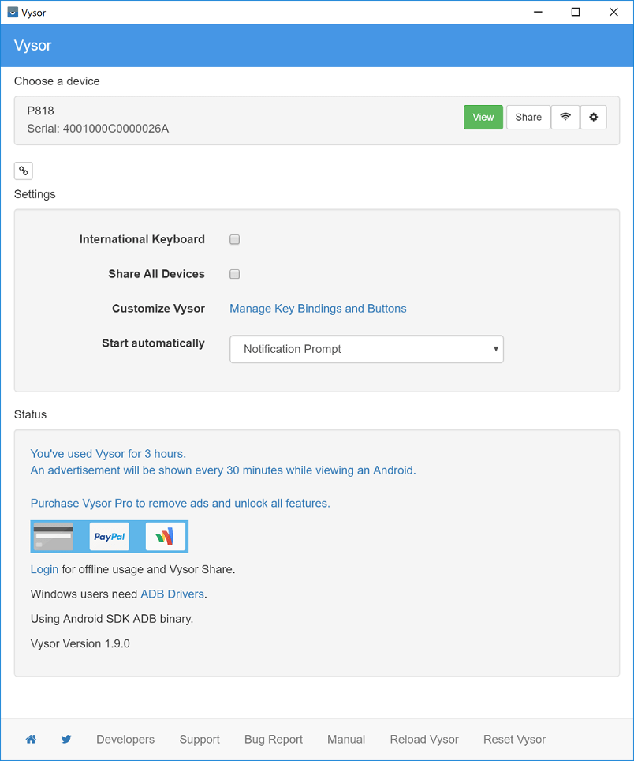
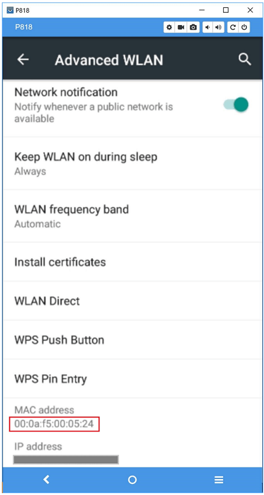
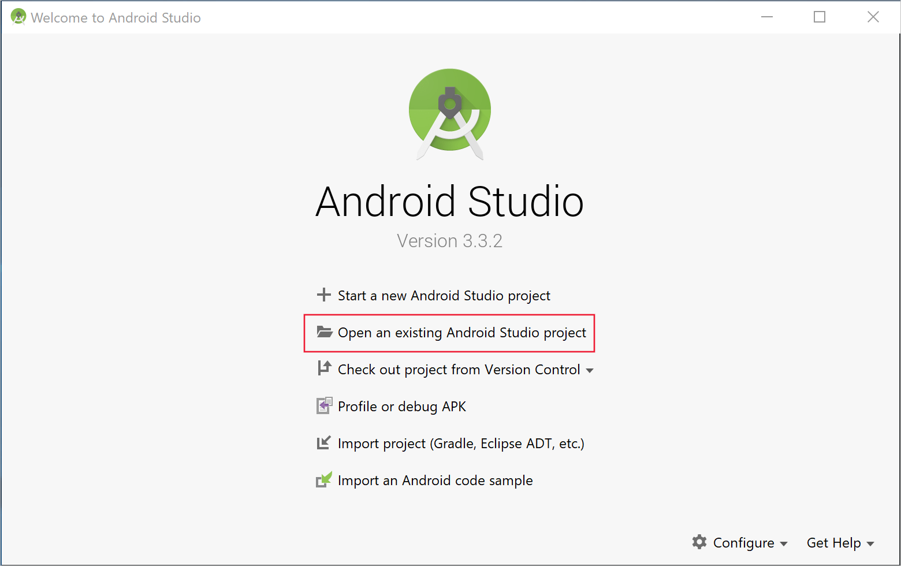
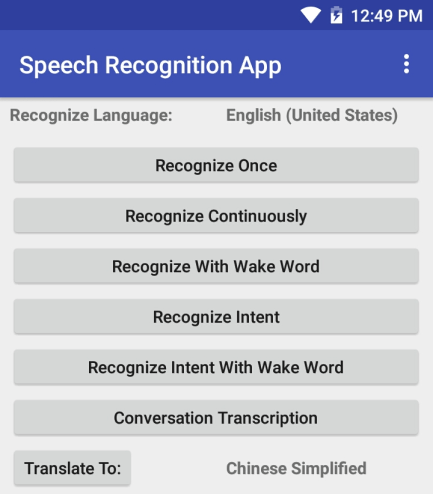

# Quickstart: Start the sample app on an Android Speech Devices SDK

This article describes how to configure your development PC and an Android Speech device development kit for developing speech-enabled devices by using the Speech Devices SDK. It shows you how to build and deploy a sample application to the device.

The source code for the sample application is included with the Speech Devices SDK. It's also [available on GitHub](https://github.com/Azure-Samples/Cognitive-Services-Speech-Devices-SDK).

## Prerequisites

Before you begin developing with the Speech Devices SDK, gather the information and software you need:

* After choosing your [development kit](get-speech-devices-sdk.md) follow the device specific instructions to power it on.

* Get the latest version of the Speech Devices SDK, which includes a sample app, from the [Speech Devices SDK download site](TBD). Extract the .zip file to a local folder, like C:\SDSDK.

* Get a [Speech Services subscription key](get-started.md). Start with a free trial or get a key from your Azure dashboard.

* If you want to use the Speech Services' intent recognition, subscribe to the [Language Understanding service](https://azure.microsoft.com/services/cognitive-services/language-understanding-intelligent-service/) (LUIS) and [get a subscription key](https://docs.microsoft.com/azure/cognitive-services/luis/azureibizasubscription).

    You can [create a simple LUIS model](https://docs.microsoft.com/azure/cognitive-services/luis/) or use the sample LUIS model, LUIS-example.json. The sample LUIS model is available from the [Speech Devices SDK download site](https://shares.datatransfer.microsoft.com/). To upload your model's JSON file to the [LUIS portal](https://www.luis.ai/home), select **Import new app**, and then select the JSON file.

* Install [Android Studio](https://developer.android.com/studio/) and [Vysor](https://vysor.io/download/) on your PC.

## Set up the device

1.	Start Vysor on your computer.

    

1.	Your device should be listed under **Choose a device**. Select the **View** button next to the device.

1.	Connect to your wireless network by selecting the folder icon, and then select **Settings** > **WLAN**.

    

    > [!NOTE]
    > If your company has policies about connecting devices to its Wi-Fi system, you need to obtain the MAC address and contact your IT department about how to connect it to your company's Wi-Fi.
    >
    > To find the MAC address of the dev kit, select the file folder icon on the desktop of the dev kit.
    >
    >  
    >
    > Select **Settings**. Search for "mac address", and then select **Mac address** > **Advanced WLAN**. Write down the MAC address that appears near the bottom of the dialog box.
    >
    > 
    >
    > Some companies might have a time limit on how long a device can be connected to their Wi-Fi system. You might need to extend the dev kit's registration with your Wi-Fi system after a specific number of days.

## Run a sample application

To validate your development kit setup, build and install the sample application:

1. Start Android Studio.

1. Select **Open an existing Android Studio project**.

   

1. Go to C:\SDSDK\Android-Sample-Release\example. Select **OK** to open the example project.

1. Add your Speech subscription key to the source code. If you want to try intent recognition, also add your [Language Understanding service](https://azure.microsoft.com/services/cognitive-services/language-understanding-intelligent-service/) subscription key and application ID.

   Your keys and application information go in the following lines in the source file MainActivity.java:

   ```java
   // Subscription
   private static final String SpeechSubscriptionKey = "[your speech key]";
   private static final String SpeechRegion = "westus";
   private static final String LuisSubscriptionKey = "[your LUIS key]";
   private static final String LuisRegion = "westus2.api.cognitive.microsoft.com";
   private static final String LuisAppId = "[your LUIS app ID]"
   ```

1. The default wake word (keyword) is "Computer". You can also try one of the other provided wake words, like "Machine" or "Assistant". The resource files for these alternate wake words are in the Speech Devices SDK, in the keyword folder. For example, C:\SDSDK\Android-Sample-Release\keyword\Computer contains the files used for the wake word "Computer".

    You can also [create a custom wake word](speech-devices-sdk-create-kws.md).

    To use a new wake word, update the following two lines of MainActivity.java, and copy the wake word package to your app. For example to use the wake word 'Machine' from the wake word package kws-machine.zip:

   * Copy the wake word package into the folder “C:\SDSDK\Android-Sample-Release\example\app\src\main\assets\”.
   * Update the MainActivity.java with the keyword and the package name: 
    
     ```java
     private static final String Keyword = "Machine";
     private static final String KeywordModel = "kws-machine.zip" // set your own keyword package name.
     ```

1. Update the following lines, which contain the microphone array geometry settings:

   ```java
   private static final String DeviceGeometry = "Circular6+1";
   private static final String SelectedGeometry = "Circular6+1";
   ```
   The following table describes the available values:

   |Variable|Meaning|Available values|
   |--------|-------|----------------|
   |`DeviceGeometry`|Physical mic configuration|For a circular dev kit: `Circular6+1` |
   |||For a linear dev kit: `Linear4`|
   |`SelectedGeometry`|Software mic configuration|For a circular dev kit that uses all mics: `Circular6+1`|
   |||For a circular dev kit that uses four mics: `Circular3+1`|
   |||For a linear dev kit that uses all mics: `Linear4`|
   |||For a linear dev kit that uses two mics: `Linear2`|


1. To build the application, on the **Run** menu, select **Run 'app'**. The **Select Deployment Target** dialog box appears.

1. Select your device, and then select **OK** to deploy the application to the device.

    

1. The Speech Devices SDK example application starts and displays the following options:

   

1. Experiment!

## Troubleshooting the Android device

1. If you cannot connect to the Speech Device. Type the following commands in a Command Prompt window:

ToDo: fix this

    > [!NOTE]
    > These commands use the Android Debug Bridge, `adb.exe`, which is part of the Android Studio installation. This tool is located in C:\Users\[user name]\AppData\Local\Android\Sdk\platform-tools. You can add this directory to your path to make it more convenient to invoke `adb`. Otherwise, you must specify the full path to your installation of adb.exe in every command that invokes `adb`.
    >
    > If you see an error `no devices/emulators found` then check your USB cable is conected and is a high quality cable. You can use `adb devices` to check that your computer can talk to the development kit as it will return a list of devices.

## Next steps

* [Review the release notes](devices-sdk-release-notes.md)
