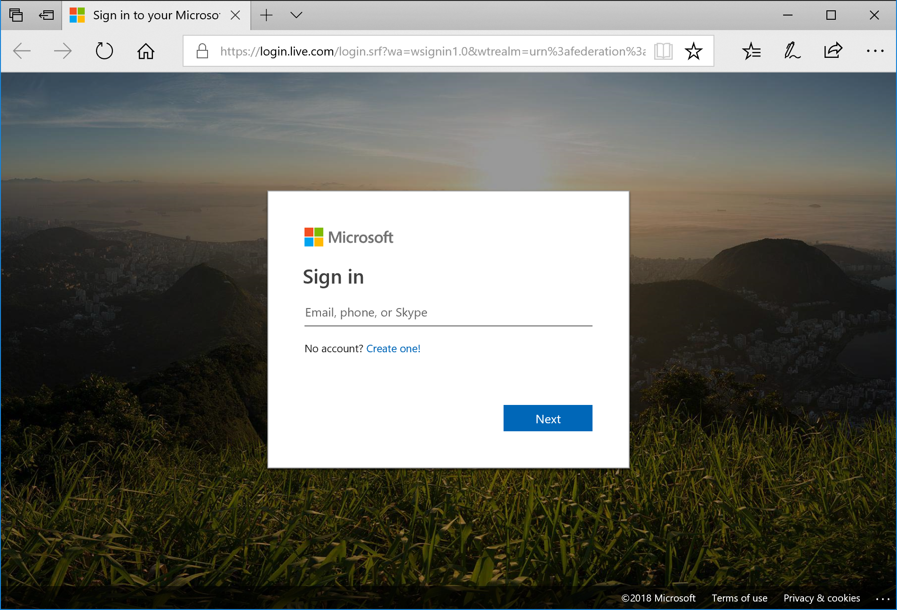
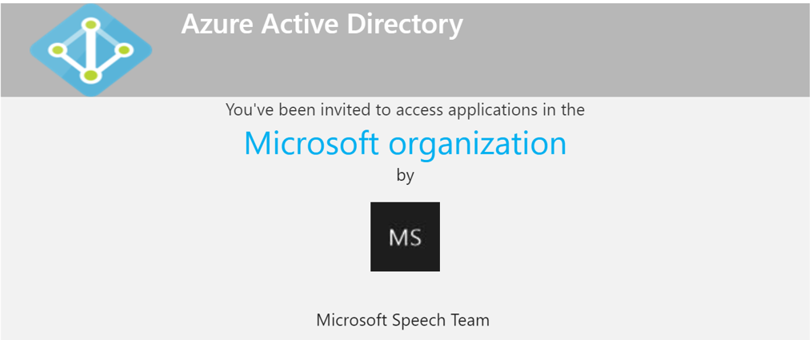
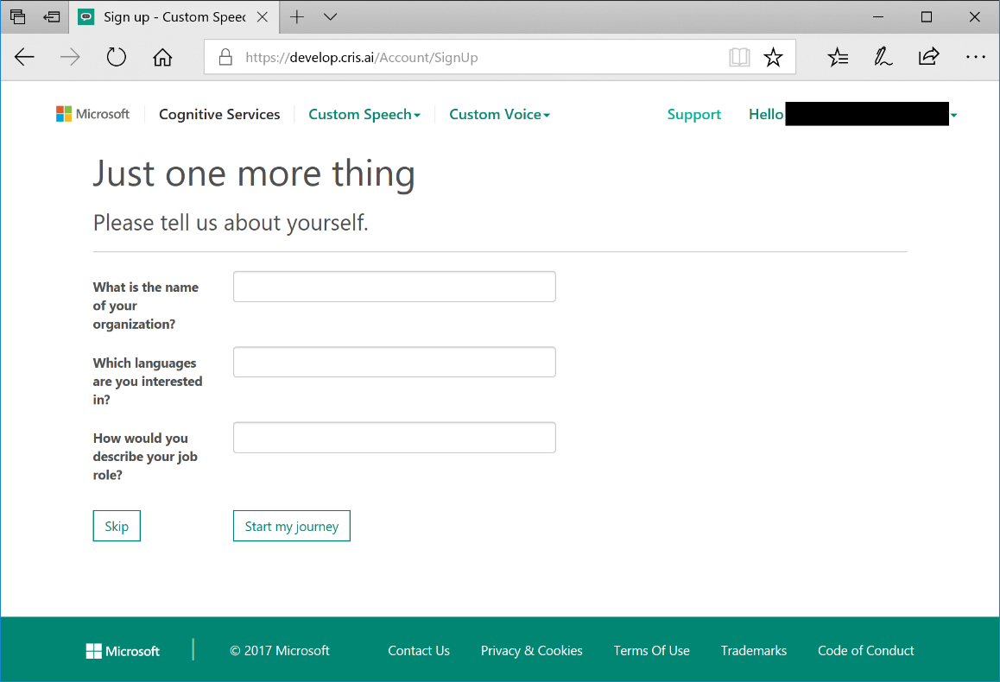
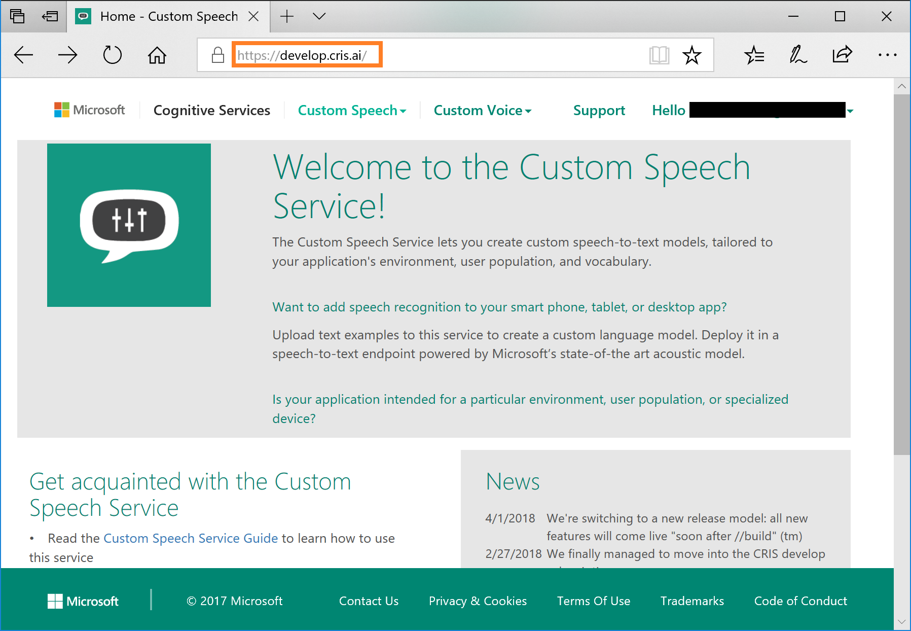
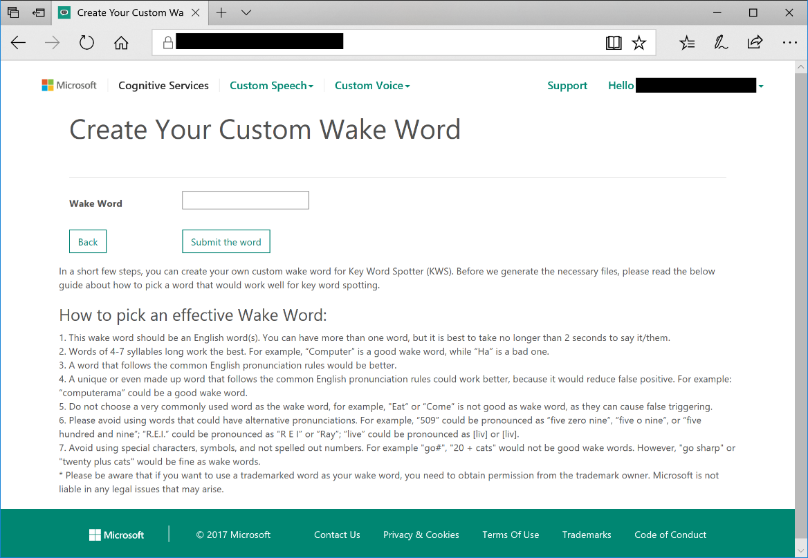
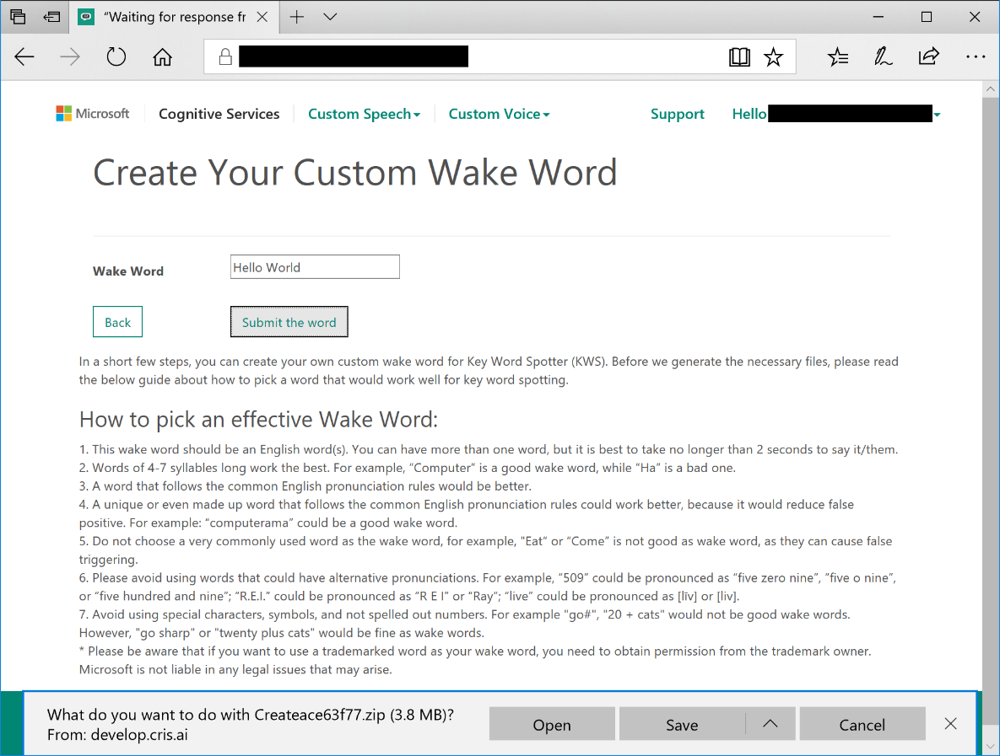

# Custom wake words

Your devices wake word (also called a "hot word") is the word that, when spoken, signals your device to begin listening. Customizing your wake word is a good way to differentiate your device and strengthen your branding.

## Choosing a good wake word

Consider the following guidelines when choosing a wake word.

1. Your wake word should be an English word or words. Your "wake word" can actually be more than one word, but it should take no longer than two seconds to say.

1. Words of 4–7 syllables work best. For example, “Hey, Computer” is a good wake word, while just “Hey” is a poor one.

1. Wake words should follow common English pronunciation rules.

1. A unique or even made-up word that follows common English pronunciation rules could reduce false positives. For example: “computerama” could be a good wake word.

1. Do not choose a very common word. For example, "eat“ and “come” are words that people say frequently in ordinary conversation, and could be false triggers for your device.

1. Avoid using a wake word that could have alternative pronunciations. Users would have to know the "right" pronunciation to get their device to respond. For example, “509” could be pronounced as “five zero nine”, “five oh nine”, or “five hundred and nine.” “R.E.I.” could be pronounced as “R E I” or “Ray”. “Live” could be pronounced as [līv] or [liv].

1. Do not use special characters, symbols, or digits. For example, "Go#" and "20 + cats" would not be good wake words. However, "go sharp" or "twenty plus cats" could work. You can still use the symbols in your branding, but use marketing and documentation to reinforce the proper pronunciation.

> [!NOTE]
> If you choose a trademarked word as your wake word, be sure that you own that trademark, or else have permission from the trademark owner to use it. Microsoft is not liable for any legal issues that may arise from your choice of wake word.

## Creating your wake word

Before you can use a custom wake word with your device, you must create it using the Microsoft Speech service. You will receive a file that you will deploy in your development kit to enable the wake word.

1. Go to https://cris.ai/.

2. Create a new account with the email address that you previously used to request access to the Azure Active Directory.

The email invitation you receive from Azure Active Directory looks like this:

 
3.	Once logged in, fill out the form, then click **Start the Journey.**

 
4. The Custom Wake Word page is not available to the public, so there is no link that takes you there. Click or paste in this link instead: https://cris.ai/customkws

 
6. Type a word of your choice, then **Submit** it.

 
7. It may take a few minutes for the files to be generated. You should see a spinning circle on your browser’s tab. After a moment, an information bar appears asking you to download a `.zip` file.

8. Save the `.zip` file to your computer. You will need this file to deploy the custom wake word to the development kit later, following the instructions in the Developer Quick Starter Guide, which will be available soon.

9. You may now **Sign out.**
