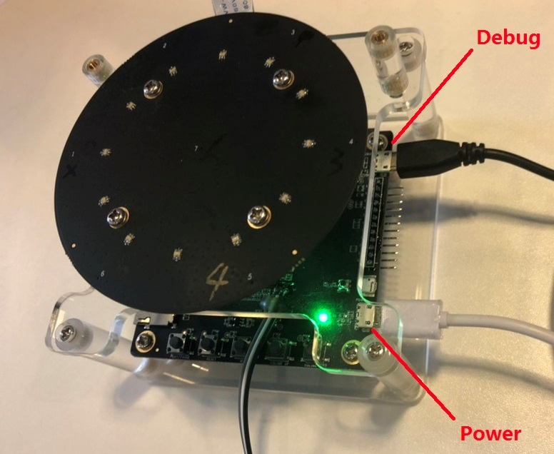

# Device: Roobo Smart Audio Dev Kit v2

This article provides device-specific information for the Roobo Smart Audio Dev Kit2.

## Set up the development kit

1. The development kit has two micro USB connectors. The left connector is to power the development kit and is highlighted as Power in the image below. The right one is to control it, and is marked Debug in the image. 

    

1. Power the development kit by using a micro USB cable to connect the power port to a PC or power adapter. A green power indicator will light up under the top board.

1. To control the development kit, connect the debug port to a computer by using a second micro USB cable. It is essential to use a high-quality cable to ensure reliable communications.

1. Orient your development kit Circularly as shown above

    |Development kit configuration|Orientation|
    |-----------------------------|------------|
    |Circular|Upright, with microphones facing the ceiling|

## Device Running
DDK2 device integrates MTK background software application(appmainprog). The application uses an amount of  open-source software to encapsulate a rich functional interface that is easy to develop and operate, such as multimedia, wireless connection, and so on, applications exist as daemons throughout the device's life cycle. 

Make sure the adb tool is successfully installed and running. You need to log into the device with adb
instructions：# adb shell

## Development information

For more development information, see the [Roobo development guide](http://dwn.roo.bo/server_upload/ddk/ROOBO%20Dev%20Kit-User%20Guide.pdf).

## Audio Record/Play

DDK2 audio operations can be performed in the following ways：
* Use ALSA Open-source libraries and their applications.
* Use appmainprog interface to do application development. 
DDK2 audio - related software framework uses standard ALSA framework, you can use libasound. So to develop software directly. So you can use ALSA's arecord and aplay directly to record and play audio.

## Next steps

Sample APP for Roobov2
