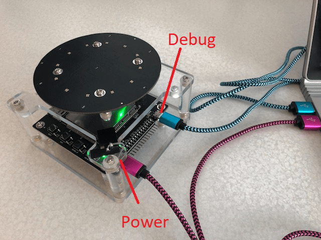
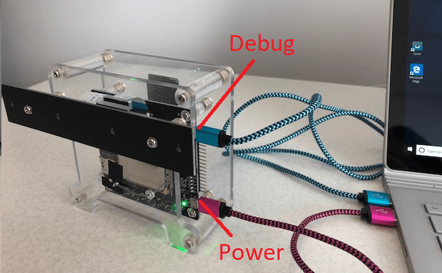
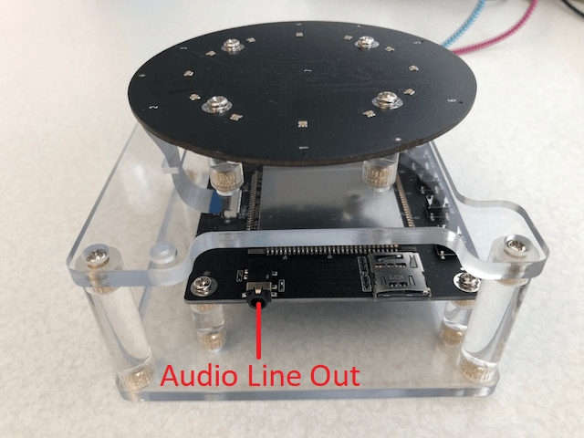

# Device: Roobo Smart Audio Dev Kit

This article provides device specific information for the Roobo Smart Audio Dev Kit.

## Set up the development kit

1. The development kit has two micro USB connectors. The left connector is to power the development kit and is highlighted as Power in the image below. The right one is to control it, and is marked Debug in the image.

    

1. Power the development kit by using a micro USB cable to connect the power port to a PC or power adapter. A green power indicator will light up under the top board.

1. To control the development kit, connect the debug port to a computer by using a second micro USB cable. It is essential to use a high quality cable to ensure reliable communications.

1. Orient your development kit for either the circular or linear configuration.

    |Development kit configuration|Orientation|
    |-----------------------------|------------|
    |Circular|Upright, with microphones facing the ceiling|
    |Linear|On its side, with microphones facing you (shown in the following image)|

    

1. Install the certificates and set the permissions of the sound device. Type the following commands in a Command Prompt window:

   ```Powershell
   adb push C:\SDSDK\Android-Sample-Release\scripts\roobo_setup.sh /data/
   adb shell
   cd /data/
   chmod 777 roobo_setup.sh
   ./roobo_setup.sh
   exit
   ```

    > [!NOTE]
    > These commands use the Android Debug Bridge, `adb.exe`, which is part of the Android Studio installation. This tool is located in C:\Users\[user name]\AppData\Local\Android\Sdk\platform-tools. You can add this directory to your path to make it more convenient to invoke `adb`. Otherwise, you must specify the full path to your installation of adb.exe in every command that invokes `adb`.
    >
    > If you see an error `no devices/emulators found` then check your USB cable is connected and is a high quality cable. You can use `adb devices` to check that your computer can talk to the development kit as it will return a list of devices.
    >
    > [!TIP]
    > Mute your PC's microphone and speaker to be sure you are working with the development kit's microphones. This way, you won't accidentally trigger the device with audio from the PC.

1. If you want to attach a speaker to the dev kit, you can connect it to the audio line out. You should choose a good-quality speaker with a 3.5mm analog plug.

    

## Development information

For more development information, see the [Roobo development guide](http://dwn.roo.bo/server_upload/ddk/ROOBO%20Dev%20Kit-User%20Guide.pdf).

## Audio

Roobo provides a tool that captures all audio to flash memory. It might help you troubleshoot audio issues. A version of the tool is provided for each development kit configuration. On the  [Roobo site](http://ddk.roobo.com/), select your device, and then select the **Roobo Tools** link at the bottom of the page.

## Next steps

* [Run the Android sample app](speech-devices-sdk-android-qsg.md)
