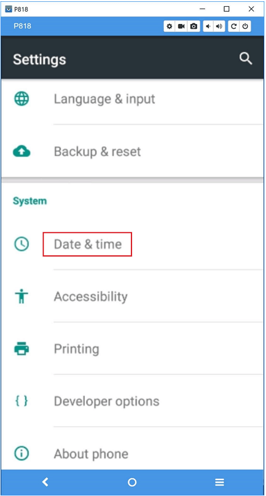

# Troubleshoot the Speech Devices SDK

This article provides information to help you solve issues you might encounter when you use the Speech Devices SDK.

## Troubleshooting

### Certificate failures

If you get certificate failures when using the Speech Services, make sure that your device has the correct date and time:

1. Go to **Settings**. Under **System**, select **Date & time**.

    

1. Keep the **Automatic date & time** option selected. Under **Select time zone**, select your current time zone.

    

    When you see that the dev kit's time matches the time on your PC, the dev kit is connected to the internet.

    For more development information, see the [ROOBO development guide](http://dwn.roo.bo/server_upload/ddk/ROOBO%20Dev%20Kit-User%20Guide.pdf).

### Audio

ROOBO provides a tool that captures all audio to flash memory. It might help you troubleshoot audio issues. A version of the tool is provided for each development kit configuration. On the  [ROOBO site](http://ddk.roobo.com/), select your device, and then select the **ROOBO Tools** link at the bottom of the page.

## Next steps

* [Review the release notes](devices-sdk-release-notes.md)
