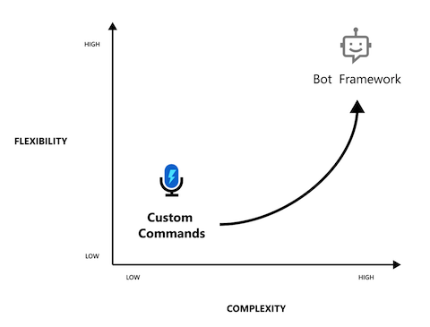

# About voice assistants

Voice assistants using Azure Speech Services empower developers to create natural, human-like conversational interfaces for their applications and experiences. The voice assistant service provides fast, reliable interaction between a device and an assistant implementation that uses the Bot Framework's Direct Line Speech channel or the integrated Custom Commands (Preview) service for task completion. Applications connect to the Voice assistant service with the Speech Software Development Kit (SDK).

   

Direct Line Speech and its associated functionality for voice assistants are an ideal supplement to the [Virtual Assistant Solution and Enterprise Template](https://docs.microsoft.com/azure/bot-service/bot-builder-enterprise-template-overview). Though Direct Line Speech can work with any compatible bot, these resources provide a reusable baseline for high-quality conversational experiences as well as common supporting skills and models for getting started quickly.

## Core features

| Category | Features |
|----------|----------|
|[Custom wake word](speech-devices-sdk-create-kws.md) | Users can start conversations with assistants with a custom keyword like "Hey Contoso." This task is accomplished with a custom wake word engine in the Speech SDK, which can be configured with a custom wake word [that you can generate here](speech-devices-sdk-create-kws.md). Voice assistants can use service-side wake word verification that improves the accuracy of the wake word activation versus the device alone.
|[Speech to text](speech-to-text.md) | Voice assistants use real-time transcription of audio into recognized text using [Speech-to-text](speech-to-text.md) from Azure Speech Services. This text is available to both your assistant implementation and your client application as it is transcribed.
|[Text to speech](text-to-speech.md) | Textual responses from your assistant will be synthesized using [Text-to-speech](text-to-speech.md) from Azure Speech Services. This synthesis will then be made available to your client application as an audio stream. Microsoft offers the ability to build your own custom, high-quality Neural TTS voice that gives a voice to your brand, to learn more [contact us](mailto:mstts@microsoft.com).
|[Direct Line Speech](https://docs.microsoft.com/azure/bot-service/bot-service-channel-connect-directlinespeech) | As a channel within the Bot Framework, Direct Line Speech enables a smooth and seamless connection between your client application, a compatible bot, and the capabilities of Azure Speech Services. For more information on configuring your bot to use the Direct Line Speech channel, see [its page in the Bot Framework documentation](https://docs.microsoft.com/azure/bot-service/bot-service-channel-connect-directlinespeech).
|[Custom Commands](custom-commands.md) | Speech Commands provides a streamlined authoring and hosting solution for Voice assistants that's tailored to the needs of task completion and command-and-control scenarios.

## Comparing assistant solutions

The voice assistant service connects your on-device application to your unique assistant implementation. Voice assistants can be authored with the Bot Framework's [Direct Line Speech](direct-line-speech.md) channel or the [Custom Commands](custom-commands.md) solution for task completion.

   

## Get started with voice assistants

We offer quickstarts designed to have you running code in less than 10 minutes. This table includes a list of voice assistant quickstarts organized by language.

| Quickstart | Platform | API reference |
|------------|----------|---------------|
| C#, UWP | Windows | [Browse](https://aka.ms/csspeech/csharpref) |
| Java | Windows, macOS, Linux | [Browse](https://aka.ms/csspeech/javaref) |
| Java | Android | [Browse](https://aka.ms/csspeech/javaref) |

## Sample code

Sample code for creating a voice assistant is available on GitHub. These samples cover the client application for connecting to your assistant in several popular programming languages.

* [Voice assistant samples (SDK)](https://aka.ms/csspeech/samples)
* [Tutorial: Voice enable your assistant with the Speech SDK, C#](tutorial-voice-enable-your-bot-speech-sdk.md)

## Tutorial
A tutorial on how to [voice-enable your assistant using the Speech SDK and Direct Line Speech channel](tutorial-voice-enable-your-bot-speech-sdk.md).

## Customization

Voice assistants built using Azure Speech Services can use the full range of customization options available for [speech-to-text](speech-to-text.md), [text-to-speech](text-to-speech.md), and [custom keyword selection](speech-devices-sdk-create-kws.md).

> [!NOTE]
> Customization options vary by language/locale (see [Supported languages](supported-languages.md)).

## Reference docs

* [Speech SDK](speech-sdk-reference.md)
* [Azure Bot Service](https://docs.microsoft.com/azure/bot-service/?view=azure-bot-service-4.0)

## Next steps

* [Get a Speech Services subscription key for free](get-started.md)
* [Get the Speech SDK](speech-sdk.md)
* []
* [Create and deploy a basic bot](https://docs.microsoft.com/azure/bot-service/bot-builder-tutorial-basic-deploy?view=azure-bot-service-4.0)
* [Get the Virtual Assistant Solution and Enterprise Template](https://github.com/Microsoft/AI)
