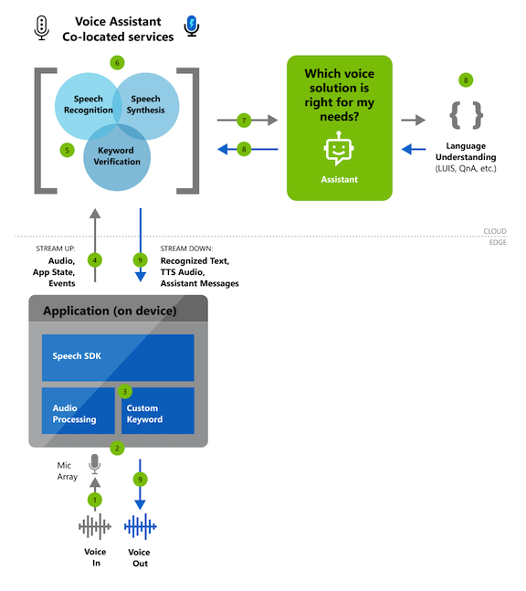

# About voice assistants

Voice assistants using Azure Speech Services empower developers to create natural, human-like conversational interfaces for their applications and experiences.

The voice assistant service provides fast, reliable interaction between a device and an assistant implementation that uses either (1) the Bot Framework's Direct Line Speech channel or (2) the integrated Custom Commands (Preview) service for task completion.

Applications connect to the voice assistant service with the Speech Software Development Kit (SDK).

   

## Core Features

| Category | Features |
|----------|----------|
|[Custom keyword](speech-devices-sdk-create-kws.md) | Users can start conversations with assistants with a custom keyword like “Hey Contoso.” An app does this with a custom keyword engine in the Speech SDK, which can be configured with a custom keyword [that you can generate here](speech-devices-sdk-create-kws.md). voice assistants can use service-side keyword verification to improve the accuracy of the keyword activation (versus the device alone).
|[Speech to text](speech-to-text.md) | voice assistants convert real-time audio into recognized text using [Speech-to-text](speech-to-text.md) from Azure Speech Services. This text is available, as it's transcribed, to both your assistant implementation and your client application.
|[Text to speech](text-to-speech.md) | Textual responses from your assistant are synthesized using [Text-to-speech](text-to-speech.md) from Azure Speech Services. This synthesis is then made available to your client application as an audio stream. Microsoft offers the ability to build your own custom, high-quality Neural TTS voice that gives a voice to your brand. To learn more, [contact us](mailto:mstts@microsoft.com).

## Comparing assistant solutions

The voice assistant service connects your on-device application to your unique assistant implementation. Developers author voice assistants using either (1) the Bot Framework's [Direct Line Speech](direct-line-speech.md) channel or (2) the [Custom Commands (Preview)](custom-commands.md) solution.

   

| Solution | Features |
|----------|----------|
|[Custom Commands (Preview)](custom-commands.md) | Custom Commands (Preview) provides a streamlined authoring and hosting solution for voice assistants. It's tailored to the needs of task completion and command-and-control scenarios.
|[Direct Line Speech](https://docs.microsoft.com/azure/bot-service/bot-service-channel-connect-directlinespeech) | Direct Line Speech enables a smooth and seamless connection between (1) your client application, (2) a compatible bot, and (3) the capabilities of Azure Speech Services. For more information on configuring your bot to use the Direct Line Speech channel, please see [its page in the Bot Framework documentation](https://docs.microsoft.com/azure/bot-service/bot-service-channel-connect-directlinespeech).

Once you've created a voice assistant with one of these solutions, connect your on-device application to it using the `DialogServiceConnector` in the Speech SDK. For more details, please see the Quickstarts and samples for each solution.

## Getting started with voice assistants

We offer Quickstarts designed to have you running code in less than 10 minutes. This table includes a list of voice assistant Quickstarts, organized by language.

| Quickstart | Platform | API reference |
|------------|----------|---------------|
| C#, UWP | Windows | [Browse](https://aka.ms/csspeech/csharpref) |
| Java | Windows, macOS, Linux | [Browse](https://aka.ms/csspeech/javaref) |
| Java | Android | [Browse](https://aka.ms/csspeech/javaref) |

## Sample Code

Sample code for creating a voice assistant is available on GitHub. These samples cover the client application for connecting to your assistant in several popular programming languages.

* [Voice assistant samples (SDK)](https://aka.ms/csspeech/samples)
* [Tutorial: Voice enable your assistant with the Speech SDK, C#](tutorial-voice-enable-your-bot-speech-sdk.md)

## Tutorial

A tutorial on how to [voice-enable your assistant using the Speech SDK and Direct Line Speech channel](tutorial-voice-enable-your-bot-speech-sdk.md).

## Customization

voice assistants built using Azure Speech Services can use the full range of customization options available for [speech-to-text](speech-to-text.md), [text-to-speech](text-to-speech.md), and [custom keyword selection](speech-devices-sdk-create-kws.md).

> [!NOTE]
> Customization options vary by language/locale (see [Supported languages](supported-languages.md)).

## Reference Docs

* [Speech SDK](speech-sdk-reference.md)
* [Azure Bot Service](https://docs.microsoft.com/azure/bot-service/?view=azure-bot-service-4.0)

## Next Steps

* [Get a Speech Services subscription key for free](get-started.md)
* [Get the Speech SDK](speech-sdk.md)
* [Learn more about Custom Commands (Preview)](custom-commands.md)
* [Learn more about Direct Line Speech](direct-line-speech.md)