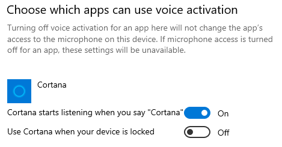

# Privacy guidelines for Windows Voice Assistants

## About voice activation privacy

It's important that users are given clear information about how their voice data is collected and used and important that they are given control over if and how this collection happens. These core facets of privacy -- *disclosure* and *consent* -- are especially important for voice assistants integrated into Windows given the always-listening nature of their use.

Developers creating Windows Voice Assistants must include clear user interface elements within their applications that reflect the listening capabilities of the assistant.

> [!NOTE]
> Failure to provide appropriate disclosure and consent for an assistant application, including after application updates, may result in the assistant becoming unavailable for voice activation until privacy issues are resolved. 

## Minimum requirements for feature inclusion

Windows users can see and control the availability of their assistant applications in **`Settings > Privacy > Voice activation`**.

 > [!div class="mx-imgBorder"]
 > 

To become eligible for inclusion in this list, an application must:

1. Prominently tell its users that it will listen for a keyword, even when the application is not running,  and what that keyword is
1. Include a description of how a user's voice data will be used, including a link or reference to relevant privacy policies
1. Inform users that, in addition to any in-app settings, users can view and modify their privacy choices in **`Settings > Privacy > Voice activation`**, optionally including a protocol link to `ms-settings:privacy-voiceactivation` for direct access

After meeting these requirements and getting approval from Microsoft, an assistant application will appear in the voice activation apps list once it has registered with the `Windows.ApplicationModel.ConversationalAgent` APIs and users will be able to grant  consent to the application for keyword activation. By default, both of these settings are `Off` and require the user to manually visit the Settings page to enable.

> [!NOTE]
> In all cases, voice activation permission requires microphone permission. If an assistant application does not have microphone access, it will not be eligible for voice activation and will appear in the voice activation privacy settings in a disabled state.

## Additional requirements for inclusion in Microphone consent

Assistant authors who want to make it easier and smoother for their users to opt in to voice activation can do so by meeting a few additional requirements to those above. After meeting these, an assistant application's standard, device-unlocked voice activation setting will default to `On` once (and only once) Microphone access is granted to the application. This removes the need for an extra trip to Settings before voice activating an assistant.

The additional requirements are that an assistant application must:

1. **Before** prompting for Microphone consent (for example, using the `AppCapability.RequestAccessAsync` API), provide prominent indication to the user that the assistant application would like to listen to a user's voice for a keyword, even when the application is not running, and would like the user's consent
2. Include all relevant information for data usage and privacy policies **prior** to requesting Microphone access or using the `Windows.ApplicationModel.ConversationalAgent` APIs
3. Avoid any directive or leading wording (for example, "click yes on the following prompt") in the experience flow disclosing audio capture behavior and requesting permission

Once these requirements are satisfied, an eligible assistant application will appear in the list of applications eligible for voice activation in an `enabled` state once Microphone access is granted.

> [!NOTE]
> Voice activation above lock is not eligible for automatic enablement with Microphone access and will still require a user to visit the Voice activation privacy page to enable above-lock access for an assistant.

## Next steps

> [!div class="nextstepaction"]
> [Learn about best practices for Windows Voice Assistants](windows-voice-assistants-best-practices.md)