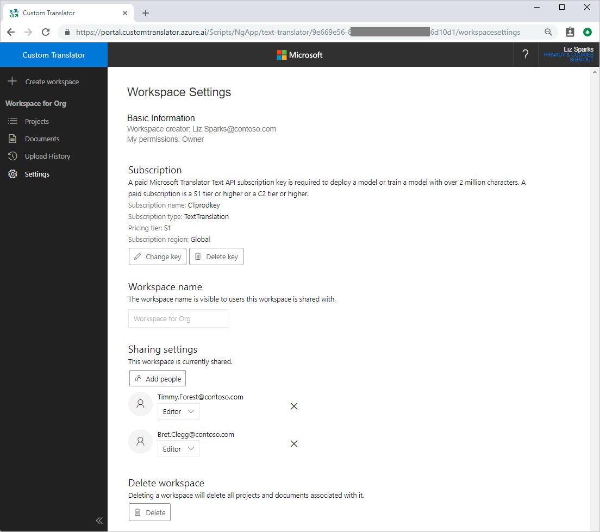
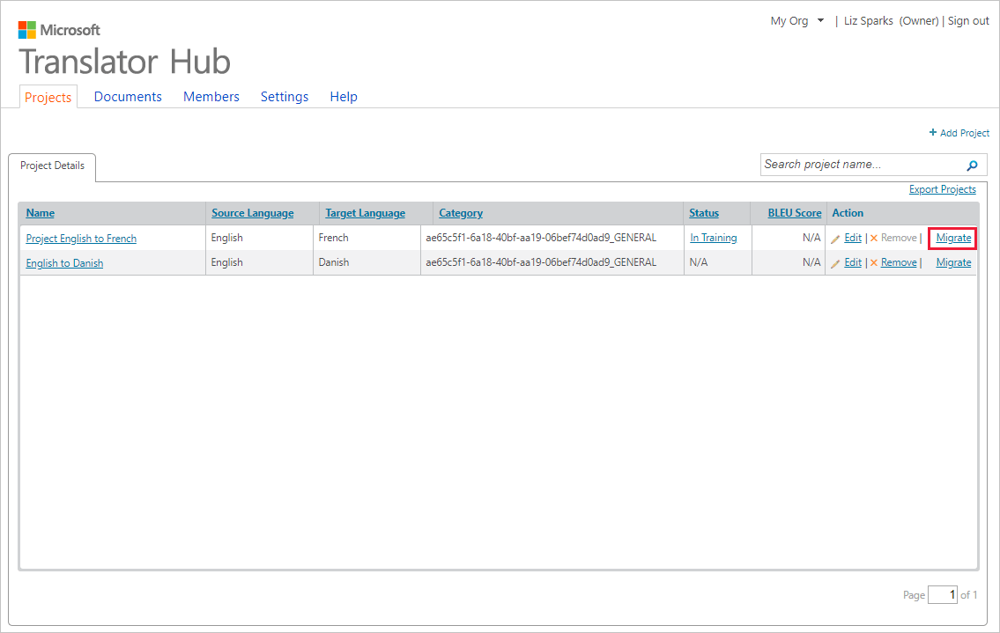
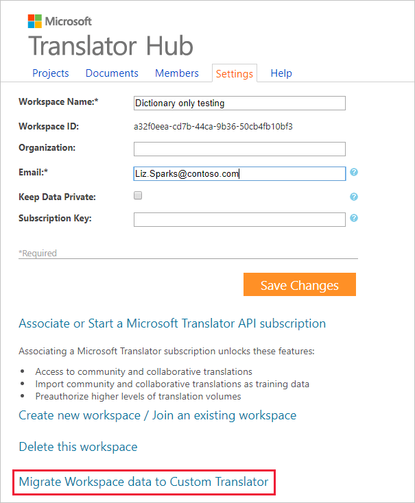
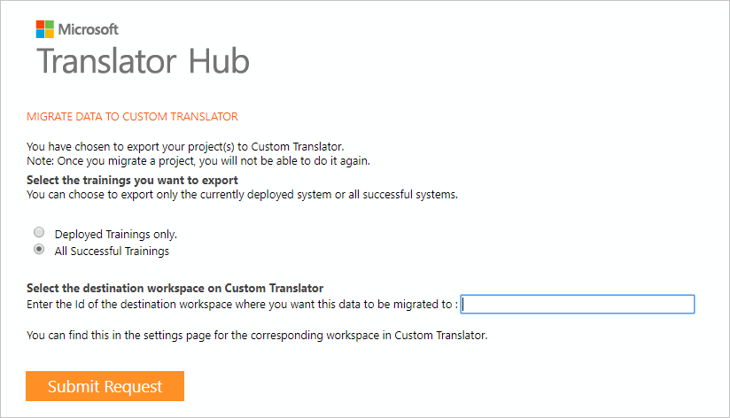

# Migrate Hub workspace and projects to Custom Translator

You can easily migrate your [Microsoft Translator Hub](https://hub.microsofttranslator.com/) workspace and projects to Custom Translator. Migration is initiated from Microsoft Hub by selecting a workspace or project, then selecting a workspace in Custom Translator, and then selecting the trainings you want to transfer. After the migration starts, the selected training settings will be transferred with all relevant documents. Deployed models are trained and can be autodeployed upon completion.

These actions are performed during migration:
* All documents and project definitions will have their names transferred with the addition of “hub_” prefixed to the name. Auto-generated test and tuning data will be named hub_systemtune_\<modelid> or hub_systemtest_\<modelid>.
* Any trainings that were in the deployed state when the migration takes place will automatically be trained using the documents of the Hub training. This training will not be charged to your subscription. If auto-deploy was selected for the migration, the trained model will be deployed upon completion. Regular hosting charges will be applied.
* Any migrated trainings that were not in the deployed state will be put into the migrated draft state. In this state, you will have the option of training a model with the migrated definition, but regular training charges will apply.
* At any point, the BLEU score migrated from the Hub training can be found in the TrainingDetails page of the model in the “Bleu score in MT Hub” heading.

> [!Note] 
> For a training to succeed, Custom Translator requires a minimum of 10,000 unique extracted sentences. Custom Translator can't conduct a training with fewer than the [suggested minimum](https://docs.microsoft.com/azure/cognitive-services/translator/custom-translator/sentence-alignment#suggested-minimum-number-of-sentences).

## Find Custom Translator Workspace ID

To migrate [Microsoft Translator Hub](https://hub.microsofttranslator.com/) workspace, you need destination Workspace ID in Custom Translator. The destination workspace in Custom Translator is where all your Hub workspaces and projects shall be migrated to.

You will find your destination Workspace ID on Custom Translator Settings page:

1. Go to "Setting" page in the Custom Translator portal.

2. You will find the Workspace ID in the Basic Information section.

    

3. Keep your destination Workspace ID to refer during the migration process.

## Migrate a project

If you want to migrate your projects selectively, Microsoft Translator Hub gives you that ability.

To migrate a project:

1. Sign in to Microsoft Translator Hub.

2. Go to "Projects" page.

3. Click "Migrate" link for appropriate project.

    

4. Upon pressing the migrate link you will be presented with a form allowing you to:
   * Specify the workspace you wish to transfer to on Custom Translator
   * Indicate whether you wish to transfer all trainings with successful trainings or just the deployed trainings. By default all successful trainings will be transferred.
   * Indicate whether you would like your training auto deployed when training completes. By default your training will not be auto deployed upon completion.

5. Click "Submit Request".

## Migrate a workspace

In addition to migrating a single project, you may also migrate all projects with successful trainings in a workspace. This will cause each project in the workspace to be evaluated as though the migrate link had been pressed. This feature is suitable for users with many projects who want to migrate all of them to Custom Translator with the same settings. A workspace migration can be initiated from the settings page of Translator Hub.

To migrate a workspace:

1. Sign in to Microsoft Translator Hub.

2. Go to "Settings" page.

3. On "Settings" page click "Migrate Workspace data to Custom Translator".

    

4. On the next page select either of these two options:

    a. Deployed Trainings only: Selecting this option will migrate only your deployed systems and related documents.

    b. All Successful Trainings: Selecting this option will migrate all your successful trainings and related documents.

    c. Enter your destination Workspace ID in Custom Translator.

    

5. Click Submit Request.

## Migration History

When you have requested workspace/ project migration from Hub, you’ll find your migration history in Custom Translator Settings page.

To view the migration history, follow these steps:

1. Go to "Setting" page in the Custom Translator portal.

2. In the Migration History section of the Settings page, click Migration History.

    

Migration History page displays following information as summary for every migration you requested.

1. Migrated By: Name and email of the user submitted this migration request

2. Migrated On: Date and time stamp of the migration

3. Projects: Number of projects requested for migration v/s number of projects successfully migrated.

4. Trainings: Number of trainings requested for migration v/s number of trainings successfully migrated.

5. Documents: The number of documents requested for migration v/s number of documents successfully migrated.

    

If you want more detailed migration report about your projects, trainings and documents, you have option export details as CSV.

## Implementation Notes
* Systems with language pairs NOT yet available in Custom Translator will only be available to access data or undeploy through Custom Translator. These projects will be marked as “Unavailable” on the Projects page. As we enable new language pairs with Custom Translator, the projects will become active to train and deploy. 
* Migrating a project from Hub to Custom Translator will not have any impact on your Hub trainings or projects. We do not delete projects or documents from Hub during a migration and we do not undeploy models.
* You are only permitted to migrate once per project. If you need to repeat a migration on a project, please contact us.
* Custom Translator supports NMT language pairs to and from English. [View the complete list of supported languages](https://docs.microsoft.com/azure/cognitive-services/translator/language-support#customization). Hub does not require baseline models and therefore supports several thousand languages. You can migrate an unsupported language pair, however we will only perform the migration of documents and project definitions. We will not be able to train the new model. Furthermore, these documents and projects will be displayed as inactive in order to indicate that they can't be used at this time. If support is added for these projects and/or documents, they will become active and trainable.
* Custom Translator does not currently support monolingual training data. Like unsupported language pairs, you can migrate monolingual documents, but they show as inactive until monolingual data is supported.
* Custom Translator requires 10k parallel sentences in order to train. Microsoft Hub could train on a smaller set of data. If a training is migrated which does not meet this requirement, it will not be trained.

## Custom Translator versus Hub

This table compares the features between Microsoft Translator Hub and Custom Translator.

|   | Hub | Custom Translator |
|:-----|:----:|:----:|
|Customization feature status	| General Availability	| General Availability |
| Text API version	| V2 	| V3  |
| SMT customization	| Yes	| No |
| NMT customization	| No	| Yes |
| New unified Speech services customization	| No	| Yes |
| No Trace | Yes | Yes |

## New languages

If you are a community or organization working on creating a new language system for Microsoft Translator, reach out to [custommt@microsoft.com](mailto:custommt@microsoft.com) for more information.

## Next steps

- [Train a model](how-to-train-model.md).
- Start using your deployed custom translation model via [Microsoft Translator Text API V3](https://docs.microsoft.com/azure/cognitive-services/translator/reference/v3-0-translate?tabs=curl).
