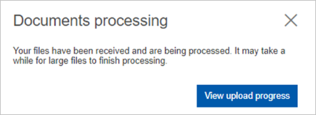

# Upload document

[Custom Translator](https://portal.customtranslator.azure.ai) provides way to upload so that you can upload parallel document to train your translation models. [Parallel documents](what-are-parallel-documents) are pairs of documents where one is the translation of the other. One document in the pair contains sentences in the source language and
the other document contains these sentences translated into the target language.

On [Custom Translator](https://portal.customtranslator.azure.ai) portal, click on “Documents” tab to go to documents page.

1.  Click on the “Upload Document” button on the documents page.

    

2.  On the dialog fill in the following information:

    a.  Document type:

    -  Training: These document(s) will be used for training set.
    -  Tuning: These document(s) will be used for tuning set.
    -  Testing: These document(s) will be used for testing set.
    -  Phrase Dictionary: These document(s) will be used for phrase  dictionary.
    -  Sentence Dictionary: These document(s) will be used for sentence  dictionary

    b.  Language pair

    c.  Override document if exists: Select this check box if you want to
        overwrite any existing documents with the same name.

    d.  Fill in the relevant section for either parallel data or combo data.

    -  Parallel data:
        -  Source file: Select source language file from your local computer.
        -  Target file: Select target language file from your local computer.
        -  Document name: Used only if you're uploading parallel files.

    - Combo data:
        -  Combo File: Select the combo file from your local computer. Your combo file has both of your source and target language sentences. [Naming convention](document-formats-naming-convention.md) is important for combo files.

    e.  Click Upload

    

3.  At this point, we're processing your documents and attempting to extract sentences. You can click “View upload Progress” to check the status of your documents as they process.

    

4.  This page will display the status, and any errors for each file within your
    upload. You can view past upload status at any time by clicking on the
    “Upload history” tab.

    

## View upload history

On the [Custom Translator](https://portal.customtranslator.azure.ai) portal,
click on the upload history tab to go to history page.

This page shows the status of all of your past uploads. It displays
uploads from most recent to least recent. For each upload, it shows the overall
status, the upload date, the number of files, the type of
file, and the language pair.

Click on any upload history record and that will take you to upload history details page. In the details page, you can view the status of each individual file and error messages.

## Next steps

- Use [document details page](how-to-view-document-details.md) to review list of extracted sentences in a document.
- [How to train a model](how-to-train-model.md).
