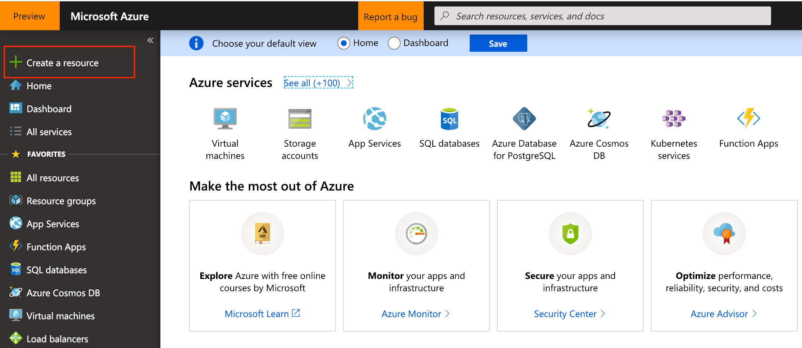

# Quickstart: Create a Cognitive Services account in the Azure portal

In this quickstart you'll learn how to sign-up for Azure Cognitive Services and create a single-service or multi-service subscription. These services are represented by Azure [resources](https://docs.microsoft.com/azure/azure-resource-manager/resource-group-portal), which enable you to connect to one or many of the Azure Cognitive Services APIs.

## Prerequisites

* A valid Azure subscription. [Create an account](https://azure.microsoft.com/free/) for free.

## Create and subscribe to an Azure Cognitive Services resource

Before you get started it's important to know that there are two types of Azure Cognitive Services subscriptions. The first is a subscription to a single service, such as Computer Vision or the Speech Services. A single-service subscription is restricted to that resource. The second is a multi-service subscription for Azure Cognitive Services. This subscription allows you to use a single subscription for most of the Azure Cognitive Services. This option also consolidates billing. See [Cognitive Services pricing](https://azure.microsoft.com/pricing/details/cognitive-services/) for additional information.

>[!WARNING]
> At this time, these services **don't** support multi-service keys: QnA Maker, Speech Services, and Custom Vision.

The next sections walk you through creating either a single or multi-service subscription.

### Single-service subscription

1. Sign in to the [Azure portal](http://portal.azure.com), and click **+Create a resource**.

    

2. Under Azure Marketplace, select **AI + Machine Learning**. If you don't see the service you're interested in, click on **See all** to view the entire catalog of Cognitive Services APIs.

    

3. On the **Create** page, provide the following information:

    |    |    |
    |--|--|
    | **Name** | A descriptive name for your cognitive services resource. We recommend using a descriptive name, for example *MyNameFaceAPIAccount*. |
    | **Subscription** | Select one of your available Azure subscriptions. |
    | **Location** | The location of your cognitive service instance. Different locations may introduce latency, but have no impact on the runtime availability of your resource. |
    | **Pricing tier** | The cost of your Cognitive Services account depends on the options you choose and your usage. For more information, see the API [pricing details](https://azure.microsoft.com/pricing/details/cognitive-services/).
    | **Resource group** | The [Azure resource group](https://docs.microsoft.com/azure/architecture/cloud-adoption/getting-started/azure-resource-access#what-is-an-azure-resource-group) that will contain your Cognitive Services resource. You can create a new group or add it to a preexisting group. |

    

### Multi-service subscription

1. Sign in to the [Azure portal](http://portal.azure.com), and click **+Create a resource**.

    

2. Locate the search bar and enter: **Cognitive Services**.

    

3. Select **Cognitive Services**.

    

3. On the **Create** page, provide the following information:

    |    |    |
    |--|--|
    | **Name** | A descriptive name for your cognitive services resource. We recommend using a descriptive name, for example *MyCognitiveServicesAccount*. |
    | **Subscription** | Select one of your available Azure subscriptions. |
    | **Location** | The location of your cognitive service instance. Different locations may introduce latency, but have no impact on the runtime availability of your resource. |
    | **Pricing tier** | The cost of your Cognitive Services account depends on the options you choose and your usage. For more information, see the API [pricing details](https://azure.microsoft.com/pricing/details/cognitive-services/).
    | **Resource group** | The [Azure resource group](https://docs.microsoft.com/azure/architecture/cloud-adoption/getting-started/azure-resource-access#what-is-an-azure-resource-group) that will contain your Cognitive Services resource. You can create a new group or add it to a preexisting group. |

    

## Access your resource

> [!NOTE]
> Subscription owners can disable the creation of Cognitive Services accounts for resource groups and subscriptions by applying [Azure policy](https://docs.microsoft.com/azure/governance/policy/overview#policy-definition), assigning a “Not allowed resource types” policy definition, and specifying **Microsoft.CognitiveServices/accounts** as the target resource type.

After creating your resource, you can access it from the Azure dashboard if you pinned it. Otherwise, you can find it in **Resource Groups**.

Within your Cognitive Services resource, You can use the Endpoint URL and keys in the **Overview** section to start making API calls in your applications.

## Next Steps

> [!div class="nextstepaction"]
> [Authenticate requests to Azure Cognitive Services](authentication.md)

## See also

* [Quickstart: Extract handwritten text from an image](https://docs.microsoft.com/azure/cognitive-services/computer-vision/quickstarts/csharp-hand-text)
* [Tutorial: Create an app to detect and frame faces in an image](https://docs.microsoft.com/azure/cognitive-services/Face/Tutorials/FaceAPIinCSharpTutorial)
* [Build a custom search webpage](https://docs.microsoft.com/azure/cognitive-services/bing-custom-search/tutorials/custom-search-web-page)
* [Integrate Language Understanding (LUIS) with a bot using the Bot Framework](https://docs.microsoft.com/azure/cognitive-services/luis/luis-nodejs-tutorial-build-bot-framework-sample)
