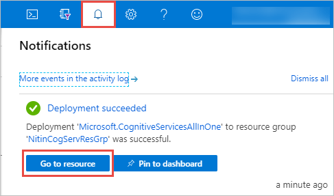

# Create a Cognitive Services resource using the Azure portal

Use this quickstart to create an Azure Cognitive Services resource using the Azure portal. After you have successfully created a Cognitive Services resource, you will obtain an endpoint and a key that you can use to authenticate your applications.

## Prerequisites

* A valid Azure subscription - [Create one for free](https://azure.microsoft.com/free/).

[!INCLUDE [cognitive-services-subscription-types](../../includes/cognitive-services-subscription-types.md)]

## Create a new Azure Cognitive Services resource

When you create a new Cognitive Services resource, you have the option to either create a new resource group to contain it, or use an existing one. This article shows how to create a new resource group.

1. Sign in to the [Azure portal](https://portal.azure.com), and click **+Create a resource**.

    

2. Find the Cognitive Services resource you want to create in two ways: by searching for it, or viewing all available resource types. 

    #### [Using search](#tab/multiservice)

    * To create a multi-service resource, enter **Cognitive Services** in the search bar.
    * To create a single-service resource, search for the service name you want to use. For example **Computer Vision**.
    

    On the Cognitive Services page, select **Create**.

    

    #### [viewing all available types](#tab/singleservice)

    To see all available cognitive services, select **AI + Machine Learning**, under **Azure Marketplace**. If you don't see the service you're interested in, click on **See all** and scroll to **Cognitive Services**. Click **See more** to view the entire catalog of Cognitive Services.

    Once you are on the service you are interested in, click **Create**.
    
    

    ***
3. On the **Create** page, provide the following information:

    #### [Multi-service resource](#tab/multiservice)

    |    |    |
    |--|--|
    | **Name** | A descriptive name for your cognitive services resource. For example, *MyCognitiveServicesResource*. |
    | **Subscription** | Select one of your available Azure subscriptions. |
    | **Location** | The location of your cognitive service instance. Different locations may introduce latency, but have no impact on the runtime availability of your resource. Remember your Azure location, as you may need it when calling the Azure Cognitive Services. |
    | **Pricing tier** | The cost of your Cognitive Services account depends on the options you choose and your usage. For more information, see the API [pricing details](https://azure.microsoft.com/pricing/details/cognitive-services/).
    | **Resource group** | The Azure resource group that will contain your Cognitive Services resource. You can create a new group or add it to a pre-existing group. |

    

    Click **Create**.

    #### [Single-service resource](#tab/singleservice)

    |    |    |
    |--|--|
    | **Name** | A descriptive name for your cognitive services resource. For example, *TextAnalyticsResource*. |
    | **Subscription** | Select one of your available Azure subscriptions. |
    | **Location** | The location of your cognitive service instance. Different locations may introduce latency, but have no impact on the runtime availability of your resource. Remember your Azure location, as you may need it when calling the Azure Cognitive Services. |
    | **Pricing tier** | The cost of your Cognitive Services account depends on the options you choose and your usage. For more information, see the API [pricing details](https://azure.microsoft.com/pricing/details/cognitive-services/).
    | **Resource group** | The Azure resource group that will contain your Cognitive Services resource. You can create a new group or add it to a pre-existing group. |

    

    Click **Create**.

    ***

## Get the keys for your resource

After the resource is successfully created, you get a pop-up notification in the top-right of the screen. From the notification, click **Go to resource** to see the cognitive service resource you created. 

From the quickstart pane that opens, you can access your endpoint and key.

[!INCLUDE [cognitive-services-environment-variables](../../includes/cognitive-services-environment-variables.md)]

## Pricing tiers and billing

Pricing tiers (and the amount you get billed) are based on the number of transactions you send using your authentication information. Each pricing tier specifies the:
* maximum number of allowed transactions per second (TPS).
* service features enabled within the pricing tier.
* The cost for a predefined number of transactions. Going above this amount will cause an extra charge as specified in the [pricing details](https://azure.microsoft.com/pricing/details/cognitive-services/custom-vision-service/) for your service.

## Clean up resources

If you want to clean up and remove a Cognitive Services subscription, you can delete the resource or resource group. Deleting the resource group also deletes any other resources contained in the group.

To remove a resource group using the Azure portal:

1. In the Azure portal, expand the menu on the left side to open the menu of services, and choose **Resource Groups** to display the list of your resource groups.
2. Locate the resource group to delete, and right-click the More button (...) on the right side of the listing.
3. Select **Delete resource group**, and confirm.

## See also

* [Authenticate requests to Azure Cognitive Services](authentication.md)
* [What is Azure Cognitive Services?](Welcome.md)
* [Natural language support](language-support.md)
* [Docker container support](cognitive-services-container-support.md)
