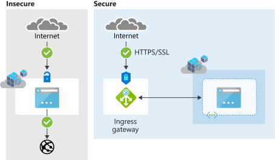

## Azure Cognitive Services container security

Security should be a primary focus whenever developing applications. The importance of security is a metric for success. When architecting a software solution that includes Cognitive Services containers, it's vital to understand the limitations and capabilities available to you. For more information, see [Azure Security][az-security].

> [!IMPORTANT]
> By default there is **no security** on the Cognitive Services container API. The reason for this is that most often the container will run as part of a pod which is protected from the outside by a network bridge. However, it is possible to enable authentication which works identically to the authentication used when accessing the [cloud-based Cognitive Services][request-authentication].

The diagram below illustrates the default and **insecure** approach:

As an alternative and **secure** approach, consumers of Cognitive Services containers could augment a container with a front-facing component, keeping the container endpoint private. Let's consider a scenario where we use [Istio][istio] as an ingress gateway. Istio supports HTTPS/SSL and client-certificate authentication. In this scenario, the Istio frontend exposes the container access, presenting the client certificate that is whitelisted beforehand with Istio.

[Nginx][nginx] is another popular choice in the same category. Both Istio and Nginx act as a service mesh and offer additional features including things like load-balancing, routing, and rate-control.

[istio]: https://istio.io/
[nginx]: https://www.nginx.com
[request-authentication]: authentication.md
[az-security]: ../security/fundamentals/overview.md