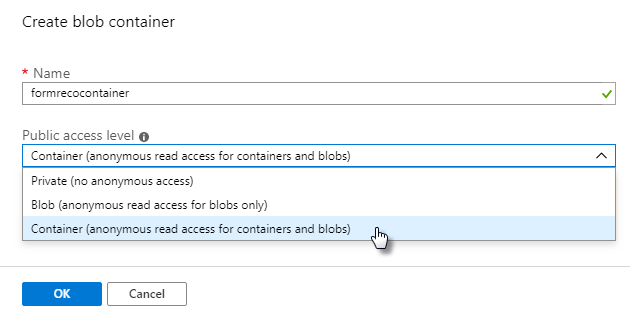

# Tutorial: Use Form Recognizer with PowerApps to analyze receipts

In this tutorial, you create a Flow in PowerApps that uses Form Recognizer from Azure Cognitive Services to extract data from receipts. You will use Form Recognizer to first train a model using some sample data and then test the model using another data set. The sample data used in this tutorial is stored in Azure Storage blob containers.

Here's what this tutorial covers:

> [!div class="checklist"]
> * Get Azure subscription keys
> * Set up your development environment and install dependencies
> * Create a Flask app
> * Use the Translator Text API to translate text
> * Use Text Analytics to analyze positive/negative sentiment of input text and translations
> * Use Speech Services to convert translated text into synthesized speech
> * Run your Flask app locally

## Request access for Form Recognizer

Form Recognizer is available in a limited-access preview. To get access to the preview, fill out and submit the [Form Recognizer access request](https://aka.ms/FormRecognizerRequestAccess) form. Once your request is approved by the Azure Cognitive Services team, you'll receive an email with instructions for accessing the service.

## Prerequisites

* Azure subscription - [Create one for free](https://azure.microsoft.com/free/).
* [Sign up](https://docs.microsoft.com/en-us/powerapps/maker/signup-for-powerapps) for PowerApps.

## Create an Azure Storage blob container

You use this container to upload sample data that is required to train the model.

1. Follow these [instructions](../../storage/common/storage-quickstart-create-account.md) to create an Azure Storage account. Give it the name **formrecostorage**.
1. Follow these [instructions](../../storage/blobs/storage-quickstart-blobs-portal.md) to create an Azure blob container within the Azure Storage account. Give it the name **formrecocontainer**. Make sure you set the public access level to **Container (anonymous read access for containers and blobs)**.

    > [!div class="mx-imgBorder"]
    > 

## Upload sample data to the Azure blob container

Download the sample data that we use in this tutorial from [Github](https://go.microsoft.com/fwlink/?linkid=2090451). Upload this sample data to the **formrecocontainer** that you created earlier. Follow the instructions at [Upload a block blob](../../storage/blobs/storage-quickstart-blobs-portal.md#upload-a-block-blob) on how to upload data to a container.

Copy the URL to the container. You will need this later in this tutorial. If you created the storage account and the container with the same names as listed in this tutorial, the URL will be *https://formrecostorage.blob.core.windows.net/formrecocontainer/*.

## Create a Form Recognizer resource

[!INCLUDE [create resource](./includes/create-resource.md)]

## Create a Flow in PowerApps using Form Recognizer

You can use Microsoft Flow to create logic that performs one or more tasks when an event occurs. In this tutorial, you create a flow that is triggered by uploading a reciept that you want to analyze.

1. Sign in to [PowerApps](http://www.web.powerapps.com).

1. From the left pane, select **Flows**.

    > [!div class="mx-imgBorder"]
    > 

1. On the next page, select **New**, and then select, **Instant-from Blank**.
    > [!div class="mx-imgBorder"]
    > 

1. On the next page, enter a name for your Flow application. From **Choose how to trigger this flow**, select **Manually trigger a flow**, and then select **Create**. 

    > [!div class="mx-imgBorder"]
    > 

1. In this tutorial, we trigger the Flow by providing a receipt sample to analyze. To configure the  select **Manually trigger a flow**, select **Add an input**, and then select **File**.

    > [!div class="mx-imgBorder"]
    > 

1. Provide a name for the input data variable. Change the default text to **Input Data**, and leave the other information as-is.

    > [!div class="mx-imgBorder"]
    > 

1. Select **New step**, and under **Choose an action**, select **Form Recognizer**. Under the actions that are available for Form Recognizer, select **Train Model**.

    

1. Before you can use the Form Recognizer service to analyze receipts, you need to train a model by providing it some sample receipts data that the model can analyze and learn from. So, under the **Train Model** step, for **Source**, enter the URL for the container where you uploaded the sample data, and then select **Save**.

    > [!div class="mx-imgBorder"]
    > 

1. Once the model is trained, you can now use the model to analyze the receipt. To analyze the receipt, you need to 

## Integrate Form Recognizer in Flow

## Test your Flow

## Next steps

* TBD
* TBD
* TBD
