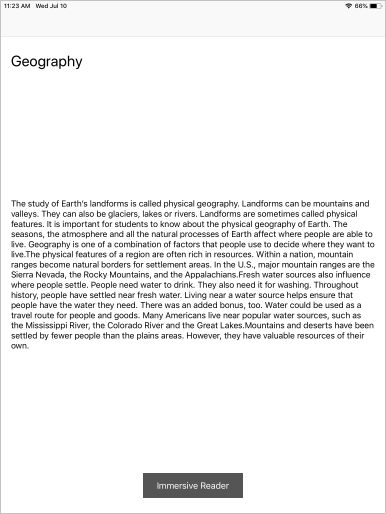
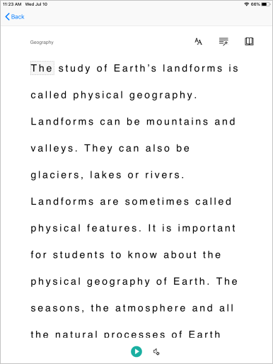

# Quickstart: Create an iOS app that launches the Immersive Reader (Swift)

The [Immersive Reader](https://www.onenote.com/learningtools) is an inclusively designed tool that implements proven techniques to improve reading comprehension.

In this quickstart, you build an iOS app from scratch and integrate the Immersive Reader. A full working sample of this quickstart is available [here](https://github.com/microsoft/immersive-reader-sdk/tree/master/iOS/samples/quickstart-swift).

If you don't have an Azure subscription, create a [free account](https://azure.microsoft.com/free/?WT.mc_id=A261C142F) before you begin.

## Prerequisites

* [Xcode](https://apps.apple.com/us/app/xcode/id497799835?mt=12)
* An Immersive Reader resource configured for Azure Active Directory authentication. Follow [these instructions](./how-to-create-immersive-reader.md) to get set up. You will need some of the values created here when configuring the sample project properties. Save the output of your session into a text file for future reference.

## Create an Xcode project

Create a new project in Xcode.

Choose **Single View App**.

## Set up the app to run without a storyboard

Open AppDelegate.swift and replace the file with the following code.

[!code-swift[AppDelegate](~/ImmersiveReaderSdk/iOS/samples/quickstart-swift/quickstart-swift/AppDelegate.swift)]

## Create the Launch View Controller and add sample content

Rename ViewController.swift to LaunchViewController.swift and replace the file with the following code.

[!code-swift[LaunchViewController](~/ImmersiveReaderSdk/iOS/samples/quickstart-swift/quickstart-swift/LaunchViewController.swift)]

## Build and run the app

Set the archive scheme in Xcode by selecting a simulator or device target.
 

In Xcode, press Ctrl + R or click on the play button to run the project and the app should launch on the specified simulator or device.

In your app, you should see:

When you click on the "Immersive Reader" button, you'll see the Immersive Reader launched with the content on app.

## Next steps

* Explore the [Immersive Reader iOS SDK](https://github.com/microsoft/immersive-reader-sdk/tree/master/iOS) and the [Immersive Reader iOS SDK Reference](./ios-reference.md)
