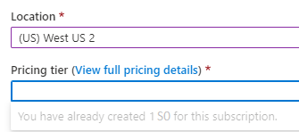

# Metrics Advisor Frequently Asked Questions

### What is the cost of my instance?

During public preview, the cost is covered by Microsoft.

### Why is the demo website readonly?

The [demo website](https://anomaly-detector.azurewebsites.net/) is shared by everyone. This instance is made readonly for the sake of preventing our customers accidentally uploading any private data. Therefore, many features are disabled to protect your data privacy.

### Why can't I create the resource as "Pricing tier" can't be selected and it says "You have already created 1 S0 for this subscription"?

During public preview, only one instance of Metrics Advisor is allowed to create under one subscription in one region.

If you already have one instance created in the same region using the same subscription, you could try a different region or a different subscription to create a new instance.
Or you could delete the existing instance to create a new one.

If you have already deleted the existing instance but still meet the error, please wait for about 20 minutes after resource deletion before you go to create a new instance.

## Basic concepts

### What is multi-dimensional time-series data?

Let's use two examples.

* Revenue of an e-business

Your time series data would look like this:

| Timestamp | Category | Market | Revenue |
| ----------|----------|--------|----- |
| 2020-6-1 | Food | US | 1000 |
| 2020-6-1 | Apparel | US | 2000 |
| 2020-6-2 | Food | UK | 800 | 
…

"Category" and "Market" are dimensions. "Revenue" is the KPI which could be sliced into different categories and/or markets and could also be aggregated, e.g. revenue of "food" for all markets.

* Error count of a complex application

| Timestamp	| Application component | Region | Error count |
| ----------|----------|--------|----- |
| 2020-6-1 | Employee database | WEST EU | 9000 |
| 2020-6-1 | Message queue | EAST US | 1000 |
| 2020-6-2 | Message queue | EAST US | 8000| 
…

"Application component" and "Region" are dimensions. "Error count" is the KPI which could be sliced into different components and/or regions and could also be aggregated, e.g. error count of "message queue" in all regions.

### How much data is needed for Metrics Advisor to start anomaly detection?

At minimum, one data point could already trigger anomaly detection.
However, that surely doesn't bring the best accuracy. The service will assume a window of previous data points using the value you've specified as the "fill-gap" rule during data feed creation.

The recommendation is to have some data before the timestamp that you want detection to run.
Based on the granularity of your data, the recommended data amount varies as below.

| Granularity | Recommended data amount for detection |
| ----------- | ------------------------------------- |
| Less than 5 minutes | 4 days of data |
| 5 minutes to 1 day | 28 days of data |
| More than 1 day, to 31 days | 4 years of data |
| Greater than 31 days | 48 years of data |

### Why Metrics Advisor doesn't detect anomalies from historical data?

Metrics Advisor is designed for detecting live streaming data. There's a limitation of the maximum length of historical data that the service will look back and run anomaly detection. It means only data points after a certain earliest timestamp will have anomaly detection results. That earliest timestamp depends on the granularity of your data.

Based on the granularity of your data, the lengths of the historical data that will have anomaly detection results are as below.

| Granularity | Maximum length of historical data for anomaly detection |
| ----------- | ------------------------------------- |
| Less than 5 minutes | Onboard time - 13 hours |
| 5 minutes to less than 1 hour | Onboard time - 4 days  |
| 1 hour to less than 1 day | Onboard time - 14 days  |
| 1 day | Onboard time - 28 days  |
| Greater than 1 day, less than 31 days | Onboard time - 2 years  |
| Greater than 31 days | Onboard time - 24 years   |

### More concepts and technical terms

Please go to [Glossary](glossary.md) to read more.

## How do I detect such kinds of anomalies? 

### How do I detect spikes & dips as anomalies?

If you have hard thresholds predefined, you could actually manually set "hard threshold" in [anomaly detection configurations](how-tos/configure-metrics.md#anomaly-detection-methods).
If there's no thresholds, you could use "smart detection" which is powered by AI. Please refer to [tune the detecting configuration](how-tos/configure-metrics.md#tune-the-detecting-configuration) for details.

### How do I detect inconformity with regular (seasonal) patterns as anomalies?

"Smart detection" is able to learn the pattern of your data including seasonal patterns. It then detects those data points that don't conform to the regular patterns as anomalies. Please refer to [tune the detecting configuration](how-tos/configure-metrics.md#tune-the-detecting-configuration) for details.

### How do I detect flat lines as anomalies?

If your data is normally quite unstable and fluctuates a lot, and you want to be alarmed when it turns too stable or even becomes a flat line.
"Change threshold" is able to be configured to detect such data points when the change is too tiny.
Please refer to [anomaly detection configurations](how-tos/configure-metrics.md#anomaly-detection-methods) for details.

## Next Steps
- [Metrics Advisor overview](overview.md)
- [Try the demo site](quickstarts/explore-the-demo.md)
- [Use the web portal](quickstarts/web-portal.md)