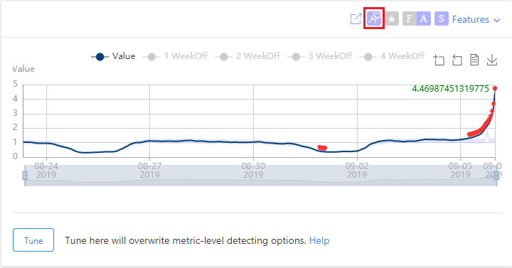
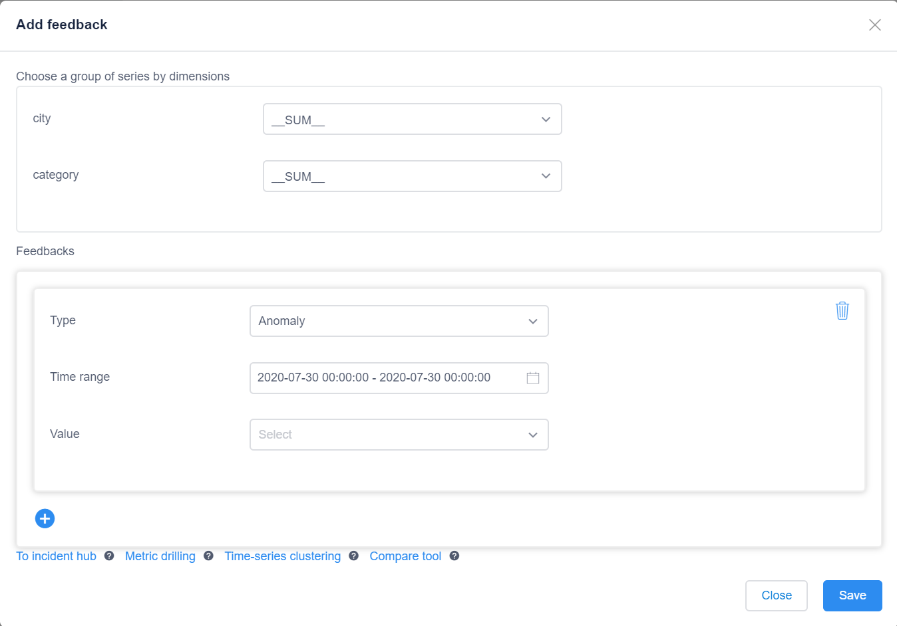
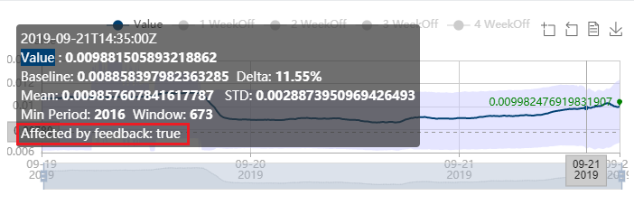

# Adjust anomaly detection using feedback

If you aren't satisfied with some of the anomaly detection results provided by Metrics Monitor, you can manually add feedback that will affect the model applied to your data. 

Use the buttons on the top right corner of the page to activate Feedback annotation mode.

After feedback annotation mode is activated, you can give feedback for one point, or multiple continuous points.

## Give feedback for one point 

With feedback annotation mode activated, click on a point to open a **Add feedback** panel. You can set the type of feedback you want to apply. This feedback will be incorporated in the detection for future points.  

* Select **Anomaly** if you think the point was incorrectly labeled by Metrics Monitor. You can specify whether a point should or shouldn't be an anomaly. 
* Select **ChangePoint** if you think the point indicates the start of a trend change.
* Select **Period** to indicate seasonality. Metric Monitor can automatically detect intervals of seasonality, or you can specify this manually. 

Consider leaving a comment in the **Comment** text box at the same time, and click **Save** to save your feedback.

## Give feedback for multiple continuous points

You can give feedback for multiple continuous points at once by clicking down and dragging your mouse on the points you want to annotate. You will see the same feedback menu as above. The same feedback will be applied to all chosen points after you click **Save**.

## How to view my feedback

To see if a point's anomaly detection has changed, hover over the point. The tooltip will show **Affected by feedback: true** if the detection was changed. If it displays **False**, then feedback calculation was done on the point, but the anomaly detection result was not changed.

## When should I annotate an anomaly as "normal"

There are many reasons when you might consider an anomaly is a false alarm. Consider using the following Metrics Advisor features if one of the following scenarios apply:

|Scenario  |Recommendation |
|---------|---------|
|The anomaly is caused by known data source change, for example a system change.     | Don't annotate this anomaly if this scenario isn't expected to regularly reoccur.        |
|The anomaly is caused by holiday.     | Use [Preset events](configure-metrics.md#preset-events) to flag anomaly detection at specified times.       |
|There is a regular pattern to detected anomalies (for example on weekends) and they should not be anomalies.      |Use the feedback feature, or preset events.        |

## Next steps
- [Diagnose incidents](diagnose-incident.md).
- [Configure metrics and fine tune detecting configuration](configure-metrics.md)
- [Create alerts](../how-tos/alerts.md)