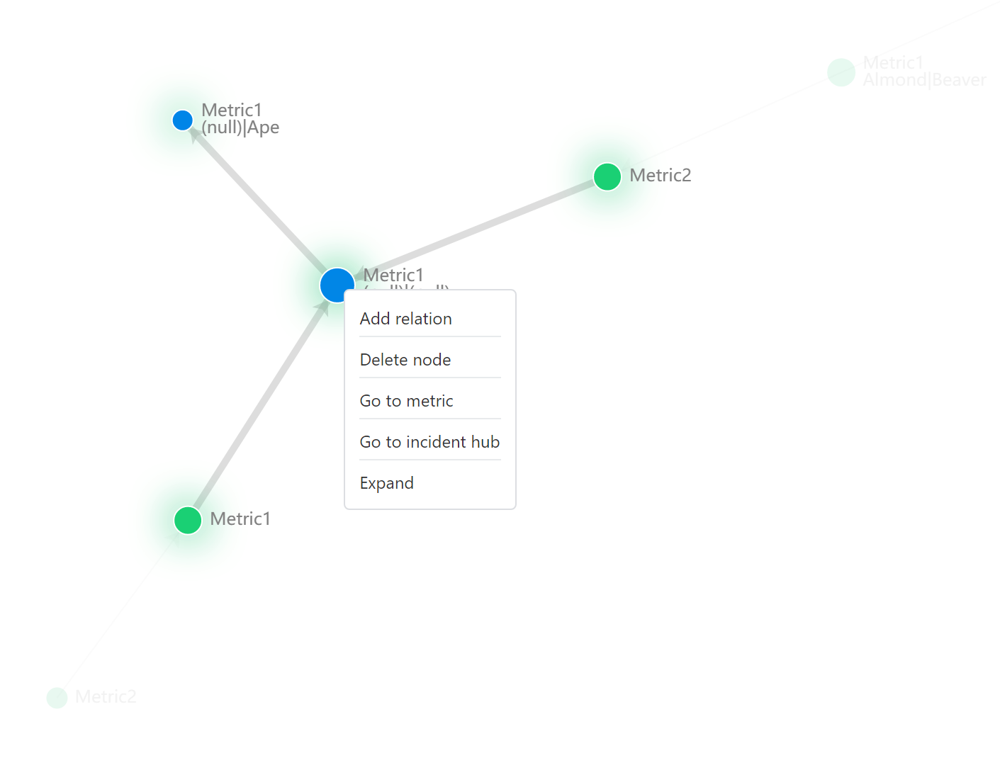
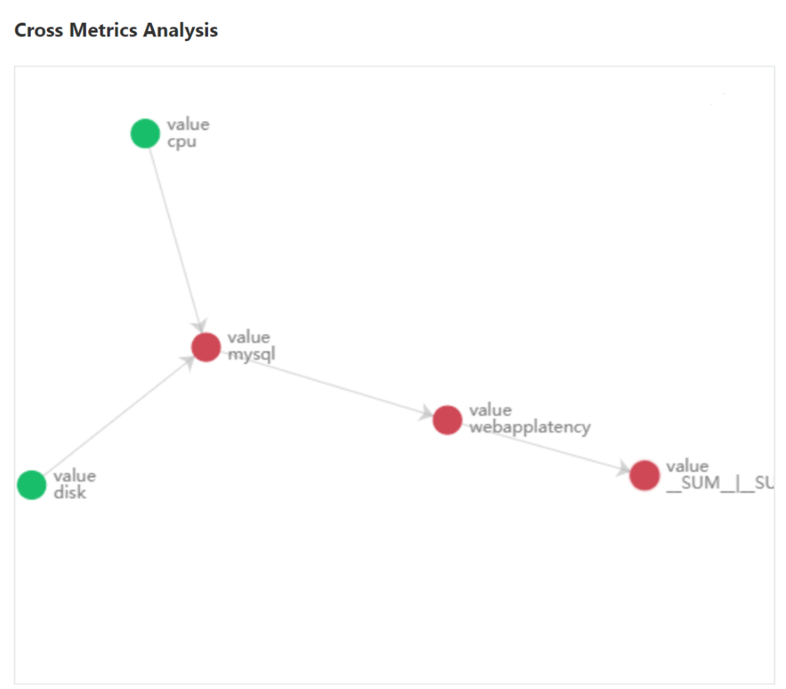

# How-to: Build a metrics graph to analyze related metrics

Each metric in Metrics Advisor is monitored separately by a model that learns from historical data to predict future trends. Each metric has a separate model that is applied to it. In some cases however, several metrics may relate to each other, and anomalies need to be analyzed across multiple metrics. The **Metrics Graph** helps with this. 

As an example, if you have different streams of telemetry in separate metrics, Metrics Advisor will monitor them separately. If anomalies in one metric cause anomalies in others, finding those relations and the root cause in your data can be helpful when addressing incidents. The metrics graph enables you to create a visual topology graph of found anomalies. 

## Select a metric to put the first node to the graph

Click the **Metrics Graph** tab in the navigation bar. The first step in building a metrics graph is to put a node onto the graph. Select a data feed and metric at the top of the page. A node will appear in the bottom panel. 

## Add a node/relation on existing node

Next you need to add another node and specify a relation to an existing node(s). Select an existing node and right click on it. A context menu will appear with several options. 

Click **Add relation**, and you will be able to choose another metric, and specify the relation type between the two nodes. You can also apply specific dimension filters. 

After repeating the above steps, you will have a metrics graph describing the relations between all related metrics.
**Hint on node colors**
> [!TIP]
> - When you select a metric and dimension filter, all the nodes with the same metric and dimension filter in the graph will be colored as **blue**.
> - Unselected nodes that represent a metric in the graph will be colored **green**.
> - If there's an anomaly observed in the current metric, the node will be colored **red**.

## View related metrics anomaly status in incident hub

When the metrics graph is built, whenever an anomaly is detected on metrics within the graph, you will able to view related anomaly statuses, and get a high-level view of the incident. 

Click into an incident within the graph and scroll down to **cross metrics analysis**, below the diagnostic information.

## Next steps

- [Adjust anomaly detection using feedback](anomaly-feedback.md)
- [Diagnose an incident](diagnose-incident.md).
- [Configure metrics and fine tune detecting configuration](configure-metrics.md)
