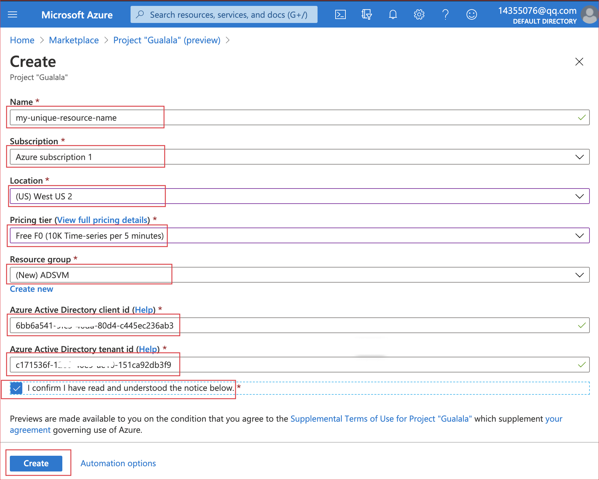

# Quickstart: Create a Metrics Advisor instance

Use this quickstart to get started with Metrics Advisor by creating an instance in your Azure subscription.

## Prerequisites

* Azure subscription - [Create one for free](https://azure.microsoft.com/free/cognitive-services/)

## Create a new Metrics Advisor resource

Use the [Azure Portal](https://aka.ms/newgualala) to create a new Metrics Advisor resource.

On the Create page, provide the following information:

| Information  | Description  |
|---------|---------|
|Name     | A descriptive, unique name for your resource.         |
|Subscription     | One of your available Azure subscriptions.        |
|Location     | The location of your resource. Different locations may introduce latency, but won't impact service availability.        |
|Pricing tier     | As of now there's only one S0(free) tier available.    |
|Resource Group     | The Azure resource group that will contain your resource. You can create a new group or add it to a pre-existing one.        |

After inputting all above fields, select **Create** to start deploying an instance. Normally it will take less than 10 mins to get the resource deployed. However, sometimes it may take around 30 minutes to complete.

You can start using your Metrics Advisor instance with the web portal, and through the REST API. You can check both URLs in the Cognitive service instance you've created.
If you want to access this service using the REST API or Client library, you will need an authentication key.

## Clean up resources

If you want to clean up and remove a Cognitive Services subscription, you can delete the resource or resource group. Deleting the resource group also deletes any other resources associated with it.

In the Azure portal, expand the menu on the left side to open the menu of services, and choose Resource Groups to display the list of your resource groups.
Locate the resource group containing the resource to be deleted
Right-click on the resource group listing. Select **Delete resource group**, and confirm.

## Next Steps

- [Build your first monitor on web](web-portal.md)
