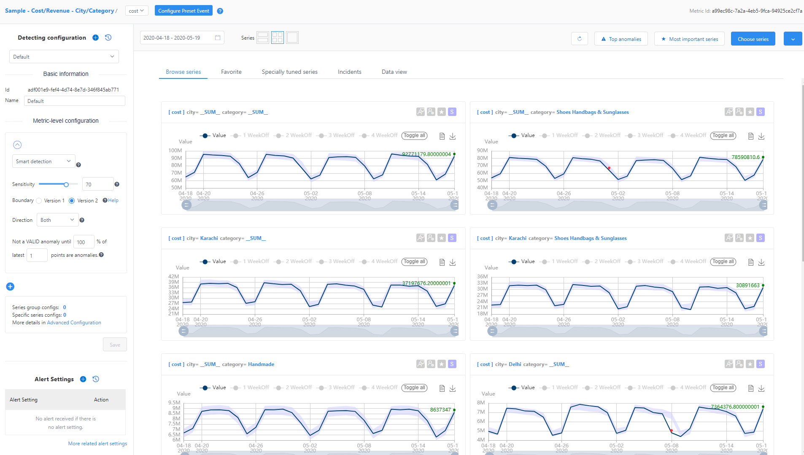
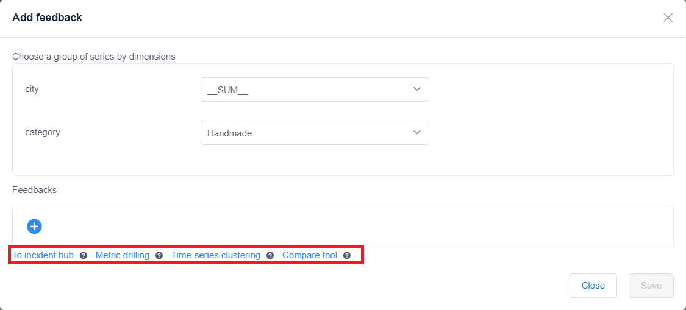

# Quickstart: Explore the Metrics Advisor demo with example data

> [!Note]
> The Metrics Advisor demo is read-only, and you will not be able to onboard your data. To use the service on your data, first [create a Metrics Advisor resource](web-portal.md).

Use this article to quickly start exploring the key features in Metrics Advisor. We provide a demo site with sample data and preset configurations, for you to get familiar with the fully featured Web portal.

Click [this link](https://aka.ms/MetricsAdvisor/Demo) to go to the demo site.

## View the available sample data

After you sign into into the demo site, you will see a **Data feed** page. a data feed is a logical group of time series data, which is queried from your data source. For more information on terms and concepts used in Metrics Advisor, see the [Glossary](../glossary.md). 

There are several data feeds listed, which are ingested from different types of data sources, such as Azure SQL database or Azure Table. Each uses slightly different configuration settings to connect to the associated data stores.

## Explore the data feed configurations

Click on the *Sample - Cost/Revenue - City/Category* data feed. You'll see several sections of details for the feed:

* Data feed name and ingestion status.
* A list of metrics queried from the data source. For example, *cost* and *revenue*. 
* Alert history for when the data feed becomes unavailable. 
* Logs of when the data feed was updated.   
* Data feed information and settings.

## View time series visualizations and configurations

Click into the *cost* metric in the *Sample - Cost/Revenue - City/Category* data feed. You'll see the associated time series sliced by dimensions, with visualizations according to the historical metric data. The blue band around the metric data represents the expected value range from Metrics Advisor's machine learning models. Points that fall outside of this band will be marked as red dots, which are detected anomalies. 

The anomaly detection is configurable by tuning the **detecting configurations** on the left side of metric details page. Multiple anomaly detection methods are available and you can combine them. You can additionally try different sensitivities, detecting directions, and other configurations. The **Advanced configuration** link at the bottom of **detecting configurations** lets you create more complex and customized detection settings, which can be used on groups or individual series. 

You can also tune anomaly detection by providing feedback to the detection algorithm. Click into an anomaly, and use the **Add feedback** panel to configure its anomaly status, seasonality, and change point status. This feedback will be incorporated in the detection for future points.  

At the bottom of the **Add feedback** panel, there's a link of **To incident hub**, which will direct you to incident analysis page and analyze root cause of the incident.  

## Explore anomaly detection results and perform root cause analysis

When you click the **To incident hub** link from an anomaly, you will see an incident analysis page, containing diagnostics insights about the incident, such as Severity, the number of anomalies involved, and start/end time. The **Root cause** section displays automated advice by analyzing the incident tree, taking into account: deviation, distribution and contribution to parent anomalies, which may be the root cause of the incident.

The **Diagnostics** section shows a tree of the incident, along with several tabs for diagnosing the incident.

By pinpointing root cause of the incident, you can take take action and mitigate the issue before the situation gets worse. You can also explore more insights by clicking through the other diagnostic features provided. 

## Next Step

- [Use the web portal](web-portal.md)
- [Use the REST API](rest-api.md)
- [Onboard your data feeds](../how-tos/onboard-your-data.md)
    - [Manage data feeds](../how-tos/manage-data-feeds.md)
    - [Configurations for different data sources](../data-feeds-from-different-sources.md)
