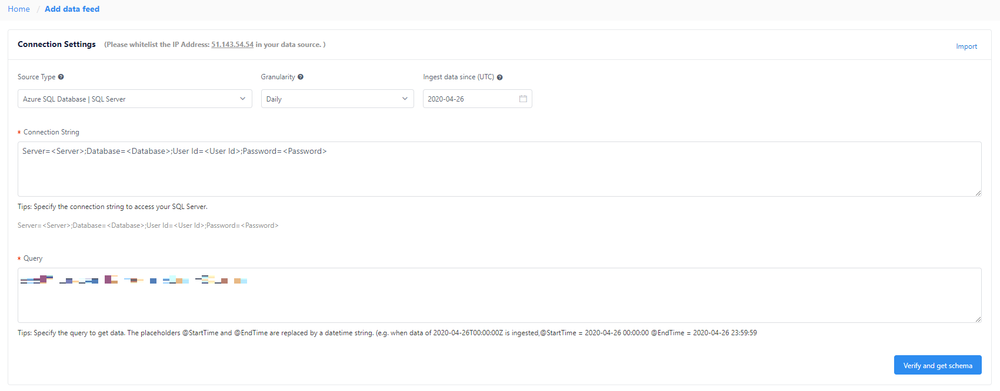
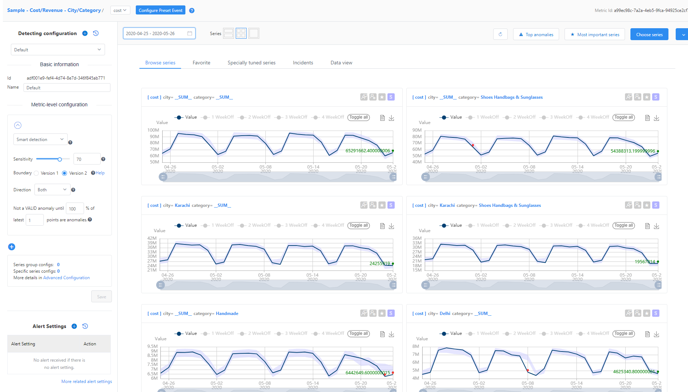

# Quickstart: Monitor your first metric using the web portal

When you provision a Metrics Advisor instance, you can use the APIs and web-based workspace to work with the service. The web-based workspace can be used as a straightforward way to quickly get started with the service. It also provides a visual way to configure settings, customize your model, and perform root cause analysis. 

* Onboard your metric data
* View your metrics and visualizations
* Fine-tune detection configurations
* Explore diagnostic insights
* Create and subscribe to anomaly alerts

## Prerequisites

* Azure subscription - [Create one for free](https://azure.microsoft.com/free/cognitive-services)
* Once you have your Azure subscription, <a href="https://go.microsoft.com/fwlink/?linkid=2142156"  title="Create a Metrics Advisor resource"  target="_blank">create a Metrics Advisor resource </a> in the Azure portal to deploy your Metrics Advisor instance.  

    
> [!TIP]
> * It may 10 to 30 minutes for your Metrics Advisor resource to deploy. Click **Go to resource** once it successfully deploys.
> * If you'd like to use the REST API to interact with the service, you will need the key and endpoint from the resource you create. You can find them in the  **Keys and endpoints** tab in the created resource.

This document uses a SQL Database as an example for creating your first monitor.

## Onboard time series data

Metrics Advisor provides connectors for different data sources, such as SQL Database, Azure Data Explorer, and Azure Table Storage. The steps for connecting data are similar for different connectors, although some configuration parameters may vary. See [connect your data from different sources](../data-feeds-from-different-sources.md) for the required parameters for specific data sources.

This quickstart uses a SQL Database as an example. You can also ingest your own data follow the same steps.

To get started, sign into your Metrics Advisor workspace, with your Active Directory account. From the landing page, select your **Directory**, **Subscription** and **Workspace** that just created, then click **Get started**. After the main page of the workload loads, select **Add data feed** from the left menu.

### Data schema requirements and configuration

[!INCLUDE [data schema requirements](../includes/data-schema-requirements.md)]

### Configure connection settings

> [!TIP]
> See [how to add data feeds](../how-tos/onboard-your-data.md) for details on the available parameters.

Add the data feed by connecting to your time-series data source. Start by selecting the following parameters:

* **Source Type**: The type of data source where your time series data is stored.
* **Granularity**: The interval between consecutive data points in your time series data, for example Yearly, Monthly, Daily. The lowest interval customization supports is 60 seconds.
* **Ingest data since (UTC)**: The start time for the first timestamp to be ingested. 

Next, specify the **Connection string** with the credentials for your data source, and a custom **Query**. The query is used to specify the data to be ingested, and converted into the required schema.

[!INCLUDE [query requirements](../includes/query-requirements.md)]

### Verify the connection and load the data schema

After the connection string and query string are created, select **Verify and get schema** to verify the connection and run the query to get your data schema from the data source. Normally it takes a few seconds depending on your data source connection. If there's an error at this step, confirm that:

1. Your connection string and query are correct.
2. Your Metrics Advisor instance is able to connect to the data source if there are firewall settings.

### Schema configuration

Once the data schema is loaded and shown like below, select the appropriate fields.

|Selection  |Description  |Notes  |
|---------|---------|---------|
|**Timestamp**     | The timestamp of a data point. If omitted, Metrics Advisor will use the timestamp when the data point is ingested instead. For each data feed, you could specify at most one column as timestamp.        | Optional. Should be specified with at most one column.       |
|**Measure**     |  The numeric values in the data feed. For each data feed, you could specify multiple measures but at least one column should be selected as measure.        | Should be specified with at least one column.        |
|**Dimension**     | Categorical values. A combination of different values identifies a particular single-dimension time series, for example: country, language, tenant. You could select none or arbitrary number of columns as dimensions. Note: if you're selecting a non-string column as dimension, be cautious with dimension explosion. | Optional.        |
|**Ignore**     | Ignore the selected column.        |         |

### Automatic roll up settings

> [!IMPORTANT]
> If you'd like to enable **root cause analysis** and other diagnostic capabilities, 'automatic roll up setting' needs to be configured. 
> Once enabled, the automatic roll up settings cannot be changed.

Metrics Advisor can automatically perform aggregation(SUM/MAX/MIN...) on each dimension during ingestion, then builds a hierarchy which will be used in root case analysis and other diagnostic features. See [Automatic roll up settings](../how-tos/onboard-your-data.md#automatic-roll-up-settings) for more details.

Give a custom name for the data feed, which will be displayed in your workspace. Click on **Submit**. 

## Tune detection configuration

After the data feed is added, Metrics Advisor will attempt to ingest metric data from the specified start date. It will take some time for data to be fully ingested, and you can view the ingestion status by clicking **Ingestion progress** at the top of the data feed page. If data is ingested, Metrics Advisor will apply detection, and continue to monitor the source for new data.

When detection is applied, click one of the metrics listed in data feed to find the **Metric detail page** to: 
- View visualizations of all time series slices under this metric
- Update detecting configuration to meet expected results
- Set up notification for detected anomalies

## View the diagnostic insights

After tuning the detection configuration, anomalies that are found should reflect actual anomalies in your data. Metrics Advisor performs analysis on multi-dimensional metrics, like anomaly clustering, incident correlation and root cause analysis. Use these features to analyze and diagnose incidents in your data.

To view the diagnostic insights, click on the red dots on time series visualizations, which represent detected anomalies. A window will appear with a link to incident analysis page. 

After clicking the link, you will be pivoted to the incident analysis page which analyzes on corresponding anomaly, with a bunch of diagnostics insights. At the top, there will be statistics about the incident, such as **Severity**, **Anomalies involved**, and impacted **Start time** and **End time**. 

Next you'll see the ancestor anomaly of the incident, and automated root-cause advice. This automated root cause advice is generated by analyzing the incident tree of all related anomalies, including: deviation, distribution and contribution to the parent anomalies. 

Based on these, you can already get a straightforward view of what is happening and the impact of the incident as well as the most potential root cause. So that immediate action could be taken to resolve incident as soon as possible. 

But you can also pivot across more diagnostics insights leveraging additional features to drill down anomalies by dimension, view similar anomalies and do comparison across metrics. Please find more at [How to: diagnose an incident](../how-tos/diagnose-incident.md). 

## Get notified when new anomalies are found

If you'd like to get alerted when an anomaly is detected in your data, you can create a subscription for one or more of your metrics. Metrics Advisor uses hooks to send alerts. Three types of hooks are supported: email hook, web hook and Azure DevOps. We'll use web hook as an example. 

### Create a web hook

A web hook is the entry point to get anomaly noticed by a programmatic way from the Metrics Advisor service, which calls a user-provided API when an alert is triggered.For details on how to create a hook, please refer to the **Create a hook** section in [How-to: Configure alerts and get notifications using a hook](../how-tos/alerts.md#create-a-hook). 

### Configure alert settings

After creating a hook, an alert setting determines how and which alert notifications should be sent. You can set multiple alert settings for each metric. two important settings are **Alert for** which specifies the anomalies to be included, and **Filter anomaly options** which defines which anomalies to include in the alert. See the **Add or Edit alert settings** section in [How-to: Configure alerts and get notifications using a hook](../how-tos/alerts.md#add-or-edit-alert-settings) for more details.

## Next steps

- [Onboard your data feeds](../how-tos/onboard-your-data.md)
    - [Manage data feeds](../how-tos/manage-data-feeds.md)
    - [Configurations for different data sources](../data-feeds-from-different-sources.md)
- [Use the REST API or Client libraries](rest-api.md)
- [Configure metrics and fine tune detecting configuration](../how-tos/configure-metrics.md)