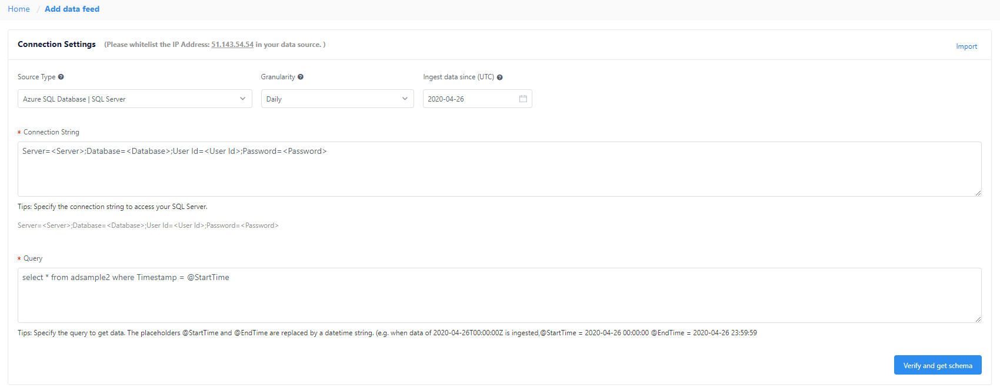

# Quickstart: Build your first Metrics monitor on the web

Metrics Monitor provides a web portal to help you onboard your data and begin using the service. 

Use the portal to:
* Interact with your metrics
* Onboarding your data
* Set up detection configurations
* View time-series visualizations
* Explore diagnostic insights 
* Create alerts and subscriptions 

## Prerequisites

* Azure subscription - [Create one for free](https://azure.microsoft.com/free/cognitive-services/)
* A [Metrics Monitor instance](create-instance.md)
  * You can access the web portal for your instance at: `https://<resource-name>.azurewebsites.net` where `<resource-name>` is the name for your Metrics Monitor resource.

This document uses a SQL Database as an example for creating your first monitor.

## Onboard time series data

Metrics Monitor provides connectors different data sources, such as SQL Database, Azure Data Explorer, and Azure Table Storage. The steps for connecting data are similar for different connectors, although some parameters may vary. 

This quickstart uses a SQL Database as an example.

To get started, sign into your Metrics Monitor portal, with your Active Directory account. from the landing page, select **Get started**. After the main page of the portal loads, select **Add data feed** from the left menu.

### Configure connection settings

> [!TIP]
> See [how to add data feeds](../how-tos/datafeeds.md) for details on the available parameters.

Add the data feed by connecting to your time-series data source. Start by selecting the following parameters:

* **Source Type**: The type of data source where your time series data is stored.
* **Granularity**: The interval between consecutive data points in your time series data, for example Yearly, Monthly, Daily. The lowest interval customization supports is 60 seconds.
* **Ingest data since (UTC)**: The start time for the first timestamp to be ingested. 

Next, specify the **Connection string** with the credentials for your data source, and a custom **Query**. The query is used to specify the data to be ingested, and converted into the required schema.

### Verify the connection and load the data schema

After the connection string and query string are created, select **Verify and get schema** to verify the connection and run the query to get your data schema from the data source. Normally it takes a few seconds depending on your data source connection. If there's an error at this step, confirm that:

1. Your connection string and query are correct.
2. Your Metrics Monitor instance is able to connect to the data source if there are firewall settings.

### Schema configuration

Once the data schema is loaded and shown like below, select the appropriate fields.

|Selection  |Description  |Notes  |
|---------|---------|---------|
|**Timestamp**     | The timestamp of a data point. If omitted, Metrics Monitor will use the timestamp when the data point is ingested instead. For each data feed, you could specify at most one column as timestamp.        | Optional. Should be specified with at most one column.       |
|**Measure**     |  The numeric values in the data feed. For each data feed, you could specify multiple measures but at least one column should be selected as measure.        | Should be specified with at least one column.        |
|**Dimension**     | Categorical values. A combination of different values identifies a particular single-dimension time series, for example: country, language, tenant. You could select none or arbitrary number of columns as dimensions. Note: if you're selecting a non-string column as dimension, be cautious with dimension explosion. | Optional.        |
|**Ignore**     | Ignore the selected column.        |         |

Give a custom name for the data feed, which will be displayed on the portal. Click on **Submit**. 

## Tune detection configuration

After the data feed is added, Metrics Monitor will attempt to ingest metric data from the specified start date. It will take some time for data to be fully ingested, and you can view the ingestion status by clicking **Ingestion progress** at the top of the data feed page. If data is ingested, Metrics Monitor will apply detection, and continue to monitor the source for new data.

When detection is applied, click one of the metrics listed in data feed to find the **Metric detail page** to: 
- View visualizations of all time series slices under this metric
- Update detecting configuration to meet expected results
- Set up notification for detected anomalies

## Next Steps

- [Add a data feed](../how-tos/datafeeds.md)