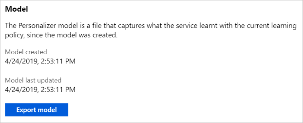

# How to manage model and learn settings

The machine-learned model is the combination of the current data from the Rank and Reward calls and the learning policy. 

## Export the Personalizer model

From the Resource management's section for **Model and learning settings**, review model creation and last updated date and export the current model. You can use the Azure portal or the Personalizer APIs to export a model file for archival purposes.

## Clear data for your learning loop

1. In the Azure portal, for your Personalizer resource, on the **Model and learning settings** page, select **Clear data**.
1. In order to clear all data, and reset the learning loop to the original state, select all 3 check boxes.

    

    |Value|Purpose|
    |--|--|
    |Logged personalization and reward data.|This logging data is used in offline evaluations. Clear the data if you are resetting your resource.|
    |Reset the Personalizer model.|This model changes on every retraining. This frequency of training is specified in **upload model frequency** on the **Configuration** page. |
    |Set the learning policy to default.|If you have changed the learning policy as part of an offline evaluation, this resets to the original learning policy.|

1. Select **Clear selected data** to begin the clearing process. Status is reported in Azure notifications, in the top-right navigation.