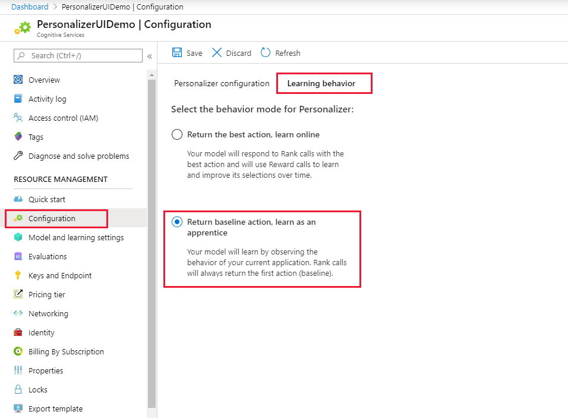
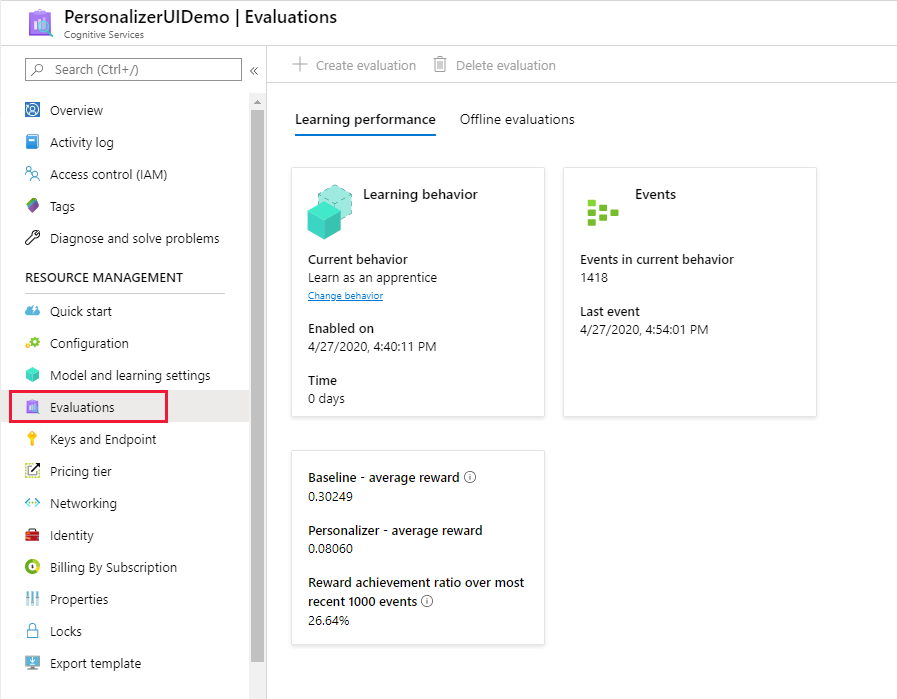

# Configure the Personalizer learning behavior

Apprentice mode gives you confidence in the Personalizer service and its machine learning capabilities, and provides metrics that the service is sent information that can be learned from – without risking online traffic.

Configure the learning behavior on the **Configuration** page, on the **Learning behavior** tab, in the Azure portal for that Personalizer resource.

## Use an enterprise resource

In order to use Apprentice mode for your Personalizer resource, use the Azure portal to [create the resource](how-to-create-resource.md) in the `E0` pricing tier.  You can upgrade an existing resource to the `E0` pricing tier on the **Pricing tier** page of the Personalizer resource.

## Configure Apprentice mode

In the Azure portal for your Personalizer resource, on the **Configuration** page, on the **Learning behavior** tab, select **Learn as an apprentice** then select **Save**.

> [!div class="mx-imgBorder"]
> 

## Changes to the existing application

Your existing application shouldn't change how it currently selects actions to display or how the application determines the value, **reward** of that action. The only change to the application is the order of the actions sent to Personalizer's Rank API. The action your application currently displays is sent as the _first action_ in the action list. The Rank API uses this first action to train your Personalizer model.

## Configure your application to call Rank API

You need to add calls to the Rank and Reward APIs, in order to add Personalizer to your application.

1. Add the Rank API call after the point in your existing application logic where you determine the list of actions and their features. The first action in the actions list should be the action selected by your existing logic.

1. Configure your code to display the action associated with the response's **Reward Action ID**.

    In Apprentice mode, this action is selected by your existing logic, to train your model and not adversely impact your application while the model is training. In Online mode, this action is selected by Personalizer.

## Configure your application to call Reward API

1. Use your existing business logic to calculate the **reward** of the displayed action. The value needs to be in the range from 0 to 1. You can delay returning the reward until the full value of the action is known.

1. If you don't return the reward within the configured **Reward wait time**, the default reward will be used instead.

## Evaluate Apprentice mode

1. In the Azure portal, on the **Evaluations** page for your Personalizer resource, review the **Current learning behavior performance**.

    > [!div class="mx-imgBorder"]
    > 

1. The **Baseline - average reward** value indicates the rewards from your existing application logic. The **Personalizer - average reward** value indicates how the current Personalizer model would perform. The **Rolling average reward over most recent 1000 events** gives you a snapshot of how well the Personalizer model is performing above your baseline.

## Evaluate Apprentice mode features

Evaluate the features using an [offline evaluation](how-to-offline-evaluation.md).

## Switch to Online mode

When you determine Personalizer is trained with an average of 70-85% rolling average, the model is ready to switch to Online mode.

In the Azure portal for your Personalizer resource, on the **Configuration** page, on the **Learning behavior** tab, select **Return the best action** then select **Save**.

## Next steps

* [Manage model and learning settings](how-to-manage-model.md)