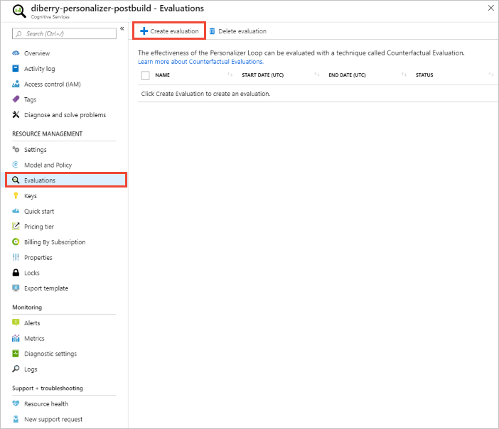
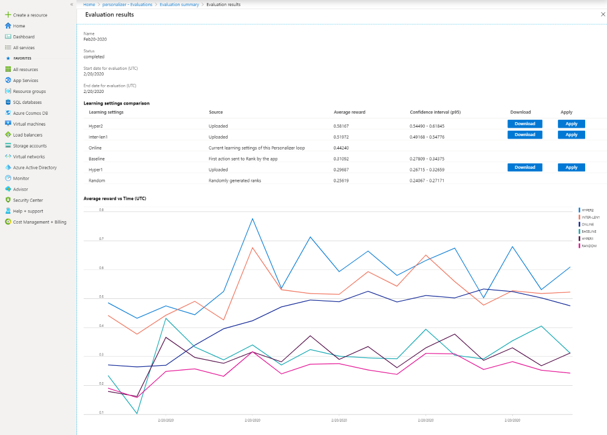

# How to analyze your learning loop with an offline evaluation

Learn how to complete an offline evaluation and understand the results.

Offline Evaluations allow you to measure how effective Personalizer is compared to your application's default behavior, learn what features are contributing most to personalization, and discover new machine learning settings automatically.

Read about [Offline Evaluations](concepts-offline-evaluation.md) to learn more.

## Prerequisites

* A configured Personalizer loop
* The Personalizer loop must have a representative amount of data - as a ballpark we recommmend at least 50,000 events in its logs for meaningful evaluation results. Optionally, you may also have previously exported _learning policy_ files you can compare and test in the same evaluation.

## Steps to Start a new offline evaluation

1. In the [Azure portal](https://azure.microsoft.com/free/), locate your Personalization resource.
1. In the Azure portal, go to the **Evaluations** section and select **Create Evaluation**.
    
1. Select the following settings:

    * An evaluation name
    * Start and end date - these are dates in the past, that specify the range of data to use in the evaluation. This data must be present in the logs, as specified in the [Data Retention](how-to-settings.md) setting.
    * Optimization Discovery set to **yes**

    

1. Start the Evaluation by selecting **Ok**. 

## Results

Evaluations can take a long time to run, depending on the amount of data to process, number of learning policies to compare, and whether an optimization was requested.

Once completed, you can select the evaluation from the list of evaluations. 

Comparisons of Learning Policies include:

* **Online Policy**: The current Learning Policy used in Personalizer
* **Baseline**: The application's default (as determined by the first Action sent in Rank calls),
* **Random Policy**: An imaginary Rank behavior that always returns random choice of Actions from the supplied ones.
* **Custom Policies**: Additional Learning Policies uploaded when starting the evaluation.
* **Optimized Policy**: If the evaluation was started with the option to discover an optimized policy, it will also be compared, and you will be able to download it or make it the online learning policy, replacing the current one.

Effectiveness of [Features](concepts-features.md) for Actions and Context.

## More Information

* Learn [how offline evaluations work](concepts-offline-evaluation.md).
