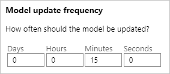
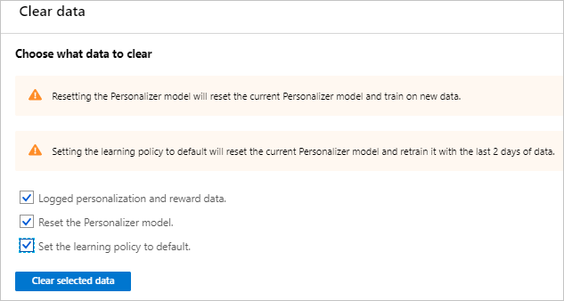

# Create Personalizer resource

### Configure reward for the feedback loop based on use case

Configure the service for your feedback loop's use of rewards. Changes to the following values will reset the current Personalizer model and retrain it with the last 2 days of data:

|Value|Purpose|
|--|--|
|Reward wait time|​Sets the length of time during which Personalizer will collect reward values for a Rank call, starting from the moment the Rank call happens. This value is set by asking: "How long should Personalizer wait for rewards calls?" Any reward arriving after this window will be logged but not used for learning.|
|Default reward|If no reward call is received by Personalizer during the Reward Wait Time window associated to a Rank call, Personalizer will assign the Default Reward. By default, and in most scenarios, the Default Reward is zero.|
|Reward aggregation|If multiple rewards are received for the same Rank API call, this aggregation method is used: **sum** or **earliest**. Earliest picks the earliest score received and discards the rest. This is useful if you want unique reward among possibly duplicate calls. |

After changing these values, make sure to select **Save**.

### Configure exploration

Personalization is able to discover new patterns and adapt to user behavior changes over time by exploring alternatives. The **Exploration** value determines what percentage of Rank calls are answered with exploration.

Changes to this value will reset the current Personalizer model and retrain it with the last 2 days of data.

After changing this value, make sure to select **Save**.

### Model update frequency

The latest model, trained from Reward API calls from every active event, isn't automatically used by Personalizer Rank call. The **Model update frequency** sets how often the model used by the Rank call up updated.

High model update frequencies are useful for situations where you want to closely track changes in user behaviors. Examples include sites that run on live news, viral content, or live product bidding. You could use a 15-minute frequency in these scenarios. For most use cases, a lower update frequency is effective. One-minute update frequencies are useful when debugging an application's code using Personalizer, doing demos, or interactively testing machine learning aspects.

After changing this value, make sure to select **Save**.

### Data retention

**Data retention period** sets how many days Personalizer keeps data logs. Past data logs are required to perform [offline evaluations](concepts-offline-evaluation.md), which are used to measure the effectiveness of Personalizer and optimize Learning Policy.

After changing this value, make sure to select **Save**.

## Export the Personalizer model

From the Resource management's section for **Model and learning settings**, review model creation and last updated date and export the current model. You can use the Azure portal or the Personalizer APIs to export a model file for archival purposes.

## Clear data for your learning loop

1. In the Azure portal, for your Personalizer resource, on the **Model and learning settings** page, select **Clear data**.
1. In order to clear all data, and reset the learning loop to the original state, select all 3 check boxes.

    

    |Value|Purpose|
    |--|--|
    |Logged personalization and reward data.|This logging data is used in offline evaluations. Clear the data if you are resetting your resource.|
    |Reset the Personalizer model.|This model changes on every retraining. This frequency of training is specified in **upload model frequency** on the **Configuration** page. |
    |Set the learning policy to default.|If you have changed the learning policy as part of an offline evaluation, this resets to the original learning policy.|

1. Select **Clear selected data** to begin the clearing process. Status is reported in Azure notifications, in the top-right navigation.

## Next steps

[Learn how to manage a learning policy](how-to-learning-policy.md)
