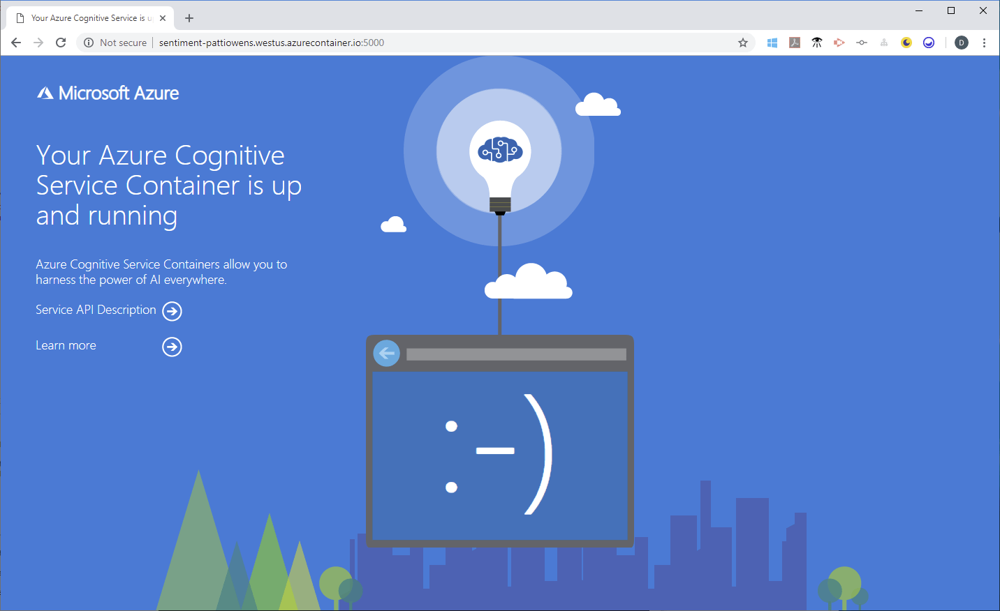

# Deploy a Text Analytics container to Azure Container Instances

Learn how to deploy the Cognitive Services [Text Analytics][install-and-run-containers] container to Azure [Container Instances][container-instances]. This procedure exemplifies the creation of a Text Analytics resource, the creation of an associated Sentiment Analysis image and the ability to exercise this orchestration of the two from a browser. Using containers can shift the developers' attention away from managing infrastructure to instead focusing on application development.

## Prerequisites

* Use an Azure subscription. If you don't have an Azure subscription, create a [free account](https://azure.microsoft.com/free/) before you begin.

> [!NOTE]
> If you're using the Text Analytics for health container, you can find a powershell script below to automate to create a resource for you. 

[!INCLUDE [Create a Cognitive Services Text Analytics resource](../includes/create-text-analytics-resource.md)]

[!INCLUDE [Create a Text Analytics Containers on Azure Container Instances](../../containers/includes/create-container-instances-resource.md)]

#### [Key Phrase Extraction](#tab/keyphrase)

[!INCLUDE [Verify the Key Phrase Extraction container instance](../includes/verify-key-phrase-extraction-container.md)]

#### [Language Detection](#tab/language)

[!INCLUDE [Verify the Language Detection container instance](../includes/verify-language-detection-container.md)]

#### [Sentiment Analysis](#tab/sentiment)

[!INCLUDE [Verify the Sentiment Analysis container instance](../includes/verify-sentiment-analysis-container.md)]

#### [Text Analytics for health](#tab/health)

### Verify that a container is running

1. Select the **Overview** tab, and copy the IP address.
1. Open a new browser tab, and enter the IP address. For example, enter `http://<IP-address>:5000 (http://55.55.55.55:5000`). The container's home page is displayed, which lets you know the container is running.

    

1. Select the **Service API Description** link to go to the container's Swagger page.

1. Choose any of the **POST** APIs, and select **Try it out**. The parameters are displayed, which includes example input.

There are several URLs you can also use to verify that the container is running.

|Request|Purpose|
|--|--|
|`http://localhost:5000/`|The container provides a home page.|
|`http://localhost:5000/ready`|Requested with GET, this provides a verification that the container is ready to accept a query against the model. This request can be used for Kubernetes [liveness and readiness probes](https://kubernetes.io/docs/tasks/configure-pod-container/configure-liveness-readiness-probes/).|
|`http://localhost:5000/status`|Requested with GET, like the /ready endpoint, this validates that the container is running without incurring a query against the model. This request can be used for Kubernetes [liveness and readiness probes](https://kubernetes.io/docs/tasks/configure-pod-container/configure-liveness-readiness-probes/).|
|`http://localhost:5000/swagger`|Through this URL, the container provides a full set of documentation for the endpoints and a `Try it now` feature. With this feature, you can enter your settings into a web-based HTML form and make the query without having to write any code. After the query returns, an example CURL command is provided to demonstrate the HTTP headers and body format that's required. |
|`http://localhost:5000/demo`|(***NEW in May release***) Requested through a browser, this feature provides an interactive visualization of the results from queries of input text samples or one you provide.  |

Use this request URL - `http://localhost:5000/text/analytics/v3.0-preview.1/domains/health` - to submit a query to the container.

***

## Next steps 

* Use more [Cognitive Services Containers](../../cognitive-services-container-support.md)
* Use the [Text Analytics Connected Service](../vs-text-connected-service.md)

[install-and-run-containers]: ./text-analytics-how-to-install-containers.md
[container-instances]: https://docs.microsoft.com/azure/container-instances