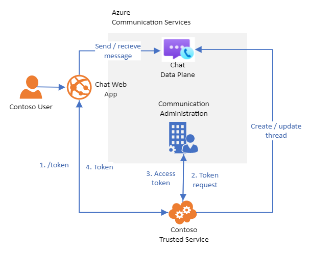

# Chat concepts

[!INCLUDE [Public Preview Notice](../../includes/public-preview-include.md)]

Azure Communication Services Chat SDKs can be used to add rich, real-time chat to your applications. These SDKs give you access to the same technology that powers Skype and Teams without requiring you to manage the underlying infrastructure yourself.

See the [Communication Services chat SDK Overview](./chat-sdk-features.md) to learn more about SDK capabilities.

## Chat Overview 

A chat conversation is represented by a chat thread. A chat thread can contain many messages and many users. Every message belongs uniquely to a thread, and a user can be part of one or many threads. 

Each user in the chat thread is a called member. You can have up to 250 members in a chat thread. Only thread members can send and receive messages in a chat thread. Max message size allowed is approximately 28KB. Communication Services stores chat history until you execute a delete operation on the chat thread. You can retrieve all messages in a chat thread using the `List Messages` operation.

For chat threads with more than 20 members, read receipts and typing indicator features are disabled. 

## Message Types

Apart from messages being sent by members in chat thread, Chat also exposes system generated messages called `Thread Activities` that are generated when a chat thread is updated. Developers can use these system messages to identify when each of the operation happened and update the UI. For example, you may want to display member added and removed actions between the messages of a conversation. Thread activities are part of message history and can be retrieved by calling `List Messages`. Supported message types are:  

 - Text: Actual message composed and sent by user as part of chat conversation. 

 - `ThreadActivity/AddMember`: System message that indicates one or more members have been added to the chat thread. For example:
```xml
<addmember>
    <eventtime>1598478187549</eventtime>
    <initiator>8:acs:57b9bac9-df6c-4d39-a73b-26e944adf6ea_3f0116-7c009490dc</initiator>
    <detailedinitiatorinfo>
        <friendlyName>User 1</friendlyName>
    </detailedinitiatorinfo>
    <rosterVersion>1598478184564</rosterVersion>
    <target>8:acs:57b9bac9-df6c-4d39-a73b-26e944adf6ea_3f0116-7c009490dc</target>
    <detailedtargetinfo>
        <id>8:acs:57b9bac9-df6c-4d39-a73b-26e944adf6ea_3f0116-7c009490dc</id>
        <friendlyName>User 1</friendlyName>
    </detailedtargetinfo>
    <target>8:acs:57b9bac9-df6c-4d39-a73b-26e944adf6ea_4b0143-7c019490d3</target>
    <detailedtargetinfo>
        <id>8:acs:57b9bac9-df6c-4d39-a73b-26e944adf6ea_4b0143-7c019490d3</id>
        <friendlyName>User 2</friendlyName>
    </detailedtargetinfo>
</addmember>
```  

 - `ThreadActivity/DeleteMember`: System message that indicates a member has been removed from the chat thread. For example:
```xml
<deletemember>
    <eventtime>1598478187642</eventtime>
    <initiator>8:acs:57b9bac9-df6c-4d39-a73b-26e944adf6ea_3f0116-7c009490dc</initiator>
    <detailedinitiatorinfo>
        <friendlyName>User 1</friendlyName>
    </detailedinitiatorinfo>
    <rosterVersion>1598478184564</rosterVersion>
    <target>8:acs:57b9bac9-df6c-4d39-a73b-26e944adf6ea_4b0143-7c019490d3</target>
    <detailedtargetinfo>
        <id>8:acs:57b9bac9-df6c-4d39-a73b-26e944adf6ea_4b0143-7c019490d3</id>
        <friendlyName>User 2</friendlyName>
    </detailedtargetinfo>
</deletemember>
```

 - `ThreadActivity/TopicUpdate`: System message that indicates the topic has been updated. For example:
```xml
<topicupdate>
    <eventtime>1598477591811</eventtime>
    <initiator>8:acs:57b9bac9-df6c-4d39-a73b-26e944adf6ea_3f0116-7c009490dc</initiator>
    <value>New topic</value>
</topicupdate>
```

## Real-time Signaling Events 

Chat JS SDK comes with real-time signaling features which allows clients to listen for live updates to a chat thread, without having to poll the APIs. The available events are:

 - `ChatMessageReceived` - when a new message is sent to a chat thread that the user is member of. This event is not sent for auto generated system messages which we discussed in the previous topic.  
 - `ChatMessageEdited` - when a message is edited in a chat thread that the user is member of. 
 - `ChatMessageDeleted` - when a message is deleted in a chat thread that the user is member of. 
 - `TypingIndicatorReceived` - when another member is typing a message in a chat thread that the user is member of. 
 - `ReadReceiptReceived` - when another member has read the message that user sent in a chat thread. 

## Chat Architecture

There are two core parts to chat architecture: 1) Trusted Service and 2) Client Application.



 - **Trusted Service:** In order to properly manage the chat session, you'll need a central service that will set up the chat session with Communication Services. In order to set up the session you'll need to pass through the full connection string, so it is preferable (and secure) to do this in a trusted environment. This service then will perform the following functions:
    - Create chat threads
    - Add/remove users from chat threads
    - Pass access tokens for chat thread to users. More information on access tokens [here](../../quickstarts/user-access-tokens.md)

 - **Client App:** A key aspect of a chat application is the user experience for chat participants to send and receive messages. Here you have the freedom to use your choice of frontend experience using Communication Services chat client SDKs. The client app will need to perform some core functions:
    - Connect to your trusted service to receive required access tokens
    - Connect directly to Communication Services to send and receive messages


## Next steps

> [!div class="nextstepaction"]
> [Get started with chat](../../quickstarts/chat/get-started-with-chat.md)

The following documents may be interesting to you:

- Familiarize yourself with the [Chat SDK](chat-sdk-features.md)
