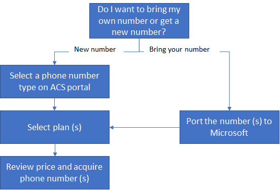

# Plan your telephony and SMS solution

[!INCLUDE [Public Preview Notice](../../includes/public-preview-include.md)]

This document describes the various telephony plans and number types that Azure Communication Services has to offer. We'll walk through the decision flows to help you select a voice service provider, phone number types, plans, and capabilities made available through Communication Services.

## About phone numbers in Azure Communications Services

Azure Communication Services allows you to use phone numbers to place and receive telephony calls and SMS messages. These phone numbers can be used to configure caller ID on outbound calls placed by your service.
  
If you don't have an existing phone number to import into your Communication Services solution, the simplest way to begin is to get a new phone number from Azure Communication Services in a matter of minutes.

If you have an existing telephone number that you want to continue using in your solution (for example, 1-800–COMPANY), you can port the phone number from the existing provider to Communication Services. (Coming soon, see [roadmap](../../roadmap.md))

The following diagram helps you to navigate through the available options:

Now, let's review the phone number types and capabilities available through Communication Services. 

## Microsoft direct offer of phone numbers and capabilities

Azure Communication Services provides excellent flexibility for developers. On most phone numbers, we allow you to configure an "a la carte" set of plans. Some developers only need an inbound calling plan; some might opt for inbound calling and outbound SMS plans. These plans can be selected as you lease and/or port your telephone numbers within Communication Services.

The available plans depend on the country and phone number type that you're operating within.The diagram below represents the decision flow:	The available plans depend on the country and phone number type that you're operating within.

Before you can select a phone number type, let’s review the international phone numbering plan.

### Optional reading. International public telecommunication numbering plan (E.164)

> [!NOTE]
> We recommend reviewing this information even if you are familiar with the E.164 phone numbering plan to better understand the number types and capabilities offered by Azure Communication Services direct offer.

The international public telecommunication numbering plan is defined in The International Telecommunication Union (ITU) recommendation E.164. Conforming numbers are limited to a maximum of 15 digits.

The phone number consists of

-	A prefix “+”
-	An international dialing prefix or country/region code (one, two or three digits) 
-	*(Optional)* A national destination code or numbering plan, commonly referred to as an area code. The length of this code depends on the country. In the United States, it's three digits. In Australia and New Zealand, it's one digit. Germany, Japan, Mexico, and some other countries have variable lengths of the area codes. For example, in Germany, the area code can be anywhere from two to five digits, while in Japan it can be anywhere from one to five digits.
-	A subscriber number

> [!NOTE]
> The classification above does not fully conform to the ITU E.164 standard and intended to provide a simplified description. For example, the subscriber number is subdivided within the standard. If you're interested in learning about the international numbering plan more deeply, the [ITU E.164 standard](https://www.itu.int/rec/T-REC-E.164) is an excellent place to start.  

Here are some examples that will help you better understand the numbering plan:

A regional phone number in the US:

A regional phone number in Canada:

A toll-free number in North America region:

A mobile phone number in the UK:

Next, let's review specific phone number types available in Azure Communication Services.

## Phone number types in Azure Communication Services

Microsoft offers regional and toll-Free plans for short codes and mobile numbers in countries where applicable.

The table below summarizes these phone number types: 

| Phone number type | Example                             | Country availability    | Common use case                                                                                                     |
| ----------------- | ----------------------------------- | ----------------------- | ------------------------------------------------------------------------------------------------------------------- |
| Regional          | +1 (geographic area code) XXX XX XX | US, Canada, Puerto Rico | Assigning phone numbers to users in your applications or assigning to Interactive Voice Response (IVR) systems/Bots |
| Toll-Free         | +1 (toll-free area code) XXX XX XX  | US, Canada, Puerto Rico | Assigning to Interactive Voice Response (IVR) systems/Bots, SMS applications                                        |

## Plans 

Let’s look at the capabilities you can enable for your phone numbers. These capabilities vary by country due to regulatory requirements. Azure Communication Services offers the following capabilities:

|  |
| ------------ |
| **One-way outbound SMS**, useful for notification and two-factor authentication scenarios |
| **Two-way inbound and outbound SMS**, a predefined package which allows the SMS to be sent and received as part of one plan |
| **PSTN calling**, you can select an inbound calling and use the Caller ID to place outbound calls |
|  |

## Next steps

### Quickstarts

- [Get a phone Number](../../quickstarts/telephony-and-sms/get-a-phone-number.md)
- [Place a call](../../quickstarts/voice-and-video-calling/calling-client-samples.md)
- [Send an SMS](../../quickstarts/telephony-and-sms/send-sms.md)

### Conceptual documentation

- [Voice and video concepts](../voice-and-video-calling/about-voice-video.md)
- [Call Flows and SMS Flows](../call-flows.md)
- [Pricing](../pricing.md)
