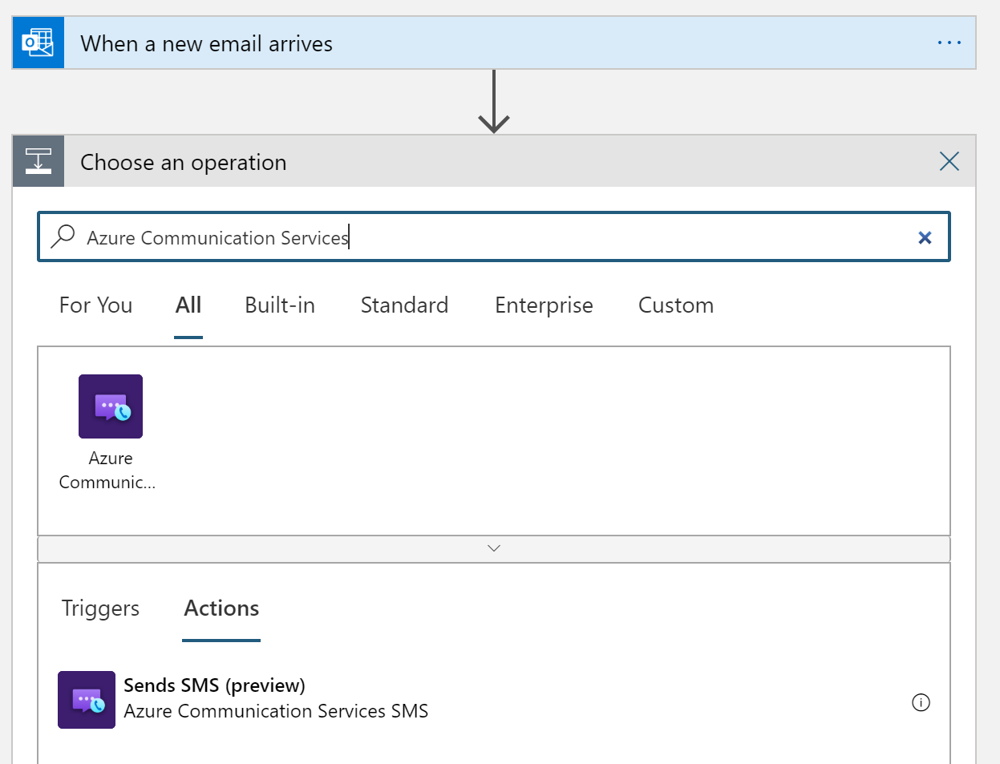

> [!WARNING]
> This document is under construction and needs the following items to be addressed: 
> - Screenshots should be updated (Need to update to latest build, plus better resolution)

# Send SMS messages in Azure Logic Apps

This article shows how you can send a SMS message from inside an Azure Logic app using the Azure Communication Services connector. This allows you to build automation that sends text messages in response to Event Grid resource events, incoming email messages, or any other Logic App trigger.

Completing this quickstart incurs a small cost of a few USD cents or less in your Azure account.

## Prerequisites

- An Azure account with an active subscription. [Create an account for free](https://azure.microsoft.com/free/?WT.mc_id=A261C142F). 
- An active Communication Services resource. [Create a Communication Services resource](../create-communication-resource.md).
- An active Logic Apps resource. [Create your Logic App](https://docs.microsoft.com/en-us/azure/logic-apps/quickstart-create-first-logic-app-workflow#create-your-logic-app)
- An SMS enabled telephone number. [Get a phone number](./get-phone-number.md).

If you're new to logic apps, review [What is Azure Logic Apps](https://docs.microsoft.com/azure/logic-apps/logic-apps-overview) before getting started.

## Setting Up

### Create a basic workflow using Logic Apps

Before getting into the Azure Communication Services connector for Logic Apps, we first need to set up a workflow. If you already have a workflow set up, feel free to skip this section.

To set up your initial workflow follow [Quickstart: Create your first logic app](https://docs.microsoft.com/azure/logic-apps/quickstart-create-first-logic-app-workflow). This quickstart will show you how to create and get started with workflows. Once you complete the quickstart, you should have a basic workflow we can further modify/build on top of.

The quickstart will yield a workflow where a trigger (RSS feed) generates an action(send email).

## Integrate SMS action to Logic Apps workflow

Once you have your workflow, we will add an SMS action using Azure Communication Services.

1. Insert a new step to your workflow: 

   * Under the last step where you want to add an action, 
   choose **New step**. 

     -or-

   * Between the steps where you want to add an action, 
   move your pointer over the arrow between steps. 
   Choose the plus sign (**+**) that appears, 
   and then select **Add an action**.

2. In the search box, enter "Azure Communication Services" as your filter. Select the Send SMS action.

3. Select the Azure Communication Service resource you want to use.

4. Specify a source telephone number, a string such as "+1555555555"

5. Specify a destination telephone number, a string such as "+1555555555". For testing purposes add your own phone number.

6. Specify the message contents such as "Hello from Logic Apps 👋"

7. Save the logic app by clicking the save button on the left.

## Run your Logic App

To manually start your logic app, on the designer toolbar bar, select **Run**. Or, wait for your logic app to run by itself once the trigger happens. You should receive an SMS on your phone.

For more information on running the Logic App, see [here](https://docs.microsoft.com/en-us/azure/logic-apps/quickstart-create-first-logic-app-workflow#run-your-logic-app)

## Clean up resources

If you want to clean up and remove a Communication Services subscription, you can delete the resource or resource group. Deleting the resource group also deletes any other resources associated with it. You can find out more about cleaning up resources [here](../create-communication-resource.md#clean-up-resources).

To clean up and remove Logic App workflows and resources take a look at instruction [here](https://docs.microsoft.com/en-us/azure/logic-apps/quickstart-create-first-logic-app-workflow#clean-up-resources)

## Next Steps

In this quickstart, you learned how to send SMS messages using Logic Apps and Azure Communication Services.

> [!div class="nextstepaction"]
> [Subscribe to SMS Events](./handle-sms-events.md)

For more information, see the following articles:

- [Plan your PSTN Solution](../../concepts/telephony-sms/plan-solution.md)
- Learn more about [SMS Concepts](../../concepts/telephony-sms/concepts.md)
- Learn more about [SMS SDK](../../concepts/telephony-sms/sdk-features.md)
