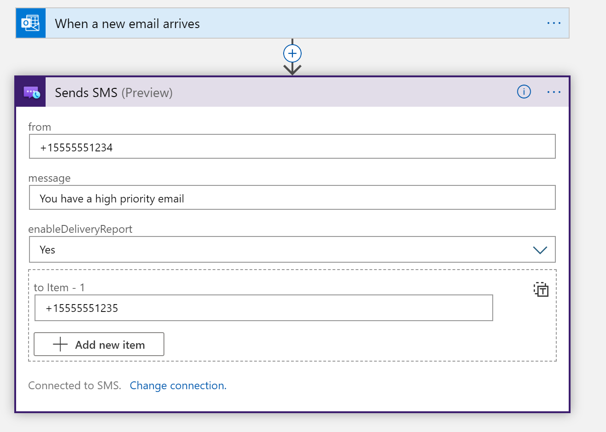

# Send SMS messages in Azure Logic Apps

This article shows how you can send a SMS message from inside an Azure Logic app using the Azure Communication Services connector. This allows you to build automation that sends text messages in response to Event Grid resource events, incoming email messages, or any other Logic App trigger.

If you're new to logic apps, review [What is Azure Logic Apps](https://docs.microsoft.com/en-us/azure/logic-apps/logic-apps-overview) and [Quickstart: Create your first logic app](https://docs.microsoft.com/en-us/azure/logic-apps/quickstart-create-first-logic-app-workflow).

## Prerequisites

- An Azure account with an active subscription. [Create an account for free](https://azure.microsoft.com/free/?WT.mc_id=A261C142F). 
- An active Communication Services resource. [Create a Communication Services resource](../../create-communication-resource.md).
- An SMS enabled telephone number. [Get a phone number](../get-phone-number.md).

## 

1. Choose a path: 

   * Under the last step where you want to add an action, 
   choose **New step**. 

     -or-

   * Between the steps where you want to add an action, 
   move your pointer over the arrow between steps. 
   Choose the plus sign (**+**) that appears, 
   and then select **Add an action**.

 

1. In the search box, enter "Azure Communication Services" as your filter. Select the Send SMS action.

  

2. Select the Azure Communication Service resource you want to use.

3. Specify a source telephone number, a string such as "+1555555555"

4. Specify a destination telephone number, a string such as "+1555555555"

5. Specify the message contents

  
