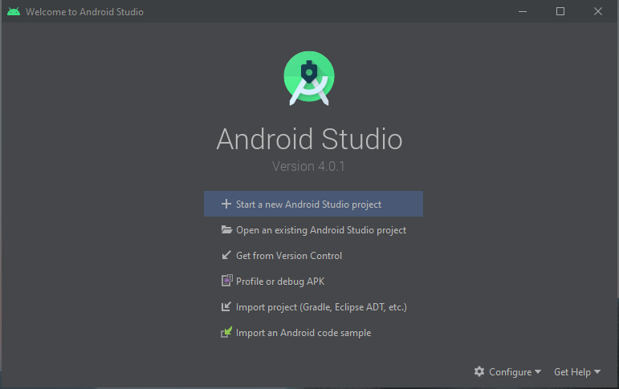
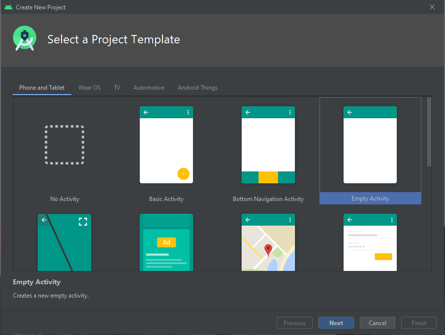
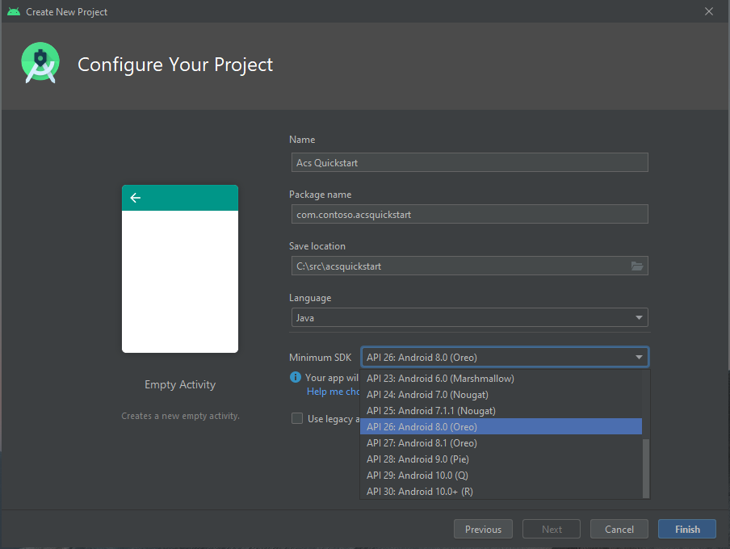
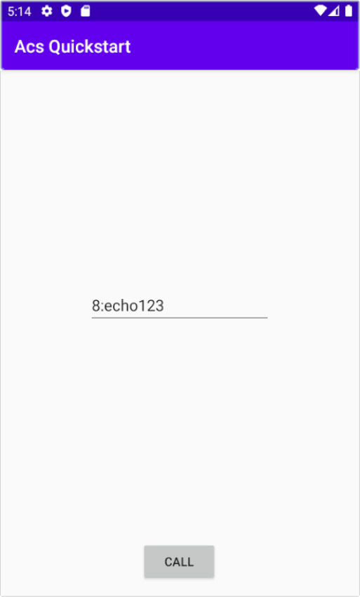

In this quickstart, you'll learn how start a call using the Azure Communication Services Calling client library for Android.

## Prerequisites

- An Azure account with an active subscription. [Create an account for free](https://azure.microsoft.com/free/?WT.mc_id=A261C142F).
- [Android Studio](https://developer.android.com/studio), for creating your Android application.
- A [User Access Token](../../user-access-tokens.md) for your Azure Communication Service.
- A deployed Communication Services resource. [Create a Communication Services resource](../../create-communication-resource.md).
- **Azure Communication Services (ACS) client libraries** For this quickstart, you'll need to install the Azure Communication Services Common and Calling client libraries.


## Create an Android app with an Empty Activity

From Android Studio, select Start a new Android Studio project.



Select "Empty Activity" project template under "Phone and Tablet".



Select Minimum client library of "API 26: Android 8.0 (Oreo)" or greater.



## Add the Azure Communication Services Calling client library to Your App

TODO: update with instructions [here](TODO-MISSING-LINK.md)

## Add permissions to application manifest

In order to request permissions required to make a call, they must first be declared in the Application Manifest (`app/src/main/AndroidManifest.xml`). Replace the content of file with the following:

```xml
    <?xml version="1.0" encoding="utf-8"?>
<manifest xmlns:android="http://schemas.android.com/apk/res/android"
    package="com.contoso.acsquickstart" xmlns:tools="http://schemas.android.com/tools">

    <uses-permission android:name="android.permission.INTERNET" />
    <uses-permission android:name="android.permission.ACCESS_NETWORK_STATE" />
    <uses-permission android:name="android.permission.ACCESS_WIFI_STATE" />
    <uses-permission android:name="android.permission.RECORD_AUDIO" />
    <uses-permission android:name="android.permission.CAMERA" />
    <uses-permission android:name="android.permission.WRITE_EXTERNAL_STORAGE" />
    <uses-permission android:name="android.permission.READ_PHONE_STATE" />
    <uses-permission android:name="android.permission.READ_PRIVILEGED_PHONE_STATE" tools:ignore="ProtectedPermissions" />

    <application
        android:allowBackup="true"
        android:icon="@mipmap/ic_launcher"
        android:label="@string/app_name"
        android:roundIcon="@mipmap/ic_launcher_round"
        android:supportsRtl="true"
        android:theme="@style/AppTheme">
        <!--Our calling client library depends on the Apache HTTP client library.
When targeting Android client library 28+, this library needs to be explicitly referenced.
See https://developer.android.com/about/versions/pie/android-9.0-changes-28#apache-p-->
        <uses-library android:name="org.apache.http.legacy" android:required="false"/>
        <activity android:name=".MainActivity">
            <intent-filter>
                <action android:name="android.intent.action.MAIN" />

                <category android:name="android.intent.category.LAUNCHER" />
            </intent-filter>
        </activity>
    </application>

</manifest>
    
```

## Request permissions at runtime

For Android 6.0 and higher (API level 23) and `targetSdkVersion` 23 or higher, permissions are granted at runtime instead of when the app is installed.

In order to support this, the activity can be configured to request these permissions `onCreate` within `MainActivity.java`:

*TODO: these assume that the user is using a quickstart. Any way we can generalize this to not require utilization of a demo app?*

Navigate to **MainActivity.java** and replace the content with the following code

```java
package com.contoso.acsquickstart;

import androidx.annotation.NonNull;
import androidx.appcompat.app.AppCompatActivity;
import androidx.core.app.ActivityCompat;

import android.Manifest;
import android.content.pm.PackageManager;
import android.os.Bundle;
import android.util.Log;
import android.widget.Button;
import android.widget.EditText;
import android.widget.Toast;

import java.util.ArrayList;

import com.azure.communication.calling.Call;
import com.azure.communication.calling.CallAgent;
import com.azure.communication.calling.CallClient;
import com.azure.communication.calling.ParticipantsUpdatedEvent;
import com.azure.communication.calling.StartCallOptions;
import com.azure.communication.calling.VideoOptions;
import com.azure.communication.common.CommunicationUser;
import com.azure.communication.common.client.CommunicationUserCredential;

public class MainActivity extends AppCompatActivity {
    private static final String[] allPermissions = new String[]{Manifest.permission.RECORD_AUDIO, Manifest.permission.CAMERA, Manifest.permission.WRITE_EXTERNAL_STORAGE, Manifest.permission.READ_PHONE_STATE};
    private static final String UserToken = "<User_Access_Token>";

    private CallAgent agent;
    private Call call;

    @Override
    protected void onCreate(Bundle savedInstanceState) {
        super.onCreate(savedInstanceState);
        setContentView(R.layout.activity_main);

        getAllPermissions();
        createAgent();
        Button callButton = findViewById(R.id.call_button);
        callButton.setOnClickListener(l -> startCall());
    }

    private void startCall() {
        EditText calleeIdView = findViewById(R.id.callee_id);
        String calleeId = calleeIdView.getText().toString();
        StartCallOptions options = new StartCallOptions();
        options.setVideoOptions(new VideoOptions(null));
        call = agent.call(
                getApplicationContext(),
                new CommunicationUser[] {new CommunicationUser(calleeId)},
                options);
    }

    private void onParticipantsUpdated(ParticipantsUpdatedEvent args) {
        Log.d("test", "onParticipantsUpdated");
    }

    private void createAgent() {
        try {
            CommunicationUserCredential credential = new CommunicationUserCredential(UserToken);
            agent = new CallClient().createCallAgent(getApplicationContext(), credential).get();
        } catch (Exception ex) {
            Toast.makeText(getApplicationContext(), "Failed to create call agent.", Toast.LENGTH_SHORT).show();
        }
    }

    /**
     * Request each required permission if the app doesn't already have it.
     */
    private void getAllPermissions() {
        ArrayList<String> permissionsToAskFor = new ArrayList<>();
        for (String permission : allPermissions) {
            if (ActivityCompat.checkSelfPermission(this, permission) != PackageManager.PERMISSION_GRANTED) {
                permissionsToAskFor.add(permission);
            }
        }
        if (!permissionsToAskFor.isEmpty()) {
            ActivityCompat.requestPermissions(this, permissionsToAskFor.toArray(new String[0]), 1);
        }
    }

    /**
     * Ensure all permissions were granted, otherwise inform the user permissions are missing.
     */
    @Override
    public void onRequestPermissionsResult(int requestCode, @NonNull String[] permissions, int[] grantResults) {
        boolean allPermissionsGranted = true;
        for (int result : grantResults) {
            allPermissionsGranted &= (result == PackageManager.PERMISSION_GRANTED);
        }
        if (!allPermissionsGranted) {
            Toast.makeText(this, "All permissions are needed to make the call.", Toast.LENGTH_LONG).show();
            finish();
        }
    }
}

```

> [!NOTE]
> When designing your app, consider when these permissions should be requested. Permissions should be requested as they are needed, not ahead of time. For more information see the [Android Permissions Guide.](https://developer.android.com/training/permissions/requesting)

## Create an agent from the user access token for placing calls

With the user token an authenticated call agent can be instantiated. Generally this token will be generated from a service with authentication specific to the application. See the documentation [here](../../user-access-tokens.md) for more information on user access tokens. For the quickstart, replace `<User_Access_Token>` with a user access token generated for your Azure Communication Service resource.

## Make an Outbound Call

Input for the callee id and the call button can be added through the designer or by editing the layout xml. Create a button with an id of `call_button` and a text input of `callee_id`. Navigate to **app/src/main/res/layout/activity_main.xml** and insert the following code:

```xml
<?xml version="1.0" encoding="utf-8"?>
<androidx.constraintlayout.widget.ConstraintLayout xmlns:android="http://schemas.android.com/apk/res/android"
    xmlns:app="http://schemas.android.com/apk/res-auto"
    xmlns:tools="http://schemas.android.com/tools"
    android:layout_width="match_parent"
    android:layout_height="match_parent"
    tools:context=".MainActivity">

    <Button
        android:id="@+id/call_button"
        android:layout_width="wrap_content"
        android:layout_height="wrap_content"
        android:layout_marginBottom="16dp"
        android:text="Call"
        app:layout_constraintBottom_toBottomOf="parent"
        app:layout_constraintEnd_toEndOf="parent"
        app:layout_constraintStart_toStartOf="parent" />

    <EditText
        android:id="@+id/callee_id"
        android:layout_width="wrap_content"
        android:layout_height="wrap_content"
        android:ems="10"
        android:hint="Callee Id"
        android:inputType="textPersonName"
        app:layout_constraintBottom_toTopOf="@+id/call_button"
        app:layout_constraintEnd_toEndOf="parent"
        app:layout_constraintStart_toStartOf="parent"
        app:layout_constraintTop_toTopOf="parent" />
</androidx.constraintlayout.widget.ConstraintLayout>
```

## Launch the app and call the echo bot

The app can now be launched using the "Run App" button on the toolbar (Shift+F10). Verify you are able to place calls by calling `8:echo123`. A pre-recorded message will play then repeat your message back to you.




