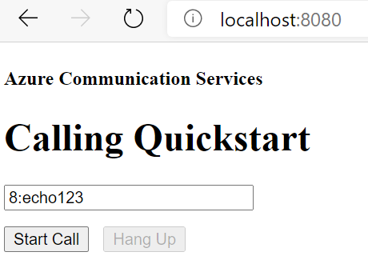

In this quickstart, you'll learn how start a call using the Azure Communication Services Calling client library for JavaScript.

## Prerequisites

- An Azure account with an active subscription. [Create an account for free](https://azure.microsoft.com/free/?WT.mc_id=A261C142F).
- [Node.js](https://nodejs.org/) Active LTS and Maintenance LTS versions (8.11.1 and 10.14.1 recommended).
- An active Communication Services resource. [Create a Communication Services resource](../../create-communication-resource.md).
- A User Access Token to instantiate the call client. Learn how to [create and manage user access tokens](../../user-access-tokens.md).

## Setting Up

### Create a new Node.js Application

Open your terminal or command window create a new directory for your app, and navigate to it.

```console
mkdir calling-quickstart && cd calling-quickstart
```

Run `npm init -y` to create a **package.json** file with default settings.

```console
npm init -y
```

### Install the package

Use the `npm install` command to install the Azure Communication Services Calling client library for JavaScript.

```console
npm install @azure/communication-calling --save
```

The `--save` option lists the library as a dependency in your **package.json** file.

### Set up the app framework

This quickstart uses webpack to bundle the application assets. Run the following command to install the webpack, webpack-cli and webpack-dev-server npm packages and list them as development dependencies in your **package.json**:

```console
npm install webpack webpack-cli webpack-dev-server --save-dev
```

Create an **index.html** file in the root directory of your project. We'll use this file to configure a basic layout that will allow the user to place a call to an Azure Communications Bot.

Here is the code:

```html
<!DOCTYPE html>
<html>
  <head>
    <title>Communication Client - Calling Sample</title>
  </head>
  <body>
    <h4>Azure Communication Services</h4>
    <h1>Calling Quickstart</h1>
    <input 
      id="callee-id-input"
      type="text"
      placeholder="Who would you like to call?"
      style="margin-bottom:1em; width: 200px;"
    />
    <div>
      <button id="call-button" type="button">
        Start Call
      </button>
      &nbsp;
      <button id="hang-up-button" type="button" disabled="true">
        Hang Up
      </button>
    </div>
    <script src="./bundle.js"></script>
  </body>
</html>
```

Create a file in the root directory of your project called **client.js** to contain the application logic for this quickstart. Add the following code to import the calling client and get references to the DOM elements we so we can attach our business logic.

```javascript
import { CallClient, CallAgent, CommunicationUser } from "@azure/communication-calling";
import { CommunicationUserCredential } from '@azure/communication-common';

let call;
const calleeInput = document.getElementById("callee-id-input");
const callButton = document.getElementById("call-button");
const hangUpButton = document.getElementById("hang-up-button");
let callClient;
let tokenCredential;
let callAgent;

// quickstart code goes here
```

## Object model

The following classes and interfaces handle some of the major features of the Azure Communication Services Calling client library:

| Name                                                           | Description                                                                                   |
| -------------------------------------------------------------- | --------------------------------------------------------------------------------------------- |
| [CallClient](../../../references/overview.md)                  | The CallClient is the main entry point to the Calling client library.                         |
| [CallAgent](../../../references/overview.md)                   | The CallAgent is used to start and manage calls.                                              |
| [CommunicationUserCredential](../../../references/overview.md) | The CommunicationUserCredential is used as the token credential to instantiate the CallAgent. |

## Authenticate the client

Initialize a `CallAgent` instance with a `User Access Token` which will enable us to make and receive calls. Add the following code to **client.js**:

```javascript
callClient = new CallClient();
tokenCredential = new CommunicationUserCredential("<USER ACCESS TOKEN>");
callClient.createCallAgent(tokenCredential).then(agent => {
  console.log("CallAgent initialized");
  callAgent = agent;
});
```

You need to replace `<USER ACCESS TOKEN>` with a valid user access token for your resource. Refer to the [user access token](../../user-access-tokens.md) documentation if you don't already have a token available.

## Start a call

Add an event handler to initiate a call to our echo bot when the `callButton` is clicked:

```javascript
callButton.addEventListener("click", () => {
  // start a call
  const userToCall = new CommunicationUser(calleeInput.value);
  call = callAgent.call(
    [userToCall],
    {}
  );

  // toggle button states
  hangUpButton.disabled = false;
  callButton.disabled = true;
});
```

## End a call

Add an event listener to end the current call when the `hangUpButton` is clicked:

```javascript
hangUpButton.addEventListener("click", () => {
  // end the current call
  call.hangUp({
    forEveryone: true
  });

  // toggle button states
  hangUpButton.disabled = true;
  callButton.disabled = false;
});
```

The `forEveryone` property ends the call for all call participants.

## Run the code

Use the `webpack-dev-server` to build and run your app. Run the following command to bundle application host in on a local webserver:

```console
npx webpack-dev-server --entry ./client.js --output bundle.js
```

Open your browser and navigate to http://localhost:8080/. You should see the following:



You can make an outbound VOIP call by providing a user ID in the text field and clicking the **Start Call** button. Calling `8:echo123` connects you with an echo bot, this is great for getting started and verifying your audio devices are working.
