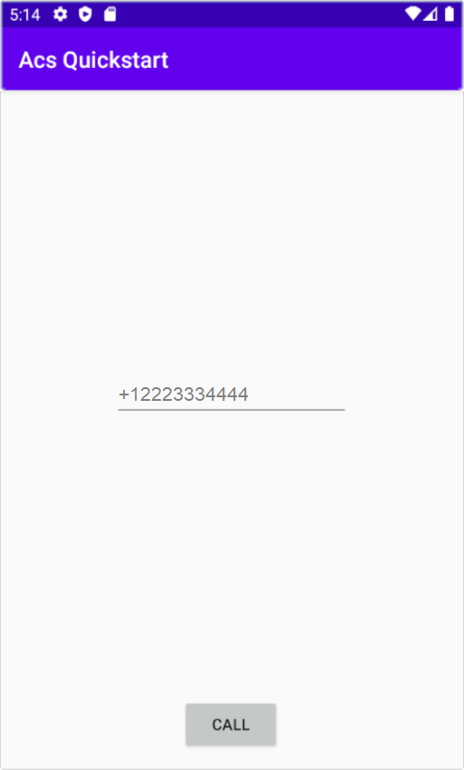

[!INCLUDE [Emergency Calling Notice](../../../includes/emergency-calling-notice-include.md)]
## Prerequisites

- An Azure account with an active subscription. [Create an account for free](https://azure.microsoft.com/free/?WT.mc_id=A261C142F). 
- A deployed Communication Services resource. [Create a Communication Services resource](../../create-communication-resource.md).
- A phone number acquired in Communication Services resource. [how to get a phone number](../../telephony-sms/get-phone-number.md).
- A `User Access Token` to enable the call client. For more information on [how to get a `User Access Token`](../../access-tokens.md)
- Complete the quickstart for [getting started with adding calling to your application](../getting-started-with-calling.md)

### Prerequisite check

- To view the phone numbers associated with your Communication Services resource, sign in to the [Azure portal](https://portal.azure.com/), locate your Communication Services resource and open the **phone numbers** tab from the left navigation pane.

## Setting up

### Add PSTN functionality your app

Add the `PhoneNumber` type to your app by modifying **MainActivity.java**:


```java
import com.azure.android.communication.common.PhoneNumber;
```
> [!TBD]
> Namespace based on input from Komivi Agbakpem. But it does not correlates with other use namespaces in Calling Quickstart. E.g: "com.azure.communication.calling.CommunicationUser" or "com.azure.communication.common.client.CommunicationUserCredential". Double-chek this.

## Object model

The following classes and interfaces handle some of the major features of the Azure Communication Services Calling client library for Android.

| Name                                           | Description                                                                                          |
| ---------------------------------------------- | ---------------------------------------------------------------------------------------------------- |
| PhoneNumber | This class is needed to initialize a phone number you would like to use for telephony functionality. |


## Start a call to phone

Specify the phone number you acquired from within your Communication Services resource. This will be used to start the call:

> [!WARNING]
> Note that phone numbers shold be provided in E.164 international standard format. (e.g.: +12223334444)

Modify `startCall()` event handler in **MainActivity.java**, so that it handles phone calls:

```java
    private void startCall() {
        EditText calleePhoneView = findViewById(R.id.callee_id);
        String calleePhone = calleePhoneView.getText().toString();
        PhoneNumber callerPhone = new PhoneNumber("+12223334444");
        StartCallOptions options = new StartCallOptions();
        options.setAlternateCallerId(callerPhone);
        options.setVideoOptions(new VideoOptions(null));
        call = agent.call(
                getApplicationContext(),
                new PhoneNumber[] {new PhoneNumber(calleePhone)},
                options);
    }
```

## Launch the app and call the echo bot

The app can now be launched using the "Run App" button on the toolbar (Shift+F10). You can make an call to phone by providing a phone number in the added text field and clicking the **CALL** button.
> [!WARNING]
> Note that phone numbers shold be provided in E.164 international standard format. (e.g.: +12223334444)


