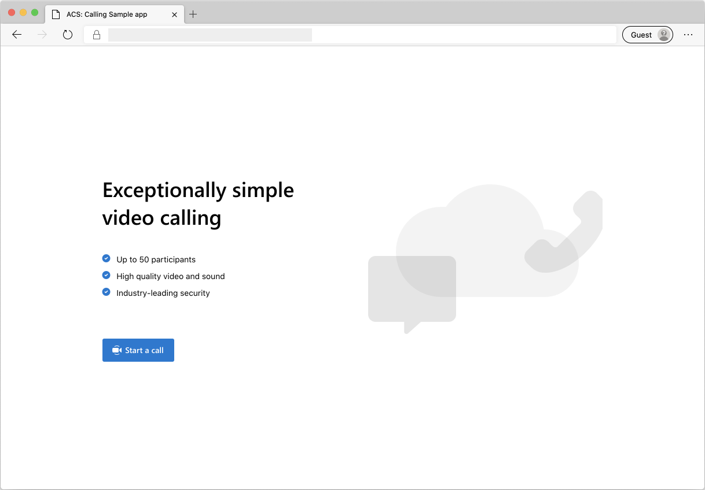
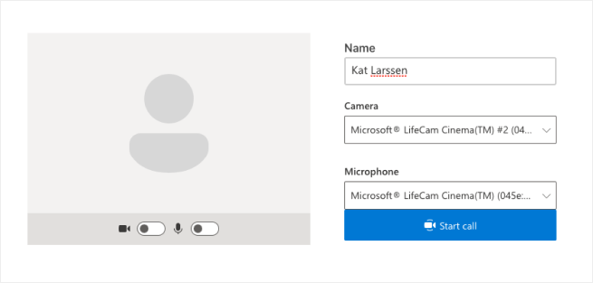
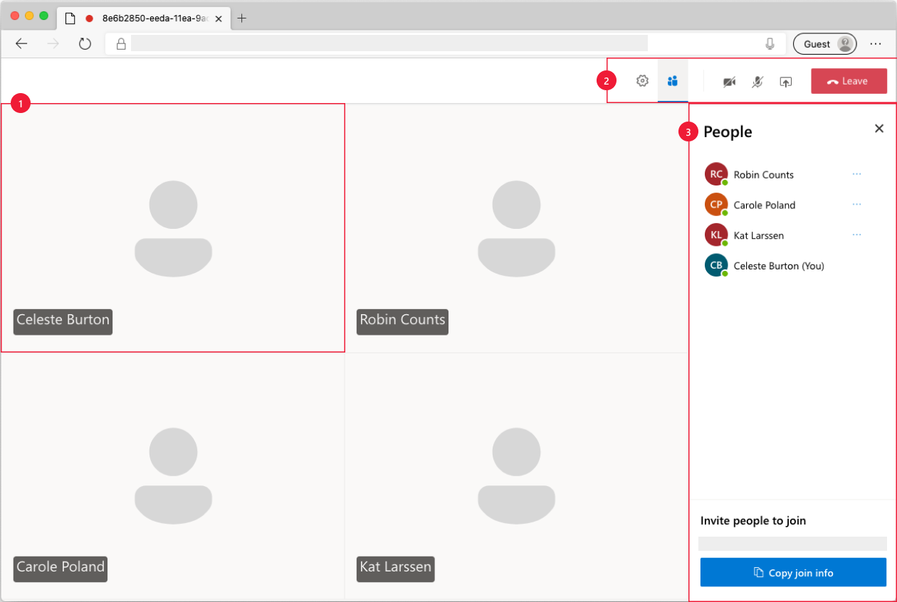

# Get started with the group calling hero sample

[!INCLUDE [Public Preview Notice](../includes/public-preview-include.md)]

> [!WARNING]
> The two links to our Hero Sample repo need to be updated when the sample is publicly available.

The Azure Communication Services **Group Calling Hero Sample** demonstrates how the Communication Services Calling Web client library can be used to build a group calling experience.

In this Sample quickstart, we'll learn how the sample works before we run the sample on your local machine. We'll then deploy the sample to Azure using your own Azure Communication Services resources. Finally, we'll update the sample's functionality.

## Overview

The sample has both a client-side application and a server-side application. The **client-side application** is a React/Redux web application that uses Microsoft's Fluent UI framework. This application sends requests to an ASP.NET Core **server-side application** that helps the client-side application connect to Azure. 

Here's what the sample looks like:

When you press the "Start a call" button, the web application fetches a user access token from the server-side application. This token is then used to connect the client app to Azure Communication Services. Once the token is retrieved, you'll be prompted to specify the camera and microphone that you want to use. You'll be able to disable/enable your devices with toggle controls:

Once your configure your display name and devices, you can join the call session. Now you will see the main call canvas where the core calling experience lives.

Components of the main calling screen:

1. **Media Gallery**: The main stage where participants are shown. If a participant has their camera enabled, their video feed is shown here. Each participant has an individual tile which shows their display name and video stream (when there is one)
2. **Header**: This is where the primary call controls are located to toggle settings and participant side bar, turn video and mix on/off, share screen and leave the call.
3.  **Side Bar**: This is where participants and setting information are shown when toggled using the controls on the header. The component can be dismissed using the 'X' on the top right corner. Participants side bar will show a list of participants and a link to invite more users to chat. Settings side bar allows you to configure microphone and camera settings.

Below you'll find more information on prerequisites, steps to set up the sample, and step-by-step tutorials to help familiarize yourself with its various components.

## Prerequisites

1. Create an Azure account with an active subscription. For details, see [Create an account for free](https://azure.microsoft.com/free/?WT.mc_id=A261C142F).
2. [Node.js (8.11.2 and above)](https://nodejs.org/en/download/)
3. [Visual Studio (2017 and above)](https://visualstudio.microsoft.com/vs/)
4. [.NET Core 2.2](https://dotnet.microsoft.com/download/dotnet-core/2.2) (Make sure to install version that corresponds with your visual studio instance, 32 vs 64 bit)
5. Create an Azure Communication Services resource. For details, see [Create an Azure Communication Resource](../quickstarts/create-communication-resource.md). You'll need to record your resource **connection string** for this quickstart.

## Locally deploy the service & client applications

The group calling sample is essentially two applications: the ClientApp and the Service.NET app.

When we want to deploy locally we need to start up both applications. When the server app is visited from the browser, it will use the locally deployed ClientApp for the user experience.

You can test the sample locally by opening multiple browser sessions with the URL of your call to simulate a multi-user call.

### Before running the sample for the first time

1. Open an instance of PowerShell, Windows Terminal, Command Prompt or equivalent and navigate to the directory that you'd like to clone the sample to.
2. `git clone`
3. Go to **ClientApp Folder** and run `npm run setup`
   1. If you see an error 1, look above in the output for a URL where you'll need to go to to authorize your client. (URL will look like this: `app.vssps.visualstudio.com/oauth2/authorize?clientid=...`)Once you visit the URL in a browser, copy the command from the browser window and run it.
   2. Run command `npm run setup-vsts-auth` again once you complete the previous step.
4. Go to the ClientApp folder and run `npm install`.
5. Get the `Connection String` from the Azure portal. For more information on connection strings, see [Create an Azure Communication Resources](../quickstarts/create-communication-resource.md)
6. Once you get the Connection String, Add the connection string to the **appsetting.json** file found under the Service .NET folder. Input your connection string in the variable: `ResourceConnectionString`.

### Local Run

1. Open the `Calling.csproj` solution in Visual Studio
2. Run the `Calling` project

The browser will open at `localhost:5000`. You should now be able to proceed with starting a group call that uses your Communication Services resources.

#### Troubleshooting

1. The solution doesn't build; it throws errors during NPM installation/build.

Try to clean/rebuild the projects.

## Publish the sample to Azure

1. Right click on the `Calling` project and select Publish.
2. Create a new publish profile and select your Azure subscription.
3. Before publishing, add your connection string with `Edit App Service Settings`, and fill in `ResourceConnectionString` as the key and provide your connection string (copied from appsettings.json) as the value.

## Next steps

For more information, see the following articles:

- Familiarize yourself with [using the calling client library](../quickstarts/voice-video-calling/calling-client-samples.md)
- Learn about calling client library capabilities [here](../quickstarts/voice-video-calling/calling-client-samples.md)
- Learn more about how calling works [here](../concepts/voice-video-calling/about-call-types.md)

## Additional Reading

- [Azure Communication Preview](https://github.com/Azure/communication-preview) - To learn more about the calling web sdk
- [Redux](https://redux.js.org/) - Client-side state management
- [FluentUI](https://developer.microsoft.com/fluentui#/) - Microsoft powered UI library
- [React](https://reactjs.org/) - Library for building user interfaces
- [ASP.NET Core](https://docs.microsoft.com/aspnet/core/introduction-to-aspnet-core?view=aspnetcore-3.1) - Framework for building web applications
