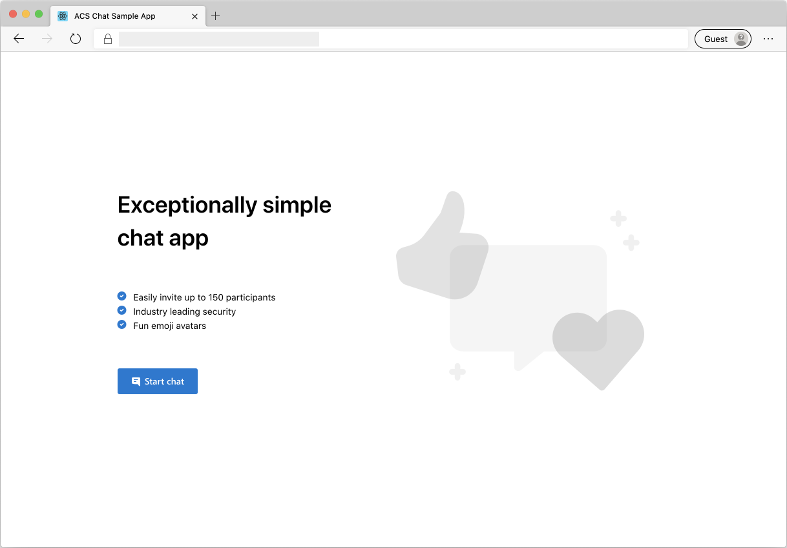
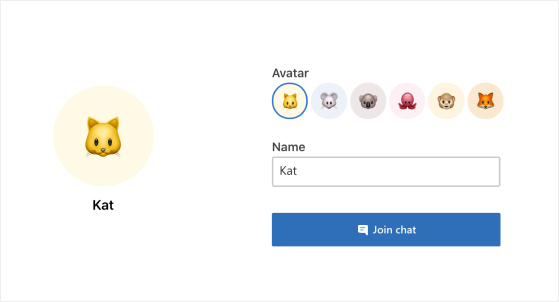
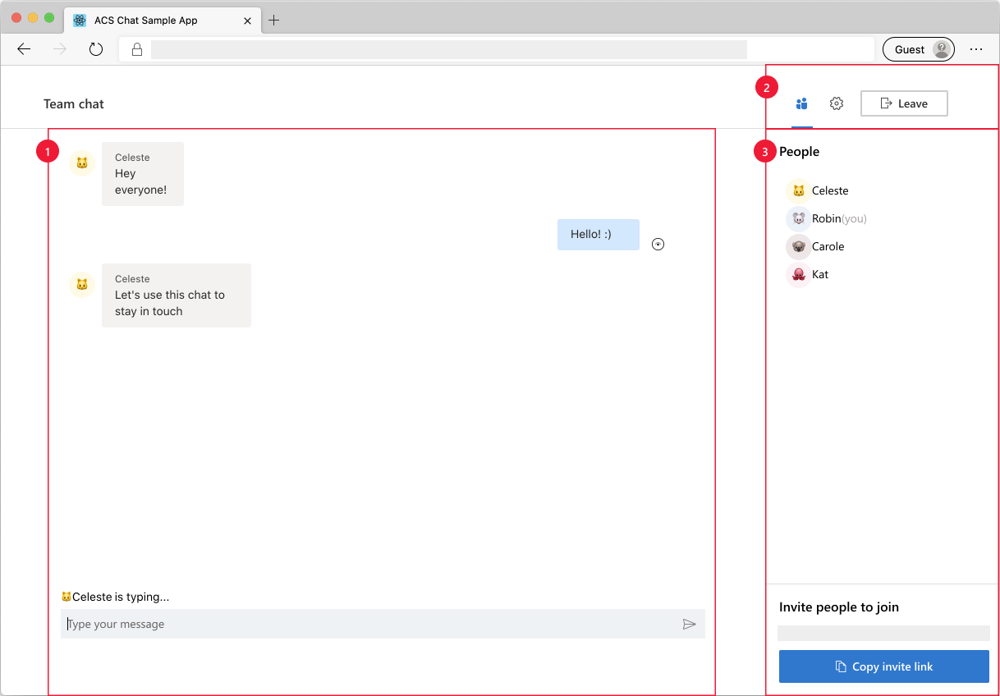

# Get started with the group chat hero sample

[!INCLUDE [Public Preview Notice](../includes/public-preview-include.md)]

> [!WARNING]
> This document is under construction and needs the following items to be addressed:
> - Add correct repo value in instructions

The Azure Communication Services **Group Chat Hero Sample** demonstrates how the Communication Services Chat Web client library can be used to build a group calling experience.

## Overview

The sample has both a client-side application and a server-side application. The **client-side application** is a React/Redux web application that uses Microsoft's Fluent UI framework. This application sends requests to an ASP.NET Core **server-side application** that helps the client-side application connect to Azure. 

Here's what the sample looks like:

When you press the "Start a Chat" button, the web application fetches a user access token from the server-side application. This token is then used to connect the client app to Azure Communication Services. Once the token is retrieved, you'll be prompted to specify your name and emoji that will represent you in chat. 

Once your configure your display name and emoji, you can join the chat session. Now you will see the main chat canvas where the core chat experience lives.

Components of the main chat screen:

1. **Main Chat Area**: This is the core chat experience where users can send and receives messages. To send messages, you can use the input area and press enter (or use the send button). Chat messages received are categorized by the sender with the correct name and emoji. You will see two types of notifications in the chat area: 1) typing notifications when a user is typing and 2) sent and read notifications for messages.
2. **Header**: This is where the user will see the title of the chat thread and the controls for toggling participant and settings side bars, and a leave button to exit the chat session.
3. **Side Bar**: This is where participants and setting information are shown when toggled using the controls in the header. The participants side bar contains a list of participants in the chat and a link to invite participants to the chat session. The settings side bar allows you to configure the chat thread title. 

Below you'll find more information on prerequisites and steps to set up the sample.

## Prerequisites

1. Create an Azure account with an active subscription. For details, see [Create an account for free](https://azure.microsoft.com/free/?WT.mc_id=A261C142F).
2. [Node.js (8.11.2 and above)](https://nodejs.org/en/download/)
3. [Visual Studio (2017 and above)](https://visualstudio.microsoft.com/vs/)
4. [.NET Core 2.2](https://dotnet.microsoft.com/download/dotnet-core/2.2) (Make sure to install version that corresponds with your visual studio instance, 32 vs 64 bit)
5. Create an Azure Communication Services resource. For details, see [Create an Azure Communication Resource](../quickstarts/create-communication-resource.md). You'll need to record your resource **connection string** for this quickstart.

## Locally deploying the service & client app

The single threaded chat sample is essentially two "applications" a client and server application.

Open up Visual Studio on the chat.csproj and run in Debug mode, this will start up the chat front end service. When the server app is visited
from the browser, it will redirect traffic towards the locally deployed chat front end service.

You can test the sample locally by opening multiple browser sessions with the URL of your chat to simulate a multi-user chat.

### Before running the sample for the first time

1. Open an instance of PowerShell, Windows Terminal, Command Prompt or equivalent and navigate to the directory that you'd like to clone the sample to.
2. `git clone {Coming Soon}`
3. Go to ClientApp and run `npm run setup`
   1. If you see an error 1, look above in the output for a URL where you'll need to go to to authorize your client. (URL will look like this: `app.vssps.visualstudio.com/oauth2/authorize?clientid=...`)Once you visit the URL in a browser, copy the command from the browser window and run it.
   2. Run command `npm run setup` again once you complete the previous step.
4. Go to the ClientApp folder and run `npm install`.
5. Get the `Connection String` from the Azure portal. For more information on connection strings, see [Create an Azure Communication Resources](../quickstarts/create-communication-resource.md)
6. Once you get the `Connection String`, Add the connection string to the **appsetting.json** file found under the Chat folder. Input your connection string in the variable: `ResourceConnectionString`.

### Local run

1. Go to the Chat folder
2. Open the `Chat.csproj` solution in Visual Studio
3. Run the project.

* The browser will open at localhost:5000 (where the node is deploying the client app)

#### Troubleshooting

1. Solution doesn\'t build, it throws errors during NPM installation/build

Clean/rebuild the C# solution

## Publish the sample to Azure

1. Right click on the `ServiceSampleDotNet` project and select Publish.
2. Create a new publish profile and select your Azure subscription.
3. Before publishing, add your connection string with `Edit App Service Settings`, and fill in `ResourceConnectionString` as the key and provide your connection string (copied from appsettings.json) as the value.

## Next steps

For more information, see the following articles:

- Learn about [chat concepts](../concepts/chat/concepts.md)
- Familiarize yourself with our [chat client library](../concepts/chat/sdk-features.md)

## Additional Reading

- [Azure Communication Preview](https://github.com/Azure/communication-preview) - To learn more about the chat web sdk
- [Redux](https://redux.js.org/) - Client-side state management
- [FluentUI](https://developer.microsoft.com/fluentui#/) - Microsoft powered UI library
- [React](https://reactjs.org/) - Library for building user interfaces
- [ASP.NET Core](https://docs.microsoft.com/aspnet/core/introduction-to-aspnet-core?view=aspnetcore-3.1) - Framework for building web applications
