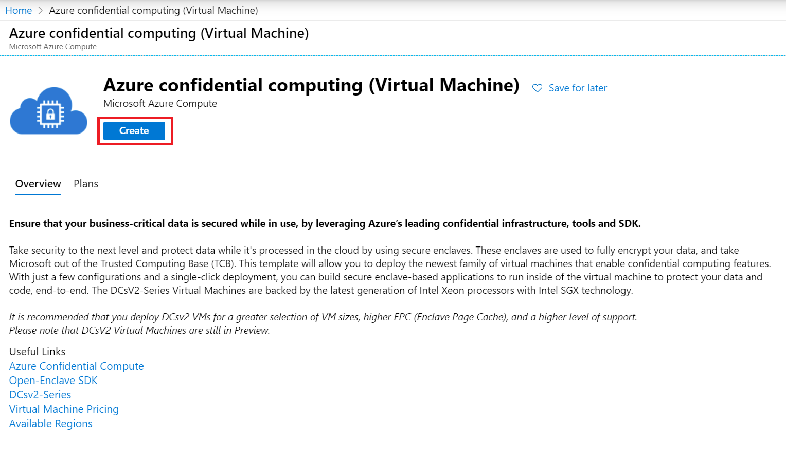
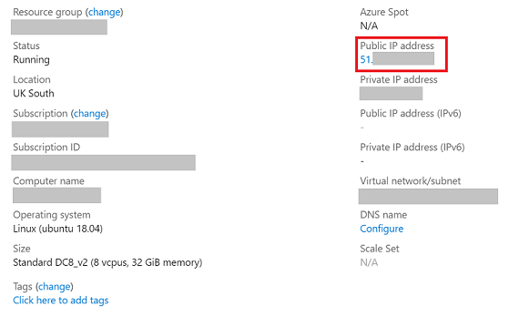

# Quickstart: Deploy an Azure confidential computing VM in the Marketplace

Get started with Azure confidential computing by using the Azure Marketplace to create a virtual machine (VM) running on Linux. You'll then install the Open Enclave Software Development Kit (SDK) to set up your development environment. 

This tutorial is recommended if you want to quickly start deploying a confidential computing virtual machine. The VMs are run on specialty hardware and require specific configuration inputs to run as intended. The marketplace offering described in this quickstart makes it easier to deploy, by restricting user input.

If you're interested in deploying a confidential compute virtual machine with more custom configuration, follow the [Azure portal Confidential Compute virtual machine deployment steps.](deploy-portal.md) or the [Azure Resource Manager deployment steps](deploy-arm.md)

## Prerequisites
If you don't have an Azure subscription, create an [account](https://azure.microsoft.com/pricing/purchase-options/pay-as-you-go/) before you begin.
   > [!NOTE]
   > Free trial accounts do not have access to the virtual machines used in this tutorial. Please upgrade to a Pay-As-You-Go subscription.

## Sign in to Azure
In this section, you'll sign into the Azure portal. Then you'll open up the Azure Confidential Compute (Virtual Machine) marketplace deployment. 

1. Sign in to the [Azure portal](https://portal.azure.com/).

1. In the search bar at the top of your screen, type **Azure Confidential Compute**.

    

1. Select **Azure Confidential Compute (Virtual Machine)** in the **Marketplace** section. 

        

1. The Azure confidential compute deployment landing page will open. Select **Create**. 

      

## Configure your virtal machine

1. In the **Basics** tab, select your **Subscription** and **Resource Group**. Your resource group must be empty to deploy a virtual machine from this template into it.

1. Then, type or select the following values:
   * **Region**: Select the Azure region that's right for you.

        > [!NOTE]
        > Confidential compute virtual machines only run on specialized hardware available in specific regions. Please check [here](https://aka.ms/accregions) for the latest available regions for DCsv2-Series VMs.
    

    * **Image**: Configure the operating system image that you would like to use for your virtual machine.
    * **Choose Image**: Select any image. For this tutorial, select Ubuntu 18.04 (Gen 2).

    * **Virtual machine name**, enter a name for your new Linux VM.

    * **Authentication type**: Select **SSH public key**.

         > [!NOTE]
         > You have the choice of using an SSH public key or a Password for authentication. SSH is more secure. For instructions on how to generate an SSH key, see [Create SSH keys on Linux and Mac for Linux VMs in Azure](https://docs.microsoft.com/azure/virtual-machines/virtual-machines-linux-mac-create-ssh-keys).

   * **Username**: Enter the Administrator name for the VM.
   * **SSH public key**: Enter your RSA public key.

1. Click the **Next: Virtual machine settings** button at the bottom of your screen.
    * Wait around 10 seconds or less for the page to update. You should **not** see a message that says *"Confidential Computing DCsv2-series VMs are available in a limited number of regions. If this message persists, return to the previous page and select an available region."* If you see this message for longer than 10 seconds, please go back and select an available DCsv2-Series region.
1. Choose a virtual machine with confidential compute capabilities in the size selector by choosing **change size**. 
    > [!TIP]
     > You should see sizes **DC1s_v2**, **DC2s_v2**, **DC4s_V2**, and **DC8_v2**. These are the only virtual machine sizes that currently support confidential computing. [Learn more](http://aka/ms/dcv2)
1. Fill in the following information:
    * **OS Disk Type**: Select a disk type
    * **Virtual Network** and **Subnet**: Either create new ones or choose from an existing resource.
    * **Select public inbound ports**: Choose **SSH(Linux)/RDP(Winodws)**. In this quickstart, this step is necessary to connect and complete the Open Enclave SDK configuration. 
    * **Boot Diagnostics**: Leave disabled for this quickstart. 
1. Select **Review + create**.
1. In the **Review + create** pane, select **Create**.

## Connect to the Linux VM

If you already use a BASH shell, connect to the Azure VM using the **ssh** command. In the following command, replace the VM user name and IP address to connect to your Linux VM.

```bash
ssh azureadmin@40.55.55.555
```

You can find the IP address of your VM in the Azure portal.

[!div class="mx-imgBorder"]


If you're running on Windows and don't have a BASH shell, install an SSH client, such as PuTTY.

1. [Download and install PuTTY](https://www.chiark.greenend.org.uk/~sgtatham/putty/download.html).

1. Run PuTTY.

1. On the PuTTY configuration screen, enter your VM's public IP address.

1. Select **Open** and enter your username and password at the prompts.

For more information about connecting to Linux VMs, see [Create a Linux VM on Azure using the Portal](https://docs.microsoft.com/azure/virtual-machines/virtual-machines-linux-quick-create-portal).

> [!NOTE]
> If you see a PuTTY security alert about the server's host key not being cached in the registry, choose from the following options. If you trust this host, select **Yes** to add the key to PuTTy's cache and continue connecting. If you want to carry on connecting just once, without adding the key to the cache, select **No**. If you don't trust this host, select **Cancel** to abandon the connection.

## <a id="Install"></a> Install the Open Enclave SDK (OE SDK)
Follow the step-by-step instructions to install the OE SDK on your DCsv2-Series virtual machine running an Ubuntu 18.04 LTS Gen 2 image. [Learn more about the OE SDK](https://github.com/openenclave/openenclave).

#### 1. Configure the Intel and Microsoft APT Repositories

```bash
echo 'deb [arch=amd64] https://download.01.org/intel-sgx/sgx_repo/ubuntu bionic main' | sudo tee /etc/apt/sources.list.d/intel-sgx.list
wget -qO - https://download.01.org/intel-sgx/sgx_repo/ubuntu/intel-sgx-deb.key | sudo apt-key add -

echo "deb http://apt.llvm.org/bionic/ llvm-toolchain-bionic-7 main" | sudo tee /etc/apt/sources.list.d/llvm-toolchain-bionic-7.list
wget -qO - https://apt.llvm.org/llvm-snapshot.gpg.key | sudo apt-key add -

echo "deb [arch=amd64] https://packages.microsoft.com/ubuntu/18.04/prod bionic main" | sudo tee /etc/apt/sources.list.d/msprod.list
wget -qO - https://packages.microsoft.com/keys/microsoft.asc | sudo apt-key add -
```

#### 2. Install the Intel SGX DCAP Driver

```bash
sudo apt update
sudo apt -y install dkms
wget https://download.01.org/intel-sgx/sgx-dcap/1.4/linux/distro/ubuntuServer18.04/sgx_linux_x64_driver_1.21.bin -O sgx_linux_x64_driver.bin
chmod +x sgx_linux_x64_driver.bin
sudo ./sgx_linux_x64_driver.bin
```

> [!WARNING]This may not be the latest Intel SGX DCAP driver.
> Please check with [Intel's SGX site](https://01.org/intel-software-guard-extensions/downloads)
> if a more recent SGX DCAP driver exists.

#### 3. Install the Intel and Open Enclave packages and dependencies

```bash
sudo apt -y install clang-7 libssl-dev gdb libsgx-enclave-common libsgx-enclave-common-dev libprotobuf10 libsgx-dcap-ql libsgx-dcap-ql-dev az-dcap-client open-enclave
```

> [!NOTE] This step also installs the [az-dcap-client](https://github.com/microsoft/azure-dcap-client)
> package which is necessary for performing remote attestation in Azure. A general
> implementation for using Intel DCAP outside the Azure environment is coming soon.

#### 4. **Verify the Open Enclave SDK install**

See [Using the Open Enclave SDK](Linux_using_oe_sdk.md) on GitHub for verifying and using the installed SDK.

## Clean up resources

When no longer needed, you can delete the resource group, virtual machine, and all related resources. 

Select the resource group for the virtual machine, then select **Delete**. Confirm the name of the resource group to finish deleting the resources.

## Next steps

In this quickstart, you deployed a confidential computing virtual machine, and installed the Open Enclave SDK. To learn more about how you can build applications with confidential computing capabilities, continue to the Open Enclave SDK on GitHub. 

> [!div class="nextstepaction"]
> [Building Open Enclave SDK Samples on Linux](https://github.com/openenclave/openenclave/blob/master/samples/README_Linux.md)
