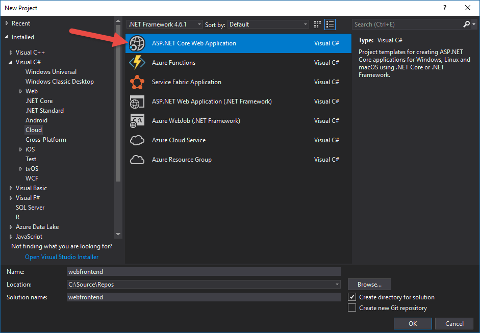

# Get Started on Connected Environment with .NET Core and Visual Studio

Previous step: [Install tools](get-started-netcore-visualstudio-01.md)

## Create an ASP.NET web app
From within Visual Studio 2017, create a new project. Currently, the project must be an **ASP.NET Core Web Application**. Name the project '**webfrontend**'.

Select the **Web Application (Model-View-Controller)** template and be sure you're targeting **.NET Core** and **ASP.NET Core 2.0** in the two dropdowns at the top of the dialog. Click **OK** to create the project.

> [!div class="nextstepaction"]
> [Create a dev environment in Azure](get-started-netcore-visualstudio-03.md)