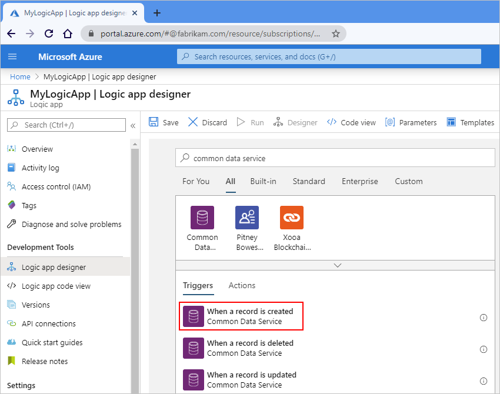
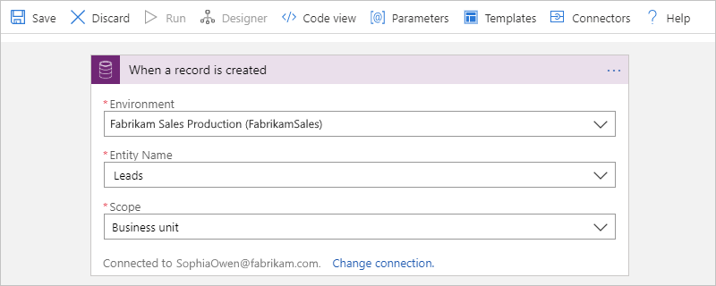
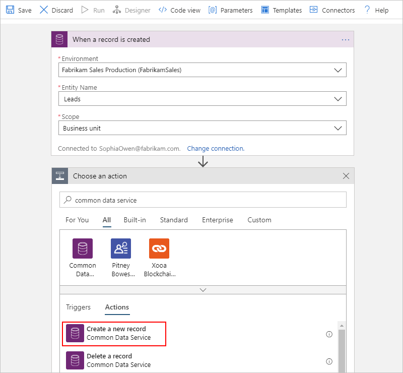

# Create and manage records in Common Data Service by using Azure Logic Apps

With [Azure Logic Apps](../logic-apps/logic-apps-overview.md) and the [Common Data Service connector](https://docs.microsoft.com/connectors/commondataservice/), you can build automated workflows that manage records in your Common Data Service database. These workflows can create records, update records, and perform other operations. You can also get information from your Common Data Service database and make the output available for other actions to use in your logic app. For example, when a record is updated in your Common Data Service database, you can send an email by using the Office 365 Outlook connector.

> [Common Data Service](https://powerapps.microsoft.com/common-data-service/) 
> lets you securely store and manage data that's used by business apps, such as Dynamics 365. 
> These apps use the Common Data Service 
> For more information, see 
> [What is Common Data Service](https://docs.microsoft.com/powerapps/maker/common-data-service/data-platform-intro)?

> [!IMPORTANT]
> The [Common Data Service connector](https://docs.microsoft.com/connectors/commondataservice/) 
> replaces the Dynamics 365 connector, which is being deprecated, and has all the Dynamics 365 
> connector's capabilities plus improvements that increase reliability. 
> 
> * For new logic apps, use the Common Data Service connector, rather than the Dynamics 365 connector. 
> After deprecation, Dynamics 365 connector actions won't be available for adding new actions.
>
> * For existing logic apps, you're not currently required to use the Common Data Service 
> connector or to stop using the Dynamics 365 connector, which will continue to work at this time.
>
> At some point, the [Common Data Service (Current Environment) connector](https://docs.microsoft.com/connectors/commondataserviceforapps/), 
> which is not yet available for logic apps, will replace both the Dynamics 365 connector and the 
> Common Data Service connector. At that point, both these connectors will be removed. For more 
> information, see the Power Platform blog post, [Dynamics 365 Connector is deprecated](https://docs.microsoft.com/power-platform/important-changes-coming).
>
> This article is updated to use the 

This article shows how you can build a logic app that creates a task whenever a new record is created.

## Prerequisites

* An Azure subscription. If you don't have an Azure subscription, [sign up for a free Azure account](https://azure.microsoft.com/free/).

* A [Common Data Service environment](https://dynamics.microsoft.com), which is a space where your organization stores, manages, and shares business data. For more information, see [Power Platform - Environments overview](https://docs.microsoft.com/power-platform/admin/environments-overview).

* Basic knowledge about [how to create logic apps](../logic-apps/quickstart-create-first-logic-app-workflow.md) and the logic app where you want to access your Dynamics 365 account. To start your logic app with a Dynamics 365 trigger, you need a [blank logic app](../logic-apps/quickstart-create-first-logic-app-workflow.md).

## Add Common Data Service trigger

[!INCLUDE [Create connection general intro](../../includes/connectors-create-connection-general-intro.md)]

For this example, add the Common Data Service trigger that fires when a new record is created.

1. In the [Azure portal](https://portal.azure.com), open your blank logic app in Logic App Designer, if not open already.

1. In the search box, enter `common data service`. For this example, under the triggers list, select this trigger: **When a record is created**

   

1. If prompted, sign in to the Common Data Service.

1. In the trigger, provide information about the environment where you want to monitor for new "Leads" records, for example:

   

   | Property | Required | Description |
   |----------|----------|-------------|
   | **Environment** | Yes | The environment to monitor, for example, "Fabrikam Sales Production". For more information, see [Power Platform - Environments overview](https://docs.microsoft.com/power-platform/admin/environments-overview). |
   | **Entity Name** | Yes | The entity to monitor, for example, "Leads" |
   | **Scope** | Yes | The source that created the new record, for example, a user in your business unit or any user in your organization. This example uses "Business unit". |
   ||||

## Add Common Data Service action

Now add a Common Data Service action that creates a task record for a new "Leads" record.

1. Under the **When a record is created** trigger, select **New step**.

1. In the search box, enter `common data service`. From the actions list, select this action: **Create a new record**

   

1. In the action, provide the information about the environment where you want to create the new task record. If available, other properties also appear based on the environment that you selected for this action, for example:

   

   | Property | Required | Description |
   |----------|----------|-------------|
   | **Organization Name** | Yes | The environment where you want to create the record, which doesn't have to be the same environment in your trigger, but is "Fabrikam Sales Production" in this example |
   | **Entity Name** | Yes | The entity where you want to create the record, for example, "Tasks" |
   | **Subject** | Yes, by the environment in this example | A short description about the objective for this task. 
1. |
   ||||

   1. For the **Subject** property, From this list, select the property values that you want to include in the task record that's associated with the new lead record:

   | Property | Description |
   |-------|----------------|
   | **First Name** | The first name from the lead record to use the primary contact in the task record |
   | **Last Name** | The last name from the lead as the primary contact in the task record |
   | **Topic** | The descriptive name for the lead record in the record |
   | | |

   

1. Save your logic app. On the designer toolbar, select **Save**.

1. To manually start the logic app, on the designer toolbar, select **Run**.

1. Now create a lead record to test your logic app's workflow.

## Add filter or query

To specify how to filter data in a Dynamics 365 action, choose **Show advanced options** in that action. 
You can then add a filter or order by query.
For example, you can use a filter query to get only the 
active accounts and order those records by account name. 
For this task, follow these steps:

1. Under **Filter query**, enter this OData filter query: `statuscode eq 1`

2. Under **Order By**, when the dynamic content list appears, 
select **Account Name**. 

   

For more information, see these Dynamics 365 
Customer Engagement Web API system query options:

* [$filter](https://docs.microsoft.com/dynamics365/customer-engagement/developer/webapi/query-data-web-api#filter-results)
* [$orderby](https://docs.microsoft.com/dynamics365/customer-engagement/developer/webapi/query-data-web-api#order-results)

### Best practices for advanced options

When you specify a value for a field in an action or trigger, 
the value's data type must match the field type whether you 
manually enter the value or select the value from the dynamic content list.

This table describes some of field types and 
the required data types for their values.

| Field type | Required data type | Description | 
|------------|--------------------|-------------|
| Text fields | Single line of text | These fields require a single line of text or dynamic content that has the text type. 

*Example fields*: **Description** and **Category** | 
| Integer fields | Whole number | Some fields require integer or dynamic content that has the integer type. 

*Example fields*: **Percent Complete** and **Duration** | 
| Date fields | Date and Time | Some fields require a date with mm/dd/yyyy format or dynamic content that has the date type. 

*Example fields*: **Created On**, **Start Date**, **Actual Start**, **Actual End**, and **Due Date** | 
| Fields requiring both a record ID and lookup type | Primary key | Some fields that reference another entity record require both a record ID and a lookup type. | 
||||

Expanding on these field types, here are example fields in 
Dynamics 365 triggers and actions that require both a 
record ID and the lookup type. This requirement means 
values that you select from the dynamic list won't work.

| Field | Description |
|-------|-------------|
| **Owner** | Must be either a valid user ID or team record ID. |
| **Owner Type** | Must be either `systemusers` or `teams`. |
| **Regarding** | Must be a valid record ID, such as an account ID or contact record ID. |
| **Regarding Type** | Must be a lookup type, such as `accounts` or `contacts`. |
| **Customer** | Must be a valid record ID, such as an account ID or contact record ID. |
| **Customer Type** | Must be the lookup type, such as `accounts` or `contacts`. |
|||

In this example, the action named **Create a new record** creates a new task record:

This action assigns the task record to a specific user ID or team record ID, 
based on the record ID in the **Owner** field and the lookup type in the **Owner Type** field:

This action also adds an account record that's associated with the record ID 
added in the **Regarding** field and the lookup type in the **Regarding Type** field:

## Find record ID

To find a record ID, follow these steps:

1. In Dynamics 365, open a record, such as an account record.

2. On the actions toolbar, choose one of these steps:

   * Choose **Pop Out**.  
   * Choose **EMAIL A LINK** so you can copy the full URL into your default email program.

   The record ID appears in the URL between the `%7b` and `%7d` encoding characters:

   

## Connector reference

For technical details, see the the [connector's reference page](/connectors/dynamicscrmonline/).

## Next steps

[Diagnose logic app failures](../logic-apps/logic-apps-diagnosing-failures.md)

* Learn about other [Logic Apps connectors](../connectors/apis-list.md)
