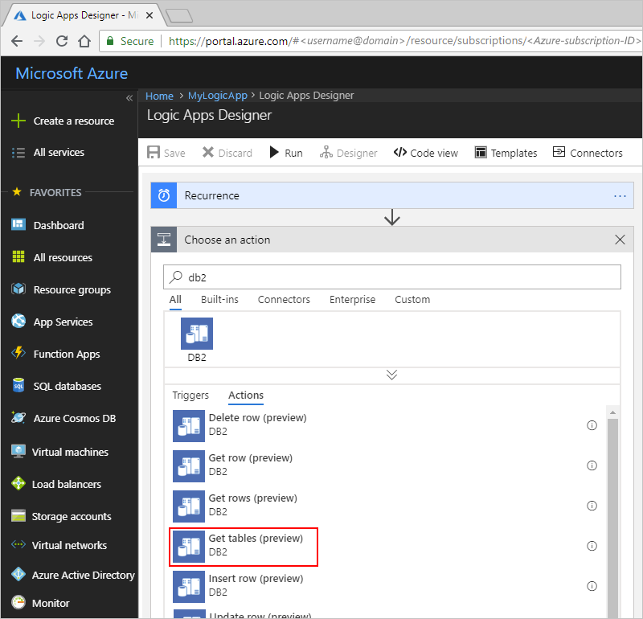
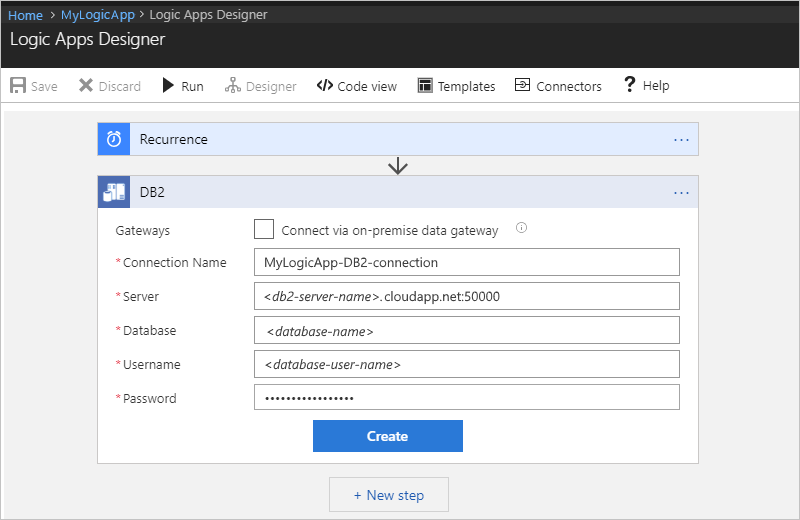
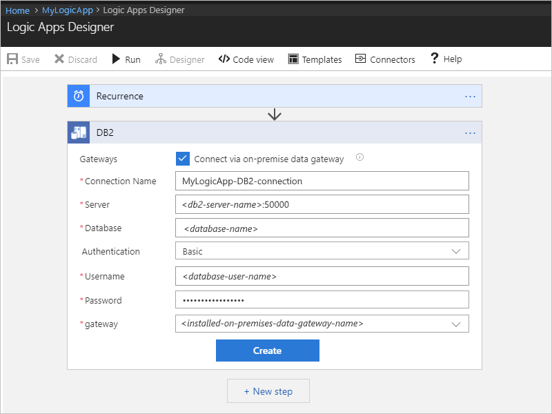
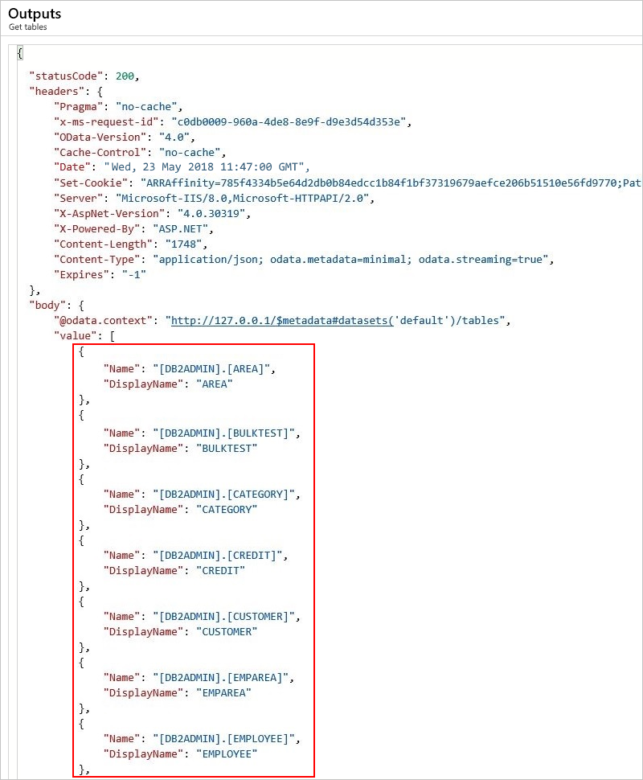

# Manage IBM DB2 resources with Azure Logic Apps

With Azure Logic Apps and the IBM DB2 connector, you can create automated 
tasks and workflows based on the resources stored in your DB2 database. 
Your workflows can connect to the resources in your database, read and 
list your database tables, add rows, change rows, delete rows, and more. 
You can include actions in your logic apps that get responses 
from your database and make the output available for other actions. 

This article shows how you can create a logic app that performs 
various database operations. If you're new to logic apps, review 
[What is Azure Logic Apps](../logic-apps/logic-apps-overview.md).

## Supported platforms and versions

The DB2 connector includes a Microsoft client that 
communicates with remote DB2 servers across a TCP/IP network. 
You can use this connector for accessing cloud databases such 
as IBM Bluemix dashDB or IBM DB2 for Windows running in Azure virtualization. 
You can also access on-premises DB2 databases after you 
[install and set up the on-premises data gateway](../logic-apps/logic-apps-gateway-connection.md). 

The IBM DB2 connector supports these IBM DB2 platforms and versions along 
with IBM DB2 compatible products, such as IBM Bluemix dashDB, 
that support Distributed Relational Database Architecture (DRDA) 
SQL Access Manager (SQLAM) versions 10 and 11:

| Platform | Version | 
|----------|---------|
| IBM DB2 for z/OS | 11.1, 10.1 |
| IBM DB2 for i | 7.3, 7.2, 7.1 |
| IBM DB2 for LUW | 11, 10.5 |
|||

## Supported database operations

The IBM DB2 connector supports these database operations, 
which map to the corresponding actions in the connector:

| Database operation | Connector action | 
|--------------------|------------------|
| List database tables | Get tables | 
| Read one row using SELECT | Get row | 
| Read all rows using SELECT | Get rows | 
| Add one row using INSERT | Insert row | 
| Edit one row using UPDATE | Update row | 
| Remove one row using DELETE | Delete row | 
|||

## Prerequisites

* An Azure subscription. If you don't have an Azure subscription, 
<a href="https://azure.microsoft.com/free/" target="_blank">sign up for a free Azure account</a>. 

* An IBM DB2 database, either cloud-based or on-premises

* Basic knowledge about 
[how to create logic apps](../logic-apps/quickstart-create-first-logic-app-workflow.md)

* The logic app where you want to access your DB2 database. 
This connector doesn't provide any triggers, so you must use 
a different trigger to start your logic app. In this article, 
the examples use the **Recurrence** trigger.

## Add DB2 action

1. In the [Azure portal](https://portal.azure.com), open your 
logic app in the Logic App Designer, if not already open.

1. Under the trigger, choose **New step**.

1. In the search box, enter "db2" as your filter. For this example, 
under the actions list, select this action: **Get tables (Preview)**
   
   

You're now prompted to provide connection details for your DB2 database 
either [in the cloud](#cloud-connection) or [on premises](#on-premises-connection).

## Connect to DB2 in the cloud

To set up your connection, provide these connection details when prompted, 
choose **Create**, and then save your logic app:

| Property | Required | Description | 
|----------|----------|-------------| 
| **Connect via on-premise gateway** | No | Applies only for on-premises connections. | 
| **Connection Name** | Yes | The name for your connection, for example, "MyLogicApp-DB2-connection" |
| **Server** | Yes | The address or alias colon port number for your DB2 server, for example, "myDB2server.cloudapp.net:50000" 

**Note**: This value is a string that represents a TCP/IP address or alias, either in IPv4 or IPv6 format, followed by a colon and a TCP/IP port number. |
| **Database** | Yes | The name for your database 

**Note**: This value is a string that represents a DRDA Relational Database Name (RDBNAM): 
- DB2 for z/OS accepts a 16-byte string where the database is known as an "IBM DB2 for z/OS" location.  - DB2 for i accepts an 18-byte string where the database is known as an "IBM DB2 for i" relational database.  - DB2 for LUW accepts an 8-byte string.|
| **Username** | Yes | Your user name for the database 

**Note**: This value is a string whose length is based on the specific database: 

- DB2 for z/OS accepts an 8-byte string.  - DB2 for i accepts a 10-byte string.  - DB2 for Linux or UNIX accepts an 8-byte string.  - DB2 for Windows accepts a 30-byte string. | 
| **Password** | Yes | Your password for the database | 
|||| 

## Connect to on-premises DB2

To set up your connection, you'll need to have the on-premises data gateway, 
provide these connection details, and then choose **Create**:

| Property | Required | Description | 
|----------|----------|-------------| 
| **Connect via on-premise gateway** | Yes | Applies when you want an on-premises connection and shows the on-premises connection properties. | 
| **Connection Name** | Yes | The name for your connection, for example, "hisdemo" | 
| **Server** | Yes | The address or alias colon port number for your DB2 server, for example, "ibmserver01:50000" 

**Note**: This value is a string that represents a TCP/IP address or alias, either in IPv4 or IPv6 format, followed by a colon and a TCP/IP port number. | 
| **Database** | Yes | The name for your database | 
| **Authentication** | Yes | The authentication type for your connection, for example, "Basic" 

**Note**: Select this value from the list, which includes Basic or Windows (Kerberos). | 
| **Username** | Yes | Your user name for the database | 
| **Password** | Yes | Your password for the database | 
| **Gateway** | Yes | The name for your installed on-premises data gateway 

**Note**: Select this value from the list, which includes all the installed data gateways within your Azure subscription and resource group. | 
|||| 

### View output tables

To run your logic app manually, on the designer toolbar, choose **Run**. 
After your logic app finishes running, you can view the output from the run.

1. On your logic app menu, choose **Overview**. 

1. Under **Summary**, in the **Runs history** section, 
select the most recent run, which is the first item in the list. 

1. Under **Logic app run**, choose **Run Details**. 

   You can now review the status, inputs, 
   and outputs for each step in your logic app. 

1. Expand the **Get tables** action.

1. To view the inputs, choose **Show raw inputs**. 

1. To view the outputs, choose **Show raw outputs**. 

   The outputs include a list of tables. 
   
   

## Get row

For the **Get row** action, 
You can define a logic app action to fetch one row in a DB2 table. 
This action instructs the connector to 
process a DB2 SELECT WHERE statement, such as `SELECT FROM AREA WHERE AREAID = '99999'`.

1. In the **Get rows (Preview)** action, select **Change connection**. 

1. In the **Connections** configurations pane, select an existing connection. 
For example, select **hisdemo2**.
   
    

1. In the **Table name** list, select the **down arrow**, and then select **AREA**.

1. Enter values for all required columns (see red asterisk). For example, type `99999` for **AREAID**. 

1. Optionally, select **Show advanced options** to specify query options.

1. Select **Save**. 
    
    

1. In the **Db2getRow** blade, within the **All runs** list under **Summary**, select the first-listed item (most recent run).

1. In the **Logic app run** blade, select **Run Details**. Within the **Action** list, select **Get_rows**. See the value for **Status**, which should be **Succeeded**. Select the **Inputs link** to view the inputs. Select the **Outputs link**, and view the outputs; which should include row.
    
    

## Get rows

You can define a logic app action to fetch all rows in a DB2 table. 
This instructs the connector to process a DB2 SELECT statement, such as `SELECT * FROM AREA`.

1. In the **actions** list, type `db2` in the **Search for more actions** edit box, and then select **DB2 - Get rows (Preview)**.
1. In the **Get rows (Preview)** action, select **Change connection**.
1. In the **Connections** configuration pane, select **Create new**. 
   
    
1. In the **Gateways** configuration pane, leave the **checkbox** disabled (unclicked) **Connect via gateway**.
   
   * Type value for **Connection name**. For example, type `HISDEMO2`.
   * Type value for **DB2 server name**, in the form of address or alias colon port number. For example, type `HISDEMO2.cloudapp.net:50000`.
   * Type value for **DB2 database name**. For example, type `NWIND`.
   * Type value for **Username**. For example, type `db2admin`.
   * Type value for **Password**. For example, type `Password1`.
1. Select **Create** to continue.
   
    
1. In the **Table name** list, select the **down arrow**, and then select **AREA**.
1. Optionally, select **Show advanced options** to specify query options.
1. Select **Save**. 
    
    
1. In the **Db2getRows** blade, within the **All runs** list under **Summary**, select the first-listed item (most recent run).
1. In the **Logic app run** blade, select **Run Details**. Within the **Action** list, select **Get_rows**. See the value for **Status**, which should be **Succeeded**. Select the **Inputs link** to view the inputs. Select the **Outputs link**, and view the outputs; which should include a list of rows.
    
    

## Insert row

You can define a logic app action to add one row in a DB2 table. This action instructs the connector to process a DB2 INSERT statement, such as `INSERT INTO AREA (AREAID, AREADESC, REGIONID) VALUES ('99999', 'Area 99999', 102)`.

### Create a logic app
1. In the **Azure start board**, select **+** (plus sign), **Web + Mobile**, and then **Logic App**.
2. Enter the **Name**, such as `Db2insertRow`, **Subscription**, **Resource group**, **Location**, and **App Service Plan**. Select **Pin to dashboard**, and then select **Create**.

### Add a trigger and action
1. In the **Logic Apps Designer**, select **Blank LogicApp** in the **Templates** list.
2. In the **triggers** list, select **Recurrence**. 
3. In the **Recurrence** trigger, select **Edit**, select **Frequency** drop-down to select **Day**, and then select **Interval** to type **7**. 
4. Select the **+ New step** box, and then select **Add an action**.
5. In the **actions** list, type **db2** in the **Search for more actions** edit box, and then select **DB2 - Insert row (Preview)**.
6. In the **DB2 - Insert row (Preview)** action, select **Change connection**. 
7. In the **Connections** configuration pane, select a connection. For example, select **hisdemo2**.
   
    
8. In the **Table name** list, select the **down arrow**, and then select **AREA**.
9. Enter values for all required columns (see red asterisk). For example, type `99999` for **AREAID**, type `Area 99999`, and type `102` for **REGIONID**. 
10. Select **Save**.
    
    
11. In the **Db2insertRow** blade, within the **All runs** list under **Summary**, select the first-listed item (most recent run).
12. In the **Logic app run** blade, select **Run Details**. Within the **Action** list, select **Get_rows**. See the value for **Status**, which should be **Succeeded**. Select the **Inputs link** to view the inputs. Select the **Outputs link**, and view the outputs; which should include the new row.
    
    

## Update row

You can define a logic app action to change one row in a DB2 table. This action instructs the connector to process a DB2 UPDATE statement, such as `UPDATE AREA SET AREAID = '99999', AREADESC = 'Area 99999', REGIONID = 102)`.

### Create a logic app
1. In the **Azure start board**, select **+** (plus sign), **Web + Mobile**, and then **Logic App**.
2. Enter the **Name**, such as `Db2updateRow`, **Subscription**, **Resource group**, **Location**, and **App Service Plan**. Select **Pin to dashboard**, and then select **Create**.

### Add a trigger and action
1. In the **Logic Apps Designer**, select **Blank LogicApp** in the **Templates** list.
2. In the **triggers** list, select **Recurrence**. 
3. In the **Recurrence** trigger, select **Edit**, select **Frequency** drop-down to select **Day**, and then select **Interval** to type **7**. 
4. Select the **+ New step** box, and then select **Add an action**.
5. In the **actions** list, type **db2** in the **Search for more actions** edit box, and then select **DB2 - Update row (Preview)**.
6. In the **DB2 - Update row (Preview)** action, select **Change connection**. 
7. In the **Connections** configurations pane, select to select an existing connection. For example, select **hisdemo2**.
   
    
8. In the **Table name** list, select the **down arrow**, and then select **AREA**.
9. Enter values for all required columns (see red asterisk). For example, type `99999` for **AREAID**, type `Updated 99999`, and type `102` for **REGIONID**. 
10. Select **Save**. 
    
    
11. In the **Db2updateRow** blade, within the **All runs** list under **Summary**, select the first-listed item (most recent run).
12. In the **Logic app run** blade, select **Run Details**. Within the **Action** list, select **Get_rows**. See the value for **Status**, which should be **Succeeded**. Select the **Inputs link** to view the inputs. Select the **Outputs link**, and view the outputs; which should include the new row.
    
    

## Delete row

You can define a logic app action to remove one row in a DB2 table. This action instructs the connector to process a DB2 DELETE statement, such as `DELETE FROM AREA WHERE AREAID = '99999'`.

### Create a logic app
1. In the **Azure start board**, select **+** (plus sign), **Web + Mobile**, and then **Logic App**.
2. Enter the **Name**, such as `Db2deleteRow`, **Subscription**, **Resource group**, **Location**, and **App Service Plan**. Select **Pin to dashboard**, and then select **Create**.

### Add a trigger and action
1. In the **Logic Apps Designer**, select **Blank LogicApp** in the **Templates** list. 
2. In the **triggers** list, select **Recurrence**. 
3. In the **Recurrence** trigger, select **Edit**, select **Frequency** drop-down to select **Day**, and then select **Interval** to type **7**. 
4. Select the **+ New step** box, and then select **Add an action**.
5. In the **actions** list, select **db2** in the **Search for more actions** edit box, and then select **DB2 - Delete row (Preview)**.
6. In the **DB2 - Delete row (Preview)** action, select **Change connection**. 
7. In the **Connections** configurations pane, select an existing connection. For example, select **hisdemo2**.
   
    
8. In the **Table name** list, select the **down arrow**, and then select **AREA**.
9. Enter values for all required columns (see red asterisk). For example, type `99999` for **AREAID**. 
10. Select **Save**. 
    
    
11. In the **Db2deleteRow** blade, within the **All runs** list under **Summary**, select the first-listed item (most recent run).
12. In the **Logic app run** blade, select **Run Details**. Within the **Action** list, select **Get_rows**. See the value for **Status**, which should be **Succeeded**. Select the **Inputs link** to view the inputs. Select the **Outputs link**, and view the outputs; which should include the deleted row.
    
    

## Connector reference

For technical details, such as triggers, actions, and limits, 
as described by the connector's Swagger file, 
see the [connector's reference page](/connectors/db2/). 

## Get support

* For questions, visit the [Azure Logic Apps forum](https://social.msdn.microsoft.com/Forums/en-US/home?forum=azurelogicapps).
* To submit or vote on feature ideas, visit the [Logic Apps user feedback site](http://aka.ms/logicapps-wish).

## Next steps

* Learn about other [Logic Apps connectors](../connectors/apis-list.md)
