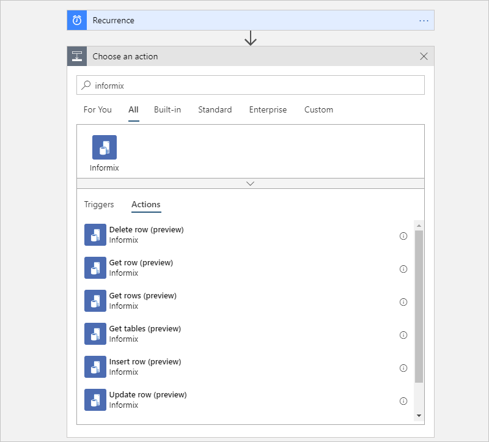
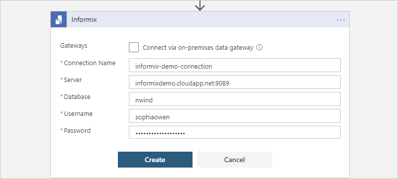
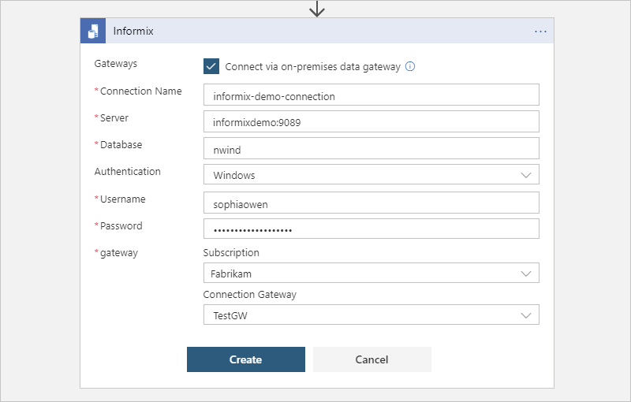
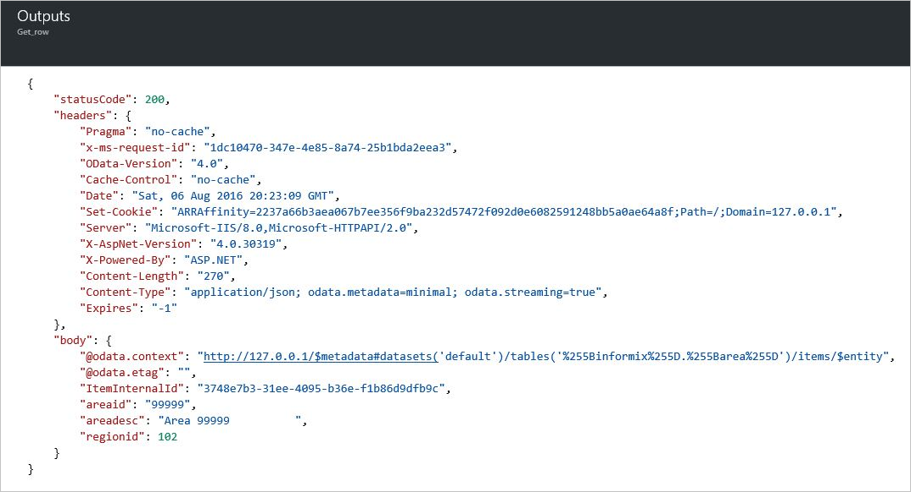
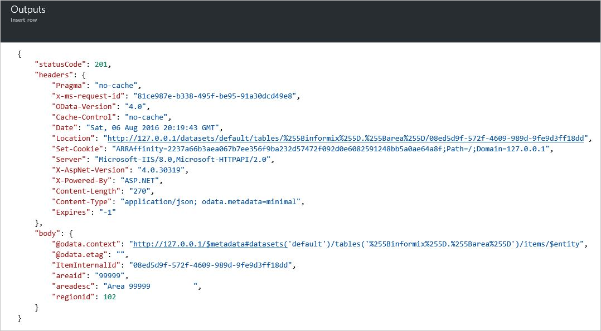
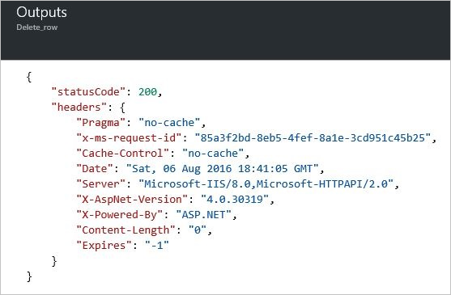

# Manage IBM Informix database resources by using Azure Logic Apps

With [Azure Logic Apps](../logic-apps/logic-apps-overview.md) and the [Informix connector](/connectors/informix/), you can create automated tasks and workflows that manage resources in an IBM Informix database. This connector includes a Microsoft client that communicates with remote Informix server computers across a TCP/IP network, including cloud-based databases, such as IBM Informix for Windows running in Azure virtualization and on-premises databases by using the on-premises data gateway. You can connect to these Informix platforms and versions if they are configured to support Distributed Relational Database Architecture (DRDA) client connections:

* IBM Informix 12.1
* IBM Informix 11.7

This topic shows you how to use the connector in a logic app to process database operations.

## Prerequisites

* An Azure subscription. If you don't have an Azure subscription, [sign up for a free Azure account](https://azure.microsoft.com/free/).

* For on-premises databases, [download and install the on-premises data gateway](../logic-apps/logic-apps-gateway-install.md) on a local computer and then [create an Azure data gateway resource in the Azure portal](../logic-apps/logic-apps-gateway-connection.md).

* The logic app where you need access to your Informix database. This connector provides only actions, so your logic app must already start with a trigger, for example, the [Recurrence trigger](../connectors/connectors-native-recurrence.md). 

## Add an Informix action

1. In the [Azure portal](https://portal.azure.com), open your logic app in the Logic App Designer, if not already open.

1. Under the step where you want to add the Informix action, select **New step**.

   To add an action between existing steps, move your mouse over the connecting arrow. Select the plus sign (**+**) that appears, and then select **Add an action**.

1. In the search box, enter `informix` as your filter. From actions list, select the action that you want, for example:

   

   The connector provides these actions, which run the corresponding database operations:

   * Get tables - List database tables by using a `CALL` statement
   * Get rows - Read all rows by using a `SELECT *` statement
   * Get row - Read a row by using a `SELECT WHERE` statement
   * Add a row by using an `INSERT` statement
   * Edit a row by using an `UPDATE` statement
   * Delete a row by using a `DELETE` statement

1. If you're prompted to provide connection details for your Informix database, follow the steps to create connections for [cloud databases](#cloud-connection) or [on-premises databases](#on-premises-connection).

1. After you create your connection, provide the information for your selected action:

   | Action | Description | Properties and descriptions |
   |--------|-------------|-----------------------------|
   | **Get tables** | List database tables by running an Informix CALL statement. | None |
   | **Get rows** | Fetch all the rows in the specified table by running an Informix `SELECT *` statement. | **Table name**: The name for the Informix table that you want 

To add other properties to this action, select them from the **Add new parameter** list. For more information, see the [connector's reference topic](/connectors/informix/). |
   | **Get row** | Fetch a row from the specified table by running an Informix `SELECT WHERE` statement. | - **Table name**: The name for the Informix table that you want  - **Row ID**: The unique ID for the row, for example, `9999` |
   | **Insert row** | Add a row to the specified Informix table by running an Informix `INSERT` statement. | - **Table name**: The name for the Informix table that you want  - **item**: The row with the values to add |
   | **Update row** | Change a row in the specified Informix table by running an Informix `UPDATE` statement. | - **Table name**: The name for the Informix table that you want  - **Row ID**: The unique ID for the row to update, for example, `9999`  - **Row**: The row with the updated values, for example, `102` |
   | **Delete row** | Remove a row from the specified Informix table by running an Informix `DELETE` statement. | - **Table name**: The name for the Informix table that you want  - **Row ID**: The unique ID for the row to delete, for example, `9999` |
   ||||

## Connect to Informix

1. If your logic app connects to an on-premises database, select **Connect via on-premises data gateway**.

1. Provide this connection information and then select **Create**.

   | Property | JSON property | Required | Example value | Description |
   |----------|---------------|----------|---------------|-------------|
   | Connection name | `name` | Yes | `informix-demo-connection` | The name to use for the connection to your Informix database |
   | Server | `server` | Yes | - Cloud: `informixdemo.cloudapp.net:9089`  - On-premises: `informixdemo:9089` | The TCP/IP address or alias that is in either IPv4 or IPv6 format, followed by a colon and a TCP/IP port number |
   | Database | `database` | Yes | `nwind` | The DRDA Relational Database Name (RDBNAM) or Informix database name (dbname). Informix accepts a 128-byte string. |
   | Authentication | `authentication` | On-premises only | **Basic** or **Windows** (kerberos) | The authentication type that's required by your Informix database. This property appears only when you select **Connect via on-premises data gateway**. |
   | Username | `username` | No | <*database-user-name*> | A user name for the database |
   | Password | `password` | No | <*database-password*> | A password for the database |
   | Gateway | `gateway` | On-premises only | - <*Azure-subscription*>  - <*Azure-on-premises-data-gateway-resource*> | The Azure subscription and Azure resource name for the on-premises data gateway that you created in the Azure portal. The **Gateway** property and sub-properties appears only when you select **Connect via on-premises data gateway**. |
   ||||||

   For example:

   * **Cloud database**

     

   * **On-premises database**

     

1. Save your logic app.

## View outputs

After your logic app runs, you can view the outputs from that run.

1. From your logic app's menu, select **Overview**. On the overview pane, under **Summary** > **Runs history**, select the most recent run.

1. Under **Logic app run**, select **Run Details**.

1. From the actions list, select the action with the outputs that you want to view, for example, **Get_tables**.

   If the action was successful, their **Status** property is marked as **Succeeded**.

1. To view the inputs, under **Inputs Link**, select the URL link. To view the outputs, under **Outputs Link** link, select the URL link. Here are some example outputs:

   * **Get tables** shows a list of tables:

     

   * **Get_rows** shows a list of rows:

     

   * **Get_row** shows the specified row:

     

   * **Insert_row** shows the new row:

     

   * **Update_row** shows the updated row:

     

   * **Delete_row** shows the deleted row:

     

## Connector-specific details

For technical details about triggers, actions, and limits, which are described by the connector's Swagger description, review the [connector's reference page](/connectors/informix/).

## Next steps

* Learn about other [Logic Apps connectors](apis-list.md)