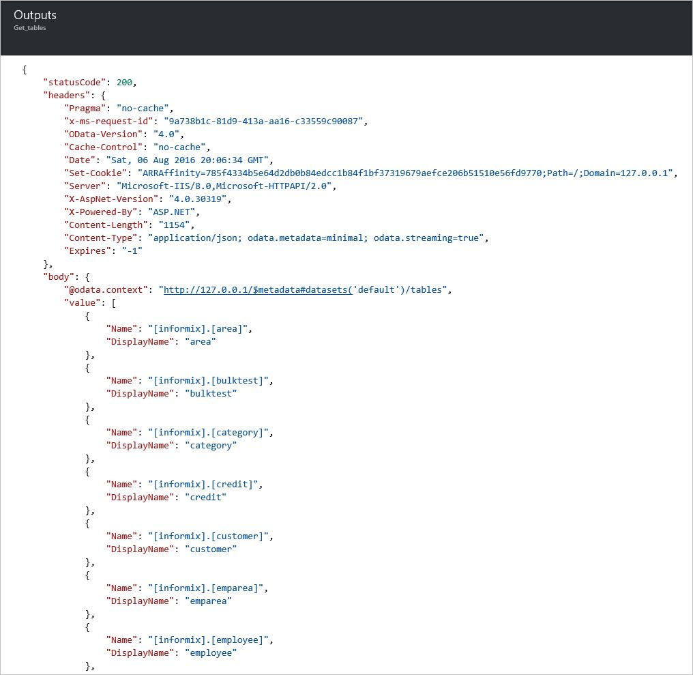
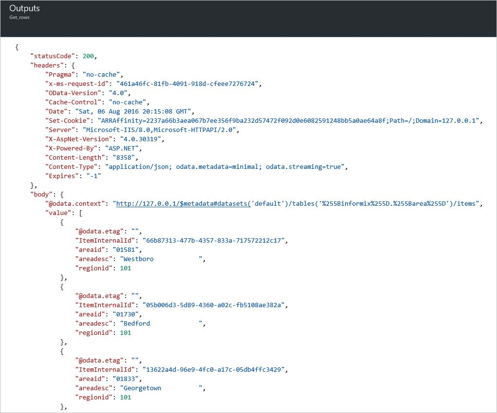
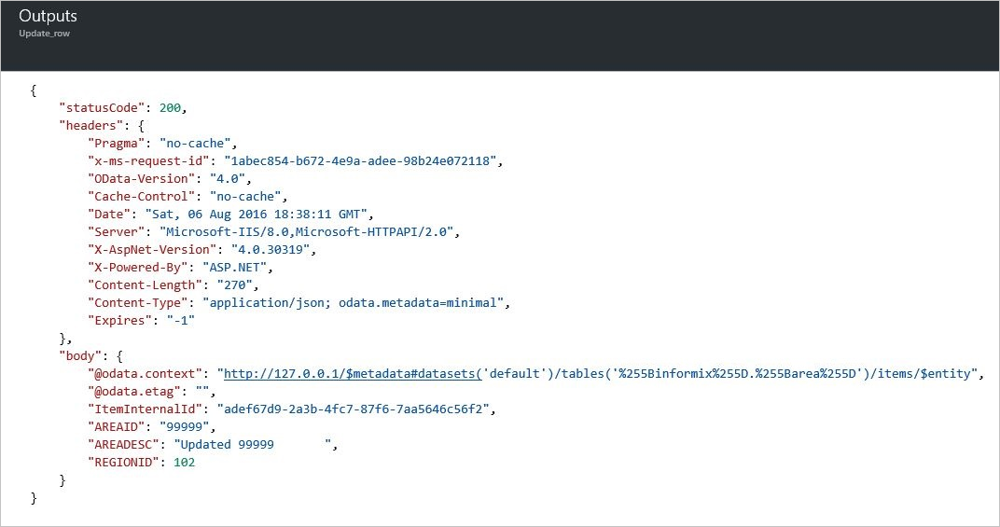

---
# required metadata
title: Connect to IBM Informix database - Azure Logic Apps | Microsoft Docs
description: Manage resources with IBM Informix REST APIs and Azure Logic Apps 
author: gplarsen
manager: jeconnoc
ms.author: plarsen
ms.date: 09/26/2016
ms.topic: article

services: logic-apps

# optional metadata
ms.reviewer: klam, LADocs
ms.suite: integration
tags: connectors
---

# Get started with the Informix connector
Microsoft connector for Informix connects Logic Apps to resources stored in an IBM Informix database. The Informix connector includes a Microsoft client to communicate to remote Informix server computers across a TCP/IP network. This includes cloud databases, such as IBM Informix for Windows running in Azure virtualization, and on-premises databases using the on-premises data gateway. See the [supported list](connectors-create-api-informix.md#supported-informix-platforms-and-versions) of IBM Informix platforms and versions (in this topic).

The connector supports the following database operations:

* List database tables
* Read one row using SELECT
* Read all rows using SELECT
* Add one row using INSERT
* Alter one row using UPDATE
* Remove one row using DELETE

This topic shows you how to use the connector in a logic app to process database operations.

To learn more about Logic Apps, see [create a logic app](../logic-apps/quickstart-create-first-logic-app-workflow.md).

## Available actions
This connector supports the following logic app actions:

* Getables
* GetRow
* GetRows
* InsertRow
* UpdateRow
* DeleteRow

## List tables
Creating a logic app for any operation is comprised of many steps performed through the Microsoft Azure portal.

Within the logic app, you can add an action to list tables in an Informix database. This action instructs the connector to process an Informix schema statement, such as `CALL SYSIBM.SQLTABLES`.

### Create a logic app
1. In the **Azure start board**, select **+** (plus sign), **Web + Mobile**, and then **Logic App**.
2. Enter the **Name**, such as `InformixgetTables`, **Subscription**, **Resource group**, **Location**, and **App Service Plan**. Select **Pin to dashboard**, and then select **Create**.

### Add a trigger and action
1. In the **Logic Apps Designer**, select **Blank LogicApp** in the **Templates** list.
2. In the **triggers** list, select **Recurrence**. 
3. In the **Recurrence** trigger, select **Edit**, select **Frequency** drop-down to select **Day**, and then select **Interval** to type **7**.  
4. Select the **+ New step** box, and then select **Add an action**.
5. In the **actions** list, type **informix** in the **Search for more actions** edit box, and then select **Informix - Get tables (Preview)**.
   
     
6. In the **Informix - Get tables** configuration pane, select **checkbox** to enable **Connect via on-premises data gateway**. Notice that the settings change from cloud to on-premises.
   
   * Type value for **Server**, in the form of address or alias colon port number. For example, type `ibmserver01:9089`.
   * Type value for **Database**. For example, type `nwind`.
   * Select value for **Authentication**. For example, select **Basic**.
   * Type value for **Username**. For example, type `informix`.
   * Type value for **Password**. For example, type `Password1`.
   * Select value for **Gateway**. For example, select **datagateway01**.
7. Select **Create**, and then select **Save**. 
   
    
8. In the **InformixgetTables** blade, within the **All runs** list under **Summary**, select the first-listed item (most recent run).
9. In the **Logic app run** blade, select **Run Details**. Within the **Action** list, select **Get_tables**. See the value for **Status**, which should be **Succeeded**. Select the **Inputs link** to view the inputs. Select the **Outputs link**, and view the outputs; which should include a list of tables.
   
   

## Create the connections
This connector supports connections to database on-premises and in the cloud using the following connection properties. 

| Property | Description |
| --- | --- |
| server |Required. Accepts a string value representing a TCP/IP address or alias, in either IPv4 or IPv6 format, followed (colon-delimited) by a TCP/IP port number. |
| database |Required. Accepts a string value representing a DRDA Relational Database Name (RDBNAM). Informix accepts a 128-byte string (database is known as an IBM Informix database name (dbname)). |
| authentication |Optional. Accepts a list item value, either Basic or Windows (kerberos). |
| username |Required. Accepts a string value. |
| password |Required. Accepts a string value. |
| gateway |Required. Accepts a list item value, representing the on-premises data gateway defined to Logic Apps within the storage group. |

## Create the on-premises gateway connection
This connector can access an on-premises Informix database using the on-premises data gateway. See gateway topics for more information. 

1. In the **Gateways** configuration pane, select **checkbox** to enable **Connect via gateway**. See the settings change from cloud to on-premises.
2. Type value for **Server**, in the form of address or alias colon port number. For example, type `ibmserver01:9089`.
3. Type value for **Database**. For example, type `nwind`.
4. Select value for **Authentication**. For example, select **Basic**.
5. Type value for **Username**. For example, type `informix`.
6. Type value for **Password**. For example, type `Password1`.
7. Select value for **Gateway**. For example, select **datagateway01**.
8. Select **Create** to continue. 
   
    

## Create the cloud connection
This connector can access a cloud Informix database. 

1. In the **Gateways** configuration pane, leave the **checkbox** disabled (unclicked) **Connect via gateway**. 
2. Type value for **Connection name**. For example, type `hisdemo2`.
3. Type value for **Informix server name**, in the form of address or alias colon port number. For example, type `hisdemo2.cloudapp.net:9089`.
4. Type value for **Informix database name**. For example, type `nwind`.
5. Type value for **Username**. For example, type `informix`.
6. Type value for **Password**. For example, type `Password1`.
7. Select **Create** to continue. 
   
    

## Fetch all rows using SELECT
You can create a logic app action to fetch all rows in the Informix table. This action instructs the connector to process an Informix SELECT statement, such as `SELECT * FROM AREA`.

### Create a logic app
1. In the **Azure start board**, select **+** (plus sign), **Web + Mobile**, and then **Logic App**.
2. Enter the **Name** (e.g. "**InformixgetRows**"), **Subscription**, **Resource group**, **Location**, and **App Service Plan**. Select **Pin to dashboard**, and then select **Create**.

### Add a trigger and action
1. In the **Logic Apps Designer**, select **Blank LogicApp** in the **Templates** list.
2. In the **triggers** list, select **Recurrence**. 
3. In the **Recurrence** trigger, select **Edit**, select **Frequency** drop-down to select **Day**, and then select **Interval** to type **7**. 
4. Select the **+ New step** box, and then select **Add an action**.
5. In the **actions** list, type **informix** in the **Search for more actions** edit box, and then select **Informix - Get rows (Preview)**.
6. In the **Get rows (Preview)** action, select **Change connection**.
7. In the **Connections** configuration pane, select **Create new**. 
   
    
8. In the **Gateways** configuration pane, leave the **checkbox** disabled (unclicked) **Connect via gateway**.
   
   * Type value for **Connection name**. For example, type `HISDEMO2`.
   * Type value for **Informix server name**, in the form of address or alias colon port number. For example, type `HISDEMO2.cloudapp.net:9089`.
   * Type value for **Informix database name**. For example, type `NWIND`.
   * Type value for **Username**. For example, type `informix`.
   * Type value for **Password**. For example, type `Password1`.
9. Select **Create** to continue.
   
    
10. In the **Table name** list, select the **down arrow**, and then select **AREA**.
11. Optionally, select **Show advanced options** to specify query options.
12. Select **Save**. 
    
    
13. In the **InformixgetRows** blade, within the **All runs** list under **Summary**, select the first-listed item (most recent run).
14. In the **Logic app run** blade, select **Run Details**. Within the **Action** list, select **Get_rows**. See the value for **Status**, which should be **Succeeded**. Select the **Inputs link** to view the inputs. Select the **Outputs link**, and view the outputs; which should include a list of rows.
    
    

## Add one row using INSERT
You can create a logic app action to add one row in an Informix table. This action instructs the connector to process an Informix INSERT statement, such as `INSERT INTO AREA (AREAID, AREADESC, REGIONID) VALUES ('99999', 'Area 99999', 102)`.

### Create a logic app
1. In the **Azure start board**, select **+** (plus sign), **Web + Mobile**, and then **Logic App**.
2. Enter the **Name**, such as `InformixinsertRow`, **Subscription**, **Resource group**, **Location**, and **App Service Plan**. Select **Pin to dashboard**, and then select **Create**.

### Add a trigger and action
1. In the **Logic Apps Designer**, select **Blank LogicApp** in the **Templates** list.
2. In the **triggers** list, select **Recurrence**. 
3. In the **Recurrence** trigger, select **Edit**, select **Frequency** drop-down to select **Day**, and then select **Interval** to type **7**. 
4. Select the **+ New step** box, and then select **Add an action**.
5. In the **actions** list, type **informix** in the **Search for more actions** edit box, and then select **Informix - Insert row (Preview)**.
6. In the **Get rows (Preview)** action, select **Change connection**. 
7. In the **Connections** configuration pane, select to select an connection. For example, select **hisdemo2**.
   
    
8. In the **Table name** list, select the **down arrow**, and then select **AREA**.
9. Enter values for all required columns (see red asterisk). For example, type `99999` for **AREAID**, type `Area 99999`, and type `102` for **REGIONID**. 
10. Select **Save**.
    
    
11. In the **InformixinsertRow** blade, within the **All runs** list under **Summary**, select the first-listed item (most recent run).
12. In the **Logic app run** blade, select **Run Details**. Within the **Action** list, select **Get_rows**. See the value for **Status**, which should be **Succeeded**. Select the **Inputs link** to view the inputs. Select the **Outputs link**, and view the outputs; which should include the new row.
    
    

## Fetch one row using SELECT
You can create a logic app action to fetch one row in an Informix table. This action instructs the connector to process an Informix SELECT WHERE statement, such as `SELECT FROM AREA WHERE AREAID = '99999'`.

### Create a logic app
1. In the **Azure start board**, select **+** (plus sign), **Web + Mobile**, and then **Logic App**.
2. Enter the **Name**, such as `InformixgetRow`, **Subscription**, **Resource group**, **Location**, and **App Service Plan**. Select **Pin to dashboard**, and then select **Create**.

### Add a trigger and action
1. In the **Logic Apps Designer**, select **Blank LogicApp** in the **Templates** list.
2. In the **triggers** list, select **Recurrence**. 
3. In the **Recurrence** trigger, select **Edit**, select **Frequency** drop-down to select **Day**, and then select **Interval** to type **7**. 
4. Select the **+ New step** box, and then select **Add an action**.
5. In the **actions** list, type **informix** in the **Search for more actions** edit box, and then select **Informix - Get rows (Preview)**.
6. In the **Get rows (Preview)** action, select **Change connection**. 
7. In the **Connections** configurations pane, select to select an existing connection. For example, select **hisdemo2**.
   
    
8. In the **Table name** list, select the **down arrow**, and then select **AREA**.
9. Enter values for all required columns (see red asterisk). For example, type `99999` for **AREAID**. 
10. Optionally, select **Show advanced options** to specify query options.
11. Select **Save**. 
    
    
12. In the **InformixgetRow** blade, within the **All runs** list under **Summary**, select the first-listed item (most recent run).
13. In the **Logic app run** blade, select **Run Details**. Within the **Action** list, select **Get_rows**. See the value for **Status**, which should be **Succeeded**. Select the **Inputs link** to view the inputs. Select the **Outputs link**, and view the outputs; which should include row.
    
    

## Change one row using UPDATE
You can create a logic app action to change one row in an Informix table. This action instructs the connector to process an Informix UPDATE statement, such as `UPDATE AREA SET AREAID = '99999', AREADESC = 'Area 99999', REGIONID = 102)`.

### Create a logic app
1. In the **Azure start board**, select **+** (plus sign), **Web + Mobile**, and then **Logic App**.
2. Enter the **Name**, such as `InformixupdateRow`, **Subscription**, **Resource group**, **Location**, and **App Service Plan**. Select **Pin to dashboard**, and then select **Create**.

### Add a trigger and action
1. In the **Logic Apps Designer**, select **Blank LogicApp** in the **Templates** list.
2. In the **triggers** list, select **Recurrence**. 
3. In the **Recurrence** trigger, select **Edit**, select **Frequency** drop-down to select **Day**, and then select **Interval** to type **7**. 
4. Select the **+ New step** box, and then select **Add an action**.
5. In the **actions** list, type **informix** in the **Search for more actions** edit box, and then select **Informix - Update row (Preview)**.
6. In the **Get rows (Preview)** action, select **Change connection**. 
7. In the **Connections** configurations pane, select to select an existing connection. For example, select **hisdemo2**.
   
    
8. In the **Table name** list, select the **down arrow**, and then select **AREA**.
9. Enter values for all required columns (see red asterisk). For example, type `99999` for **AREAID**, type `Updated 99999`, and type `102` for **REGIONID**. 
10. Select **Save**. 
    
    
11. In the **InformixupdateRow** blade, within the **All runs** list under **Summary**, select the first-listed item (most recent run).
12. In the **Logic app run** blade, select **Run Details**. Within the **Action** list, select **Get_rows**. See the value for **Status**, which should be **Succeeded**. Select the **Inputs link** to view the inputs. Select the **Outputs link**, and view the outputs; which should include the new row.
    
    

## Remove one row using DELETE
You can create a logic app action to remove one row in an Informix table. This action instructs the connector to process an Informix DELETE statement, such as `DELETE FROM AREA WHERE AREAID = '99999'`.

### Create a logic app
1. In the **Azure start board**, select **+** (plus sign), **Web + Mobile**, and then **Logic App**.
2. Enter the **Name**, such as `InformixdeleteRow`, **Subscription**, **Resource group**, **Location**, and **App Service Plan**. Select **Pin to dashboard**, and then select **Create**.

### Add a trigger and action
1. In the **Logic Apps Designer**, select **Blank LogicApp** in the **Templates** list.
2. In the **triggers** list, select **Recurrence**. 
3. In the **Recurrence** trigger, select **Edit**, select **Frequency** drop-down to select **Day**, and then select **Interval** to type **7**. 
4. Select the **+ New step** box, and then select **Add an action**.
5. In the **actions** list, type **informix** in the **Search for more actions** edit box, and then select **Informix - Delete row (Preview)**.
6. In the **Get rows (Preview)** action, select **Change connection**. 
7. In the **Connections** configurations pane, select an existing connection. For example, select **hisdemo2**.
   
    
8. In the **Table name** list, select the **down arrow**, and then select **AREA**.
9. Enter values for all required columns (see red asterisk). For example, type `99999` for **AREAID**. 
10. Select **Save**. 
    
    
11. In the **InformixdeleteRow** blade, within the **All runs** list under **Summary**, select the first-listed item (most recent run).
12. In the **Logic app run** blade, select **Run Details**. Within the **Action** list, select **Get_rows**. See the value for **Status**, which should be **Succeeded**. Select the **Inputs link** to view the inputs. Select the **Outputs link**, and view the outputs; which should include the deleted row.
    
    

## Supported Informix platforms and versions
This connector supports the following IBM Informix versions, when configured to support Distributed Relational Database Architecture (DRDA) client connections.

* IBM Informix 12.1
* IBM Informix 11.7

## Connector-specific details

View any triggers and actions defined in the swagger, and also see any limits in the [connector details](/connectors/informix/). 

## Next steps
[Create a logic app](../logic-apps/quickstart-create-first-logic-app-workflow.md). Explore the other available connectors in Logic Apps at our [APIs list](apis-list.md).

