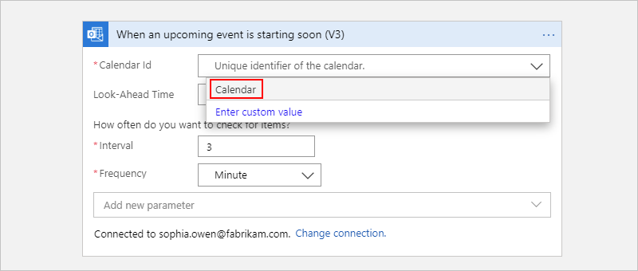
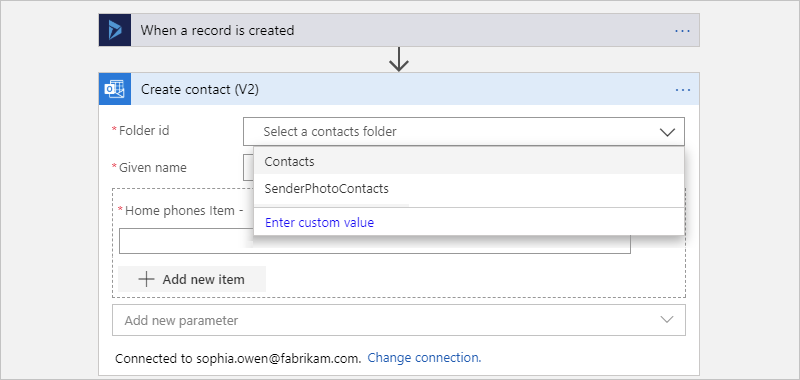

# Manage email, contacts, and calendars in Office 365 Outlook by using Azure Logic Apps

With [Azure Logic Apps](../logic-apps/logic-apps-overview.md) and the [Office 365 Outlook connector](/connectors/office365connector/), you can create automated tasks and workflows that manage your work or school account by building logic apps. For example, you can automate these tasks:

* Get, send, and reply to email.
* Schedule meetings on your calendar.
* Add and edit contacts.

You can use any trigger to start your workflow, for example, when a new email arrives, when a calendar item is updated, or when an event happens in a difference service, such as Salesforce. You can use actions that respond to the trigger event, for example, send an email or create a new calendar event.

## Prerequisites

* An Outlook account where you sign in with a [work or school account](https://www.office.com/). If you have an @outlook.com or @hotmail.com account, use the [Outlook.com connector](../connectors/connectors-create-api-outlook.md) instead. To connect to Outlook with a different user account, such as a service account, see [Connect using other accounts](#connect-using-other-accounts).

* An Azure account and subscription. If you don't have an Azure subscription, [sign up for a free Azure account](https://azure.microsoft.com/free/?WT.mc_id=A261C142F).

* The logic app where you want to access your Outlook account. To start your workflow with an Office 365 Outlook trigger, you need to have a [blank logic app](../logic-apps/quickstart-create-first-logic-app-workflow.md). To add an Office 365 Outlook action to your workflow, your logic app needs to already have a trigger.

## Add a trigger

A [trigger](../logic-apps/logic-apps-overview.md#logic-app-concepts) is an event that starts the workflow in your logic app. This example logic app uses a "polling" trigger that checks for any updated calendar event in your email account, based on the specified interval and frequency.

1. In the [Azure portal](https://portal.azure.com), open your blank logic app in the Logic App Designer.

1. In the search box, enter `office 365 outlook` as your filter. This example selects **When an upcoming event is starting soon**.
   
   

1. If you don't have an active connection to your Outlook account, you're prompted to sign in and create that connection. To connect to Outlook with a different user account, such as a service account, see [Connect using other accounts](#sign-in-other-accounts). Otherwise, provide the information for the trigger's properties.

   > [!NOTE]
   > Your connection doesn't expire until revoked, even if you change your sign-in credentials. 
   > For more information, see [Configurable token lifetimes in Azure Active Directory](../active-directory/develop/active-directory-configurable-token-lifetimes.md).

   This example selects the calendar that the trigger checks, for example:

   

1. In the trigger, set the **Frequency** and **Interval** values. To add other available trigger properties, such as **Time zone**, select those properties from the **Add new parameter** list.

   For example, if you want the trigger to check the calendar every 15 minutes, set **Frequency** to **Minute**, and set **Interval** to `15`. 

   

1. On the designer toolbar, select **Save**.

Now add an action that runs after the trigger fires. For example, you can add the Twilio **Send message** action, which sends a text when a calendar event starts in 15 minutes.

## Add an action

An [action](../logic-apps/logic-apps-overview.md#logic-app-concepts) is an operation that's run by the workflow in your logic app. This example logic app creates a new contact in Office 365 Outlook. You can use the output from another trigger or action to create the contact. For example, suppose your logic app uses the Dynamics 365 trigger, **When a record is created**. You can add the Office 365 Outlook **Create contact** action and use the outputs from the SalesForce trigger to create the new contact.

1. In the [Azure portal](https://portal.azure.com), open your logic app in the Logic App Designer.

1. To add an action as the last step in your workflow, select **New step**. 

   To add an action between steps, move your pointer over the arrow between those steps. Select the plus sign (**+**) that appears, and then select **Add an action**.

1. In the search box, enter `office 365 outlook` as your filter. This example selects **Create contact**.

    

1. If you don't have an active connection to your Outlook account, you're prompted to sign in and create that connection. To connect to Outlook with a different user account, such as a service account, see [Connect using other accounts](#connect-using-other-accounts). Otherwise, provide the information for the action's properties.

   > [!NOTE]
   > Your connection doesn't expire until revoked, even if you change your sign-in credentials. 
   > For more information, see [Configurable token lifetimes in Azure Active Directory](../active-directory/develop/active-directory-configurable-token-lifetimes.md).

   This example selects the contacts folder where the action creates the new contact, for example:

   

   To add other available action properties, select those properties from the **Add new parameter** list.

1. On the designer toolbar, select **Save**.

## Connect using other accounts

If you try connecting to Outlook by using a different account than the one currently signed in to Azure, you might get [single sign-on (SSO)](../active-directory/manage-apps/what-is-single-sign-on) errors. This problem happens when you sign in to the Azure portal with one account, but use a different account to create the connection. The Logic App Designer expects to use the account that's signed in to Azure. To resolve this problem, you have these options:

* Set up the other account as a **Contributor** to your logic app's resource group.

  1. On your logic app's resource group menu, select **Access control (IAM)**. Set up the other account with the **Contributor** role. For more information, see [Add or remove Azure role assignments using the Azure portal](../role-based-access-control/role-assignments-portal.md).

  1. If you're signed in to the Azure portal with your work or school account, sign out and sign back in with your other account. You can now create a connection to Outlook by using the other account.

* Set up the other account so that your work or school account has "send as" permissions.

   If you have admin permissions, on the service account's mailbox, set up your your work or school account with either **Send as** or **Send on behalf of** permissions. For more information, see [Give mailbox permissions to another user - Admin Help](/microsoft-365/admin/add-users/give-mailbox-permissions-to-another-user). You can then create the connection by using your work or school account. Now, in triggers or actions where you can specify the sender, you can use the service account's email address.

   For example, the **Send an email** action has an optional parameter, **From (Send as)**, which you can add to the action and use your service account's email address as the sender. To add this parameter, follow these steps:

   1. In the **Send an email** action, open the **Add a parameter** list, and select the **From (Send as)** parameter.

   1. After the parameter appears on the action, enter the service account's email address.

## Connector reference

For technical details about this connector, such as triggers, actions, and limits, as described by the connector's Swagger file, see the [connector's reference page](/connectors/office365/). 

## Next steps

* Learn about other [Logic Apps connectors](../connectors/apis-list.md)