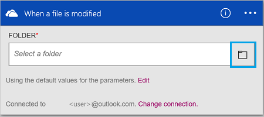
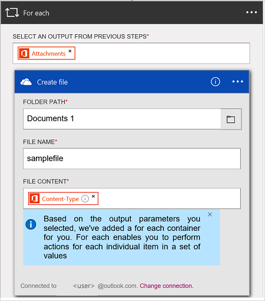

# Get started with the OneDrive connector
Connect to OneDrive to manage your files, including upload, get, delete files, and more. 

With OneDrive, you: 

* Build your workflow by storing files in OneDrive, or update existing files in OneDrive. 
* Use triggers to start your workflow when a file is created or updated within your OneDrive.
* Use actions to create a file, delete a file, and more. For example, when a new Office 365 email is received with an attachment (a trigger), create a new file in OneDrive (an action).

This topic shows you how to use the OneDrive connector in a logic app, and also lists the triggers and actions.

To learn more about Logic Apps, see [What are logic apps](../logic-apps/logic-apps-overview.md) and [create a logic app](../logic-apps/logic-apps-create-a-logic-app.md).

## Connect to OneDrive
Before your logic app can access any service, you first create a *connection* to the service. A connection provides connectivity between a logic app and another service. For example, to connect to OneDrive, you first need a OneDrive *connection*. To create a connection, enter the credentials you normally use to access the service you wish to connect to. So, with OneDrive, enter the credentials to your OneDrive account  to create the connection.

### Create the connection
> [!INCLUDE [Steps to create a connection to OneDrive](../../includes/connectors-create-api-onedrive.md)]
> 
> 

## Use a trigger
A trigger is an event that can be used to start the workflow defined in a logic app. Triggers "poll" the service at an interval and frequency that you want. [Learn more about triggers](../logic-apps/logic-apps-overview.md#logic-app-concepts).

1. In the logic app, type "onedrive" to get a list of the triggers:  
   
    
2. Select **When a file is modified**. If a connection already exists, then select the Show Picker button to select a folder.
   
    
   
    If you are prompted to sign in, then enter the sign in details to create the connection. [Create the connection](connectors-create-api-onedrive.md#create-the-connection) in this topic lists the steps. 
   
   > [!NOTE]
   > In this example, the logic app runs when a file in the folder you choose is updated. To see the results of this trigger, add another action that sends you an email. For example, add the Office 365 Outlook *Send an email* action that emails you when a file is updated. 

3. Select the **Edit** button and set the **Frequency** and **Interval** values. For example, if you want the trigger to poll every 15 minutes, then set the **Frequency** to **Minute**, and set the **Interval** to **15**. 
   
    
4. **Save** your changes (top left corner of the toolbar). Your logic app is saved and may be automatically enabled.

## Use an action
An action is an operation carried out by the workflow defined in a logic app. [Learn more about actions](../logic-apps/logic-apps-overview.md#logic-app-concepts).

1. Select the plus sign. You see several choices: **Add an action**, **Add a condition**, or one of the **More** options.
   
    
2. Choose **Add an action**.
3. In the text box, type “onedrive” to get a list of all the available actions.
   
     
4. In our example, choose **OneDrive - Create file**. If a connection already exists, then select the **Folder Path** to put the file, enter the **File Name**, and choose the **File Content** you want:  
   
    
   
    If you are prompted for the connection information, then enter the details to create the connection. [Create the connection](connectors-create-api-onedrive.md#create-the-connection) in this topic describes these properties. 
   
   > [!NOTE]
   > In this example, we create a new file in a OneDrive folder. You can use output from another trigger to create the OneDrive file. For example, add the Office 365 Outlook *When a new email arrives* trigger. Then add the OneDrive *Create file* action that uses the Attachments and Content-Type fields within a ForEach to create the new file in OneDrive. 
   > 
   > 

5. **Save** your changes (top left corner of the toolbar). Your logic app is saved and may be automatically enabled.

## Connector-specific details

View any triggers and actions defined in the swagger, and also see any limits in the [connector details](/connectors/onedriveconnector/).

## More connectors
Go back to the [APIs list](apis-list.md).