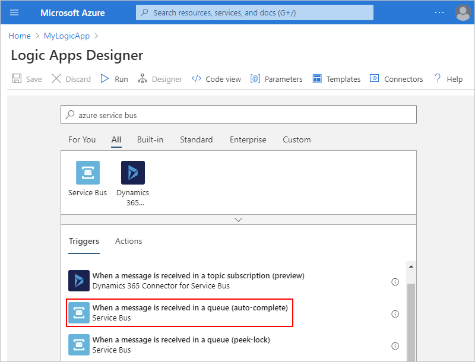

# Send and receive messages with the Azure Service Bus connector

To send and receive messages with your logic app, 
connect to [Azure Service Bus](https://azure.microsoft.com/services/service-bus/). 
You can perform actions such as send to a queue, send to a topic, 
receive from a queue, and receive from a subscription. 
Learn more about [Azure Service Bus](../service-bus-messaging/service-bus-messaging-overview.md) 
and [how pricing works for Logic Apps triggers](../logic-apps/logic-apps-pricing.md).

## Prerequisites

Before you can use the Service Bus connector, you must have these items, 
which must exist in the same Azure subscription so that they're visible to each other:

* A [Service Bus namespace and messaging entity, such as a queue](../service-bus-messaging/service-bus-create-namespace-portal)
* A [logic app](../logic-apps/quickstart-create-first-logic-app-workflow.md)

## Connect to Azure Service Bus

Before your logic app can access any service, 
you have to create a [*connection*](./connectors-overview.md) 
between your logic app and the service, if you haven't already. 
This connection authorizes your logic app to access data. 
For your logic app to access your Service Bus account, 
check your permissions.

1. Sign in to the [Azure portal](https://portal.azure.com "Azure portal"). 

2. Go to your Service Bus *namespace*, not a specific "messaging entity". 
On the namespace blade, under **Settings**, choose **Shared access policies**. 
Under **Claims**, check that you have **Manage** permissions for that namespace.

   

3. If you want to later manually enter your connection information, 
get the connection string for your Service Bus namespace. 
Choose **RootManageSharedAccessKey**. Next to your primary key connection string, 
choose the copy button. Save the connection string for later use.

   

   > [!TIP]
   > To confirm whether your connection string is 
   > associated with your Service Bus namespace or with a specific entity, 
   > check the connection string for the `EntityPath` parameter. 
   > If you find this parameter, the connection string is for a specific entity, 
   > and is not the correct string to use with your logic app.

## Trigger workflow when your Service Bus gets new messages

A [*trigger*](../logic-apps/logic-apps-overview.md#logic-app-concepts) 
is an event that starts a workflow in your logic app. To start a workflow
when new messages are sent to your Service Bus, follow these steps for adding 
the trigger that detects these messages.

1. In the [Azure portal](https://portal.azure.com "Azure portal"), 
go to your existing logic app or create a blank logic app.

2. In Logic Apps Designer, enter "service bus" in the search box as your filter. 
Select the **Service Bus** connector. 

    

3. Select the trigger that you want to use. 
For example, to run a logic app when a new item gets sent to a Service Bus queue, 
select this trigger: **Service Bus - When a message is received in a queue (auto-complete)**

   

   1. If you don't already have a connection to your Service Bus namespace, 
   you're prompted to create this connection now. Give your connection a name, 
   and select the Service Bus namespace that you want to use.

      

      Or, to manually enter the connection connection string, 
      choose **Manually enter connection information** instead. 
      Learn [how to find your connection string](#permissions-connection-string).

   2. Now select the Service Bus policy to use, and choose **Create**.

      

4. Select the Service Bus queue to use, 
and set up the interval and frequency for when to check the queue.

   

5. Save your logic app. On the designer toolbar, choose **Save**.

Now, when your logic app checks the selected queue and finds 
a new message, the trigger runs the actions in your logic app 
for the found message.

## Send messages from your logic app to your Service Bus

An [*action*](../logic-apps/logic-apps-overview.md#logic-app-concepts) 
is a task performed by your logic app workflow. After you add a trigger to your logic app, 
you can add an action to perform operations with data generated by that trigger. 
To send a message to your Service Bus messaging entity from your logic app, follow these steps.

1. In Logic Apps Designer, under your trigger, choose **+ New step** > **Add an action**.

2. In the search box, enter "service bus" as your filter. 
Select this connector: **Service Bus**

    

3. Select this action: **Service Bus - Send message**

   

4. Select the messaging entity, which is the queue or topic name, 
for where to send the message. Then, enter the message content and any other details.

       

5. Save your logic app. 

You've now set up an action that sends messages from your logic app. 

## Connector-specific details

To learn more about triggers and actions defined by the Swagger file and any limits, 
review the [connector details](/connectors/servicebus/).

## Get support

* For questions, visit the [Azure Logic Apps forum](https://social.msdn.microsoft.com/Forums/en-US/home?forum=azurelogicapps).
* To submit or vote on feature ideas, visit the [Logic Apps user feedback site](http://aka.ms/logicapps-wish).

## Next steps

* Learn more about [other connectors for Azure Logic apps](../connectors/apis-list.md)