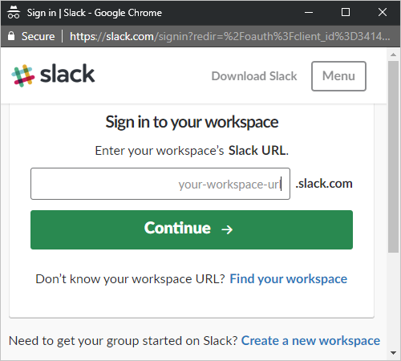
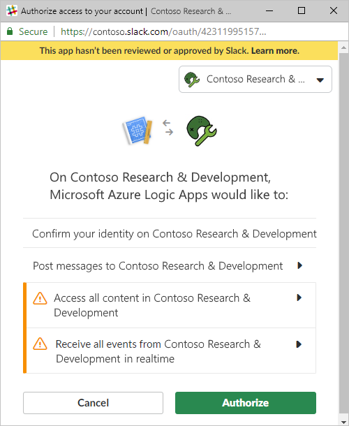

# Monitor and manage Slack with Azure Logic Apps

With Azure Logic Apps and the Slack connector, 
you can create automated tasks and workflows that monitor 
your Slack files and manage your Slack channels, messages, 
groups, and so on, for example:

* Monitor when new files are created.
* Create, list, and join channels 
* Post messages.
* Create groups and set do not disturb.

You can use triggers that get responses from your Slack account 
and make the output available to other actions. You can use actions 
that perform tasks with your Slack account. You can also have 
other actions use the output from Slack actions. For example, 
when a new file is created, you can send email with the 
Office 365 Outlook connector. If you're new to logic apps, 
review [What is Azure Logic Apps?](../logic-apps/logic-apps-overview.md)

## Prerequisites

* An Azure subscription. If you don't have an Azure subscription, 
[sign up for a free Azure account](https://azure.microsoft.com/free/). 

* Your [Slack](https://slack.com/) account and user credentials

  Your credentials authorize your logic app to create 
  a connection and access your Slack account.

* Basic knowledge about 
[how to create logic apps](../logic-apps/quickstart-create-first-logic-app-workflow.md)

* The logic app where you want to access your Slack account. 
To start with a Slack trigger, [create a blank logic app](../logic-apps/quickstart-create-first-logic-app-workflow.md). 
To use a Slack action, start your logic app with a trigger, 
such as a Slack trigger or another trigger, such as the **Recurrence** trigger.

## Connect to Slack

[!INCLUDE [Create connection general intro](../../includes/connectors-create-connection-general-intro.md)]

1. Sign in to the [Azure portal](https://portal.azure.com), 
and open your logic app in Logic App Designer, if not open already.

1. For blank logic apps, in the search box, 
enter "slack" as your filter. Under the triggers list, 
select the trigger you want. 

   -or-

   For existing logic apps, under the last step where 
   you want to add an action, choose **New step**. 
   In the search box, enter "slack" as your filter. 
   Under the actions list, select the action you want.

   To add an action between steps, 
   move your pointer over the arrow between steps. 
   Choose the plus sign (**+**) that appears, 
   and then select **Add an action**.

1. If you're prompted to sign in to Slack, 
sign in to your Slack workspace. 

   

1. Authorize access for your logic app.

   

1. Provide the necessary details for your selected trigger 
or action. To continue building your logic app's workflow, 
add more actions.

## Connector reference

For technical details about triggers, actions, and limits, which are 
described by the connector's OpenAPI (formerly Swagger) description, 
review the connector's [reference page](/connectors/slack/).

## Get support

* For questions, visit the [Azure Logic Apps forum](https://social.msdn.microsoft.com/Forums/en-US/home?forum=azurelogicapps).
* To submit or vote on feature ideas, visit the [Logic Apps user feedback site](https://aka.ms/logicapps-wish).

## Next steps

* Learn about other [Logic Apps connectors](../connectors/apis-list.md)
