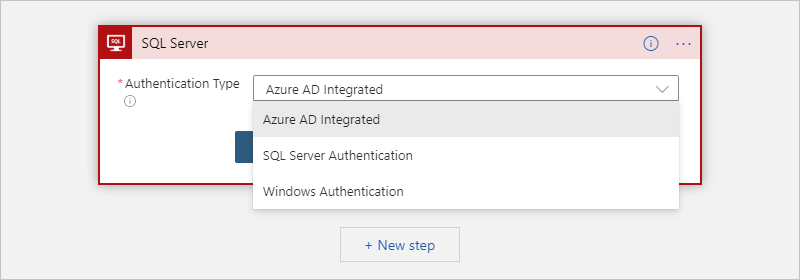
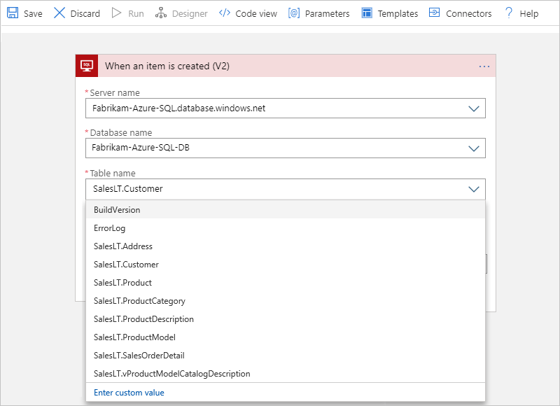
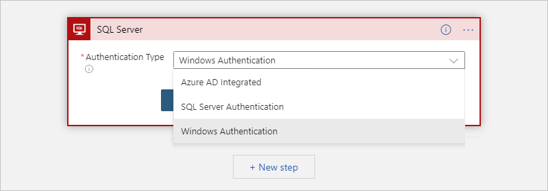
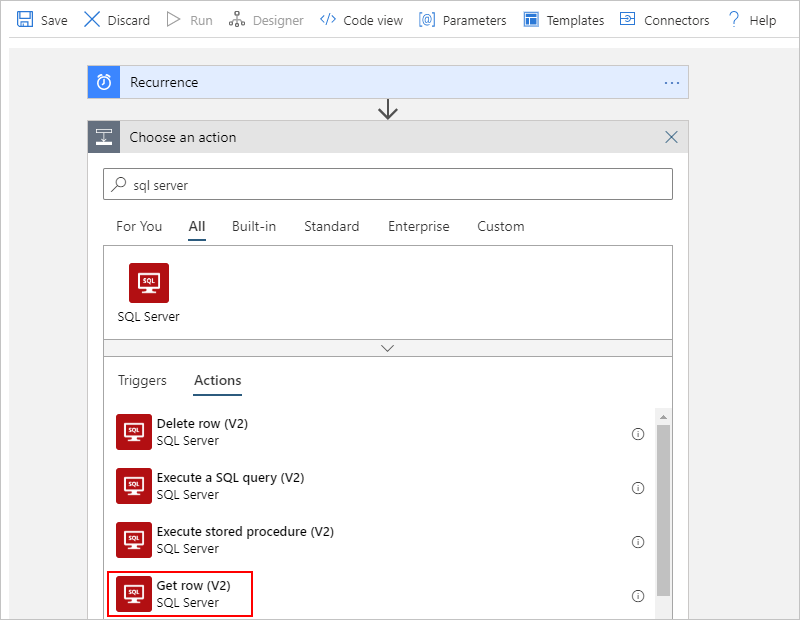
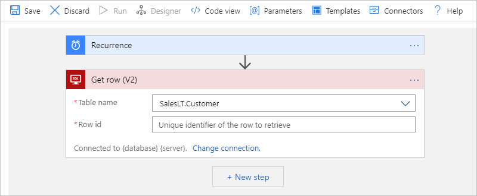

# Automate workflows for a SQL database by using Azure Logic Apps

This article shows how you can access data in your SQL database from inside a logic app with the SQL Server connector. That way, you can automate tasks, processes, or workflows that manage your SQL data and resources by creating logic apps. The SQL Server connector works for [SQL Server](/sql/sql-server/sql-server-technical-documentation) as well as [Azure SQL Database](../azure-sql/database/sql-database-paas-overview.md) and [Azure SQL Managed Instance](../azure-sql/managed-instance/sql-managed-instance-paas-overview.md).

You can create logic apps that run when triggered by events in your SQL database or in other systems, such as Dynamics CRM Online. Your logic apps can also get, insert, and delete data along with running SQL queries and stored procedures. For example, you can build a logic app that automatically checks for new records in Dynamics CRM Online, adds items to your SQL database for any new records, and then sends email alerts about the added items.

If you're new to logic apps, review [What is Azure Logic Apps](../logic-apps/logic-apps-overview.md) and [Quickstart: Create your first logic app](../logic-apps/quickstart-create-first-logic-app-workflow.md). For connector-specific technical information, limitations, and known issues, see the [SQL Server connector reference page](/connectors/sql/).

## Prerequisites

* An Azure subscription. If you don't have a subscription, [sign up for a free Azure account](https://azure.microsoft.com/free/).

* An [SQL Server database](/sql/relational-databases/databases/create-a-database), [Azure SQL Database](../azure-sql/database/single-database-create-quickstart.md), or [Azure SQL Managed Instance](../azure-sql/managed-instance/instance-create-quickstart.md).

  Your tables must have data so that your logic app can return results when calling operations. If you use Azure SQL Database, you can use sample databases, which are included.

* Your SQL server name, database name, your user name, and your password. You need these credentials so that you can authorize your logic to access your SQL server.

  * For on-premises SQL Server, you can find these details in the connection string:

    `Server={your-server-address};Database={your-database-name};User Id={your-user-name};Password={your-password};`

  * For Azure SQL Database, you can find these details in the connection string.
  
    For example, to find this string in the Azure portal, open your database. On the database menu, select either **Connection strings** or **Properties**:

    `Server=tcp:{your-server-name}.database.windows.net,1433;Initial Catalog={your-database-name};Persist Security Info=False;User ID={your-user-name};Password={your-password};MultipleActiveResultSets=False;Encrypt=True;TrustServerCertificate=False;Connection Timeout=30;`

* Based on whether your logic apps are going to run in global, multi-tenant Azure or an [integration service environment (ISE)](../logic-apps/connect-virtual-network-vnet-isolated-environment-overview.md), here are other requirements for connecting to on-premises SQL Server:

  * For logic apps in global, multi-tenant Azure that connect to on-premises SQL Server, you need to have the [on-premises data gateway](../logic-apps/logic-apps-gateway-install.md) installed on a local computer and a [data gateway resource that's already created in Azure](../logic-apps/logic-apps-gateway-connection.md).

  * For logic apps in an ISE that connect to on-premises SQL Server and use Windows authentication, the ISE-versioned SQL Server connector doesn't support Windows authentication. So, you still need to use the data gateway and the non-ISE SQL Server connector. For other authentication types, you don't need to use the data gateway and can use the ISE-versioned connector.

* The logic app where you need access to your SQL database. To start your logic app with a SQL trigger, you need a [blank logic app](../logic-apps/quickstart-create-first-logic-app-workflow.md).

## Connect to your database

[!INCLUDE [Create connection general intro](../../includes/connectors-create-connection-general-intro.md)]

Now, continue with these steps:

* [Connect to cloud-based Azure SQL Database or Managed Instance](#connect-azure-sql-db)
* [Connect to on-premises SQL Server](#connect-sql-server)

### Connect to Azure SQL Database or Managed Instance

To access a Azure SQL Managed Instance without using the on-premises data gateway or integration service environment, you have to [set up the public endpoint on the Azure SQL Managed Instance](../azure-sql/managed-instance/public-endpoint-configure.md). The public endpoint uses port 3342, so make sure that you specify this port number when you create the connection from your logic app.

The first time that you add either a [SQL trigger](#add-sql-trigger) or [SQL action](#add-sql-action), and you haven't previously created a connection to your database, you're prompted to complete these steps:

1. For **Authentication Type**, select the authentication that's required and enabled on your database in Azure SQL Database or Azure SQL Managed Instance:

   | Authentication | Description |
   |----------------|-------------|
   | [**Azure AD Integrated**](../azure-sql/database/authentication-aad-overview.md) | - Supports both the non-ISE and ISE SQL Server connector. 

- Requires a valid identity in Azure Active Directory (Azure AD) that has access to your database. 
For more information, see these topics: 
- [Azure SQL Security Overview - Authentication](../azure-sql/database/security-overview.md#authentication)  - [Authorize database access to Azure SQL - Authentication and authorization](../azure-sql/database/logins-create-manage.md#authentication-and-authorization)  - [Azure SQL - Azure AD Integrated authentication](../azure-sql/database/authentication-aad-overview.md) |
   | [**SQL Server Authentication**](/sql/relational-databases/security/choose-an-authentication-mode#connecting-through-sql-server-authentication) | - Supports both the non-ISE and ISE SQL Server connector. 

- Requires a valid user name and strong password that are created and stored in your database. 
For more information, see these topics: 
- [Azure SQL Security Overview - Authentication](../azure-sql/database/security-overview.md#authentication)  - [Authorize database access to Azure SQL - Authentication and authorization](../azure-sql/database/logins-create-manage.md#authentication-and-authorization) |
   |||

   This example continues with **Azure AD Integrated**:

   

1. After you select **Azure AD Integrated**, select **Sign In**. Based on whether you use Azure SQL Database or Azure SQL Managed Instance, select your user credentials for authentication.

1. Select these values for your database:

   | Property | Required | Description |
   |----------|----------|-------------|
   | **Server name** | Yes | The address for your SQL server, for example, `Fabrikam-Azure-SQL.database.windows.net` |
   | **Database name** | Yes | The name for your SQL database, for example, `Fabrikam-Azure-SQL-DB` |
   | **Table name** | Yes | The table that you want to use, for example, `SalesLT.Customer` |
   ||||

   > [!TIP]
   > To provide your database and table information, you have these options:
   > 
   > * Find this information in your database's connection string. For example, in the Azure portal, find and open your database. On the database menu, select either **Connection strings** or **Properties**, where you can find this string: 
   >   `Server=tcp:{your-server-address}.database.windows.net,1433;Initial Catalog={your-database-name};Persist Security Info=False;User ID={your-user-name};Password={your-password};MultipleActiveResultSets=False;Encrypt=True;TrustServerCertificate=False;Connection Timeout=30;`
   >
   > * By default, tables in system databases are filtered out, so they might not automatically appear when you select a system database. As an alternative, you can manually enter the table name after you select **Enter custom value** from the database list.
   >

   This example shows how these values might look:

   

1. Now, continue with the steps that you haven't completed yet in either [Add a SQL trigger](#add-sql-trigger) or [Add a SQL action](#add-sql-action).

### Connect to on-premises SQL Server

The first time that you add either a [SQL trigger](#add-sql-trigger) or [SQL action](#add-sql-action), and you haven't previously created a connection to your database, you're prompted to complete these steps:

1. For connections to your on-premises SQL server that require the on-premises data gateway, make sure that you've [completed these prerequisites](#multi-tenant-or-ise).

   Otherwise, your data gateway resource won't appear in the **Connection Gateway** list when you create your connection.

1. For **Authentication Type**, select the authentication that's required and enabled on your SQL Server:

   | Authentication | Description |
   |----------------|-------------|
   | [**Windows Authentication**](/sql/relational-databases/security/choose-an-authentication-mode#connecting-through-windows-authentication) | - Supports only the non-ISE SQL Server connector, which requires a data gateway resource that's previously created in Azure for your connection, regardless whether you use multi-tenant Azure or an ISE. 

- Requires a valid Windows user name and password to confirm your identity through your Windows account. 
For more information, see [Windows Authentication](/sql/relational-databases/security/choose-an-authentication-mode#connecting-through-windows-authentication) |
   | [**SQL Server Authentication**](/sql/relational-databases/security/choose-an-authentication-mode#connecting-through-sql-server-authentication) | - Supports both the non-ISE and ISE SQL Server connector. 

- Requires a valid user name and strong password that are created and stored in your SQL Server. 
For more information, see [SQL Server Authentication](/sql/relational-databases/security/choose-an-authentication-mode#connecting-through-sql-server-authentication). |
   |||

   This example continues with **Windows Authentication**:

   

1. Select or provide the following values for your SQL database:

   | Property | Required | Description |
   |----------|----------|-------------|
   | **SQL server name** | Yes | The address for your SQL server, for example, `Fabrikam-Azure-SQL.database.windows.net` |
   | **SQL database name** | Yes | The name for your SQL Server database, for example, `Fabrikam-Azure-SQL-DB` |
   | **Username** | Yes | Your user name for the SQL server and database |
   | **Password** | Yes | Your password for the SQL server and database |
   | **Subscription** |  Yes, for Windows authentication | The Azure subscription for the data gateway resource that you previously created in Azure |
   | **Connection Gateway** | Yes, for Windows authentication | The name for the data gateway resource that you previously created in Azure 

**Tip**: If your gateway doesn't appear in the list, check that you correctly [set up your gateway](../logic-apps/logic-apps-gateway-connection.md). |
   |||

   > [!TIP]
   > You can find this information in your database's connection string:
   > 
   > * `Server={your-server-address}`
   > * `Database={your-database-name}`
   > * `User ID={your-user-name}`
   > * `Password={your-password}`

   This example shows how these values might look:

   

1. When you're ready, select **Create**.

1. Now, continue with the steps that you haven't completed yet in either [Add a SQL trigger](#add-sql-trigger) or [Add a SQL action](#add-sql-action).

## Add a SQL trigger

1. In the [Azure portal](https://portal.azure.com) or in Visual Studio, create a blank logic app, which opens the Logic App Designer. This example continues with the Azure portal.

1. On the designer, in the search box, enter `sql server`. From the triggers list, select the SQL trigger that you want. This example uses the **When an item is created** trigger.

   

1. If you're connecting to your SQL database for the first time, you're prompted to [create your SQL database connection now](#create-connection). After you create this connection, you can continue with the next step.

1. In the trigger, specify the interval and frequency for how often the trigger checks the table.

1. To add other available properties for this trigger, open the **Add new parameter** list.

   This trigger returns only one row from the selected table, and nothing else. To perform other tasks, continue by adding either a [SQL connector action](#add-sql-action) or [another action](../connectors/apis-list.md) that performs the next task that you want in your logic app workflow.
   
   For example, to view the data in this row, you can add other actions that create a file that includes the fields from the returned row, and then send email alerts. To learn about other available actions for this connector, see the [connector's reference page](/connectors/sql/).

1. On the designer toolbar, select **Save**.

   Although this step automatically enables and publishes your logic app live in Azure, the only action that your logic app currently takes is to check your database based on your specified interval and frequency.

## Add a SQL action

In this example, the logic app starts with the [Recurrence trigger](../connectors/connectors-native-recurrence.md), and calls an action that gets a row from a SQL database.

1. In the [Azure portal](https://portal.azure.com) or in Visual Studio, open your logic app in Logic App Designer. This example continues the Azure portal.

1. Under the trigger or action where you want to add the SQL action, select **New step**.

   

   Or, to add an action between existing steps, move your mouse over the connecting arrow. Select the plus sign (**+**) that appears, and then select **Add an action**.

1. Under **Choose an action**, in the search box, enter `sql server`. From the actions list, select the SQL action that you want. This example uses the **Get row** action, which gets a single record.

   

1. If you're connecting to your SQL database for the first time, you're prompted to [create your SQL database connection now](#create-connection). After you create this connection, you can continue with the next step.

1. Select the **Table name**, which is `SalesLT.Customer` in this example. Enter the **Row ID** for the record that you want.

   

   This action returns only one row from the selected table, nothing else. So, to view the data in this row, you might add other actions that create a file that includes the fields from the returned row, and store that file in a cloud storage account. To learn about other available actions for this connector, see the [connector's reference page](/connectors/sql/).

1. When you're done, on the designer toolbar, select **Save**.

   This step automatically enables and publishes your logic app live in Azure.

## Handle bulk data

Sometimes, you have to work with result sets so large that the connector doesn't return all the results at the same time, or you want better control over the size and structure for your result sets. Here's some ways that you can handle such large result sets:

* To help you manage results as smaller sets, turn on *pagination*. For more information, see [Get bulk data, records, and items by using pagination](../logic-apps/logic-apps-exceed-default-page-size-with-pagination.md). For more information, see [SQL Pagination for bulk data transfer with Logic Apps](https://social.technet.microsoft.com/wiki/contents/articles/40060.sql-pagination-for-bulk-data-transfer-with-logic-apps.aspx).

* Create a [*stored procedure*](/sql/relational-databases/stored-procedures/stored-procedures-database-engine) that organizes the results the way that you want. The SQL connector provides many backend features that you can access by using Azure Logic Apps so that you can more easily automate business tasks that work with SQL database tables.

  When getting or inserting multiple rows, your logic app can iterate through these rows by using an [*until loop*](../logic-apps/logic-apps-control-flow-loops.md#until-loop) within these [limits](../logic-apps/logic-apps-limits-and-config.md). However, when your logic app has to work with record sets so large, for example, thousands or millions of rows, that you want to minimize the costs resulting from calls to the database.

  To organize the results in the way that you want, you can create a stored procedure that runs in your SQL instance and uses the **SELECT - ORDER BY** statement. This solution gives you more control over the size and structure of your results. Your logic app calls the stored procedure by using the SQL Server connector's **Execute stored procedure** action. For more information, see [SELECT - ORDER BY Clause](/sql/t-sql/queries/select-order-by-clause-transact-sql).

  > [!NOTE]
  > With this connector, a stored procedure execution is limited to a [less than 2-minute timeout limit](/connectors/sql/#known-issues-and-limitations). 
  > Some stored procedures might take longer than this limit to process and completely finish, which generates a `504 TIMEOUT` error. Actually, some 
  > long-running processes are coded as stored procedures explicitly for this purpose. Calling these procedures from Azure Logic Apps might create 
  > problems due to this timeout limit. Although the SQL connector doesn't natively support an asynchronous mode, you can simulate this mode by using a SQL 
  > completion trigger, native SQL pass-through query, a state table, and server-side jobs by using the [Azure Elastic Job Agent](../azure-sql/database/elastic-jobs-overview.md).

### Handle dynamic bulk data

When you call a stored procedure by using the SQL Server connector, the returned output is sometimes dynamic. In this scenario, follow these steps:

1. In the [Azure portal](https://portal.azure.com), open your logic app in the Logic App Designer.

1. View the output format by performing a test run. Copy and save your sample output.

1. In the designer, under the action where you call the stored procedure, select **New step**.

1. Under **Choose an action**, find and select the [**Parse JSON**](../logic-apps/logic-apps-perform-data-operations.md#parse-json-action) action.

1. In the **Parse JSON** action, select **Use sample payload to generate schema**.

1. In the **Enter or paste a sample JSON payload** box, paste your sample output, and select **Done**.

   > [!NOTE]
   > If you get an error that Logic Apps can't generate a schema, check that your sample output's syntax is correctly formatted. 
   > If you still can't generate the schema, in the **Schema** box, manually enter the schema.

1. On the designer toolbar, select **Save**.

1. To reference the JSON content properties, click inside the edit boxes where you want to reference those properties so that the dynamic content list appears. In the list, under the [**Parse JSON**](../logic-apps/logic-apps-perform-data-operations.md#parse-json-action) heading, select the data tokens for the JSON content properties that you want.

## Troubleshoot problems

* Connection problems can commonly happen, so to troubleshoot and resolve these kinds of issues, review [Solving connectivity errors to SQL Server](https://support.microsoft.com/help/4009936/solving-connectivity-errors-to-sql-server). Here are some examples:

  * `A network-related or instance-specific error occurred while establishing a connection to SQL Server. The server was not found or was not accessible. Verify that the instance name is correct and that SQL Server is configured to allow remote connections.`

  * `(provider: Named Pipes Provider, error: 40 - Could not open a connection to SQL Server) (Microsoft SQL Server, Error: 53)`

  * `(provider: TCP Provider, error: 0 - No such host is known.) (Microsoft SQL Server, Error: 11001)`

## Connector-specific details

For technical information about this connector's triggers, actions, and limits, see the [connector's reference page](/connectors/sql/), which is generated from the Swagger description.

## Next steps

* Learn about other [connectors for Azure Logic Apps](../connectors/apis-list.md)
