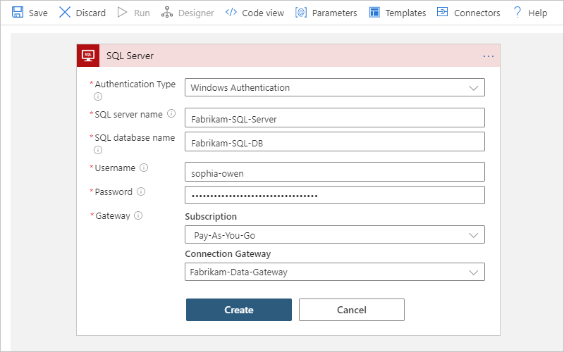
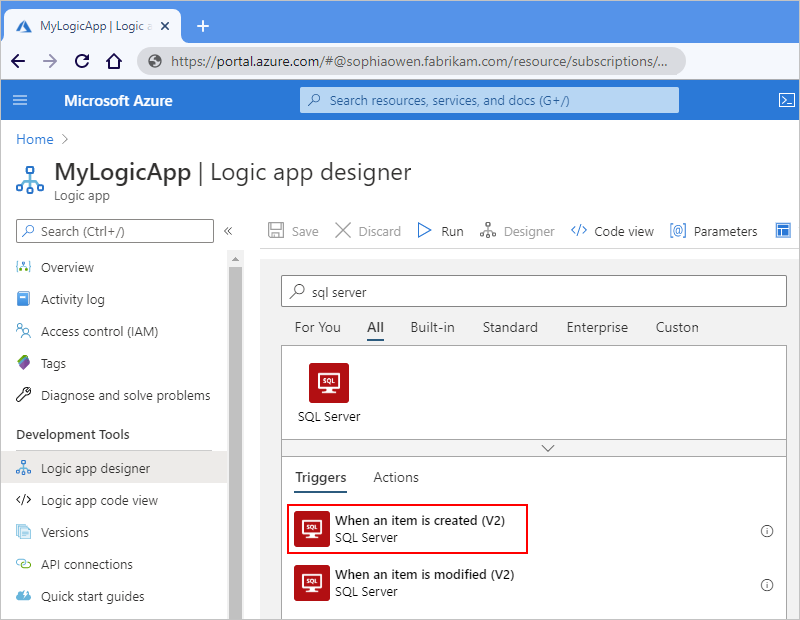
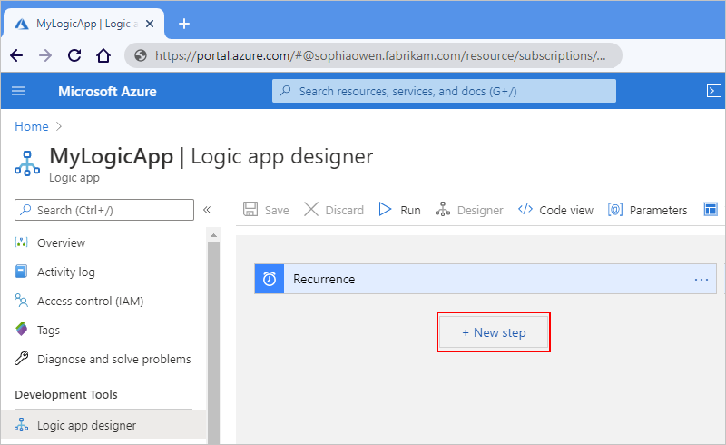

# Automate workflows for SQL Server or Azure SQL Database by using Azure Logic Apps

This article shows how you can access data in your SQL database from inside a logic app with the SQL Server connector. That way, you can automate tasks, processes, or workflows that manage your SQL data and resources by creating logic apps. The SQL Server connector works for [SQL Server](https://docs.microsoft.com/sql/sql-server/sql-server-technical-documentation) as well as [Azure SQL Database](../azure-sql/database/sql-database-paas-overview.md) and [Azure SQL Managed Instance](../azure-sql/managed-instance/sql-managed-instance-paas-overview.md).

You can create logic apps that run when triggered by events in your SQL database or in other systems, such as Dynamics CRM Online. Your logic apps can also get, insert, and delete data along with running SQL queries and stored procedures. For example, you can build a logic app that automatically checks for new records in Dynamics CRM Online, adds items to your SQL database for any new records, and then sends email alerts about the added items.

If you're new to logic apps, review [What is Azure Logic Apps](../logic-apps/logic-apps-overview.md) and [Quickstart: Create your first logic app](../logic-apps/quickstart-create-first-logic-app-workflow.md). For connector-specific technical information, limitations, and known issues, see the [SQL Server connector reference page](https://docs.microsoft.com/connectors/sql/).

## Prerequisites

* An Azure subscription. If you don't have a subscription, [sign up for a free Azure account](https://azure.microsoft.com/free/).

* An [SQL Server database](https://docs.microsoft.com/sql/relational-databases/databases/create-a-database) or [Azure SQL database](../azure-sql/database/single-database-create-quickstart.md)

  Your tables must have data so that your logic app can return results when calling operations. If you create an Azure SQL Database, you can use sample databases, which are included.

* Your SQL server name, database name, your user name, and your password. You need these credentials so that you can authorize your logic to access your SQL server.

  * For on-premises SQL Server, you can find these details in the connection string:

    `Server={your-server-address};Database={your-database-name};User Id={your-user-name};Password={your-password};`

  * For Azure SQL Database, you can find these details in the connection string.
  
    For example, to find this string in the Azure portal, open your database. On the database menu, select either **Connection strings** or **Properties**:

    `Server=tcp:{your-server-name}.database.windows.net,1433;Initial Catalog={your-database-name};Persist Security Info=False;User ID={your-user-name};Password={your-password};MultipleActiveResultSets=False;Encrypt=True;TrustServerCertificate=False;Connection Timeout=30;`

* Based on whether your logic apps are going to run in global, multi-tenant Azure or an [integration service environment (ISE)](../logic-apps/connect-virtual-network-vnet-isolated-environment-overview.md), here are other requirements for connecting to on-premises SQL Server:

  * For logic apps in global, multi-tenant Azure that connect to on-premises SQL Server, you need to have the [on-premises data gateway](../logic-apps/logic-apps-gateway-install.md) installed on a local computer and an [Azure data gateway resource created in the Azure portal](../logic-apps/logic-apps-gateway-connection.md).

  * For logic apps in an ISE that connect to on-premises SQL Server and use Windows authentication, the ISE-versioned SQL Server connector doesn't support Windows authentication. So, you still need to use the data gateway and the non-ISE SQL Server connector. For other authentication types, you don't need to use the data gateway and can use the ISE-versioned connector.

* The logic app where you need access to your SQL database. To start your logic app with a SQL trigger, you need a [blank logic app](../logic-apps/quickstart-create-first-logic-app-workflow.md).

## Connect to your database

[!INCLUDE [Create connection general intro](../../includes/connectors-create-connection-general-intro.md)]

* For cloud-based Azure SQL Database, follow [Connect to Azure SQL Database](#connect-azure-sql-db).
* For on-premises SQL Server, follow [Connect to SQL Server](#connect-sql-server).

### Connect to Azure SQL Database

1. For **Authentication Type**, select **Azure AD Integrated**.

1. Select the following values for your Azure SQL database:

   | Property | Description |
   |----------|-------------|
   | **Server name** | Your Azure SQL server |
   | **Database name** | Your Azure SQL database |
   | **Table name** | The table that you want to use |
   |||

   > [!TIP]
   > You can find this information in your database's connection string. For example, 
   > in the Azure portal, find and open your database. On the database menu, 
   > select either **Connection strings** or **Properties** where you can find this string:
   >
   > `Server=tcp:{your-server-name}.database.windows.net,1433;Initial Catalog={your-database-name};Persist Security Info=False;User ID={your-user-name};Password={your-password};MultipleActiveResultSets=False;Encrypt=True;TrustServerCertificate=False;Connection Timeout=30;`

   For example:

   

1. Return to either [Add a SQL trigger](#add-sql-trigger) or [Add a SQL action](#add-sql-action).

### Connect to SQL Server

When the SQL trigger or action prompts you for connection information, follow these steps, which work for both triggers and actions. For scenarios that require that you install the [on-premises data gateway](https://docs.microsoft.com/azure/logic-apps/logic-apps-gateway-install) on a local computer and [create the Azure data gateway resource](https://docs.microsoft.com/azure/logic-apps/logic-apps-gateway-connection), make sure that you complete these requirements first. Otherwise, your gateway resource won't appear in the gateways list when you create your connection.

Also, to use Windows authentication with the SQL Server connector in an [integration service environment (ISE)](https://docs.microsoft.com/azure/logic-apps/connect-virtual-network-vnet-isolated-environment-overview), use the connector's non-ISE version and the on-premises data gateway. The ISE-labeled version doesn't support Windows authentication.

1. For **Connection Name**, create a name for your connection.

1. In the trigger or action, select **Connect via on-premises data gateway** so that the SQL server options appear.

1. For **SQL server Name** and **SQL database name**, provide the address for your SQL server and name for your database. For **Username** and **Password**, provide the user name and password for your server.

   You can also find this information in your connection string:

   * `Server=<your-server-address>`
   * `Database=<your-database-name>`
   * `User ID=<your-user-name>`
   * `Password=<your-password>`

   

1. If your SQL server uses Windows or Basic authentication, select the **Authentication Type**.

1. Under **Gateways**, select the Azure subscription that's associated with your previously created on-premises data gateway, and select the name for your on-premises data gateway.

   If your gateway doesn't appear in the list, check that you correctly [set up your gateway](https://docs.microsoft.com/azure/logic-apps/logic-apps-gateway-connection).

   

1. When you're done, select **Create**.

1. After you create your connection, continue with [Add SQL trigger](#add-sql-trigger) or [Add SQL action](#add-sql-action).

## Add a SQL trigger

1. In the [Azure portal](https://portal.azure.com) or in Visual Studio, create a blank logic app, which opens the Logic App Designer. This example continues with the Azure portal.

1. On the designer, in the search box, enter `sql server`. From the triggers list, select the SQL trigger that you want. This example uses the **When an item is created** trigger.

   

1. If you're connecting to your SQL database for the first time, you're prompted to [create your SQL database connection now](#create-connection). After you create this connection, you can continue with the next step.

1. In the trigger, specify the interval and frequency for how often the trigger checks the table.

1. To add other available properties for this trigger, open the **Add new parameter** list.

   This trigger returns only one row from the selected table, and nothing else. To perform other tasks, continue by adding either a [SQL connector action](#add-sql-action) or [another action](../connectors/apis-list.md) that performs the next task that you want in your logic app workflow.
   
   For example, to view the data in this row, you can add other actions that create a file that includes the fields from the returned row, and then send email alerts. To learn about other available actions for this connector, see the [connector's reference page](https://docs.microsoft.com/connectors/sql/).

1. On the designer toolbar, select **Save**. 

   Although this step automatically enables and publishes your logic app live in Azure, the only action that your logic app currently takes is to check your database based on your specified interval and frequency.

## Add a SQL action

In Azure Logic Apps, an [action](../logic-apps/logic-apps-overview.md#logic-app-concepts) is a step in your workflow that follows a trigger or another action. In this example, the logic app starts with the [Recurrence trigger](../connectors/connectors-native-recurrence.md), and calls an action that gets a row from a SQL database.

1. In the Azure portal or Visual Studio, open your logic app in Logic Apps Designer. This example uses the Azure portal.

1. Under the trigger or action where you want to add the SQL action, select **New step**.

   

   To add an action between existing steps, move your mouse over the connecting arrow. Select the plus sign (**+**) that appears, and then select **Add an action**.

1. Under **Choose an action**, in the search box, enter "sql server" as your filter. From the actions list, select the SQL action that you want.

   This example uses the **Get row** action, which gets a single record.

   

   This action returns only one row from the selected table, nothing else. To view the data in this row, you might add other actions that create a file that includes the fields from the returned row, and store that file in a cloud storage account. To learn about other available actions for this connector, see the [connector's reference page](https://docs.microsoft.com/connectors/sql/).

1. If you are prompted to create a connection, [create your SQL connection now](#create-connection). If your connection exists, select a **Table name**, and enter the **Row ID** for the record that you want.

   

1. When you're done, on the designer toolbar, select **Save**.

   This step automatically enables and publishes your logic app live in Azure.

## Handle bulk data

Sometimes, you have to work with result sets so large that the connector doesn't return all the results at the same time, or you want better control over the size and structure for your result sets. Here's some ways that you can handle such large result sets:

* To help you manage results as smaller sets, turn on *pagination*. For more information, see [Get bulk data, records, and items by using pagination](../logic-apps/logic-apps-exceed-default-page-size-with-pagination.md).

* Create a stored procedure that organizes the results the way you want.

  When getting or inserting multiple rows, your logic app can iterate through these rows by using an [*until loop*](../logic-apps/logic-apps-control-flow-loops.md#until-loop) within these [limits](../logic-apps/logic-apps-limits-and-config.md). However, when your logic app has to work with record sets so large, for example, thousands or millions of rows, that you want to minimize the costs resulting from calls to the database.

  To organize the results in the way that you want, you can create a [*stored procedure*](https://docs.microsoft.com/sql/relational-databases/stored-procedures/stored-procedures-database-engine) that runs in your SQL instance and uses the **SELECT - ORDER BY** statement. This solution gives you more control over the size and structure of your results. Your logic app calls the stored procedure by using the SQL Server connector's **Execute stored procedure** action.

  For more solution details, see these articles:

  * [SQL Pagination for bulk data transfer with Logic Apps](https://social.technet.microsoft.com/wiki/contents/articles/40060.sql-pagination-for-bulk-data-transfer-with-logic-apps.aspx)

  * [SELECT - ORDER BY Clause](https://docs.microsoft.com/sql/t-sql/queries/select-order-by-clause-transact-sql)

### Handle dynamic bulk data

Sometimes, when you make a call to a stored procedure in the SQL Server connector, the returned output is dynamic. In this scenario, follow these steps:

1. Open **Logic Apps Designer**.
1. Perform a test run of your logic app to see the output format. Copy down your sample output.
1. In the designer, under the action where you call the stored procedure, select **New step**.
1. Under **Choose an action**, search for and select the [**Parse JSON**](../logic-apps/logic-apps-perform-data-operations.md#parse-json-action) action.
1. In the **Parse JSON** action, select **Use sample payload to generate schema**.
1. In the **Enter or paste a sample JSON payload** window, paste your sample output, then select **Done**.
1. If you get an error that Logic Apps can't generate a schema, check that your sample output's syntax is correctly formatted. If you still can't generate the schema, manually enter one in the **Schema** box.
1. On the designer toolbar, select **Save**.
1. To access the JSON content properties, use the data tokens that appear in the dynamic content list under the [**Parse JSON** action](../logic-apps/logic-apps-perform-data-operations.md#parse-json-action).

## Connector-specific details

For technical information about this connector's triggers, actions, and limits, see the [connector's reference page](https://docs.microsoft.com/connectors/sql/).

## Next steps

* Learn about other [connectors for Azure Logic Apps](../connectors/apis-list.md)
