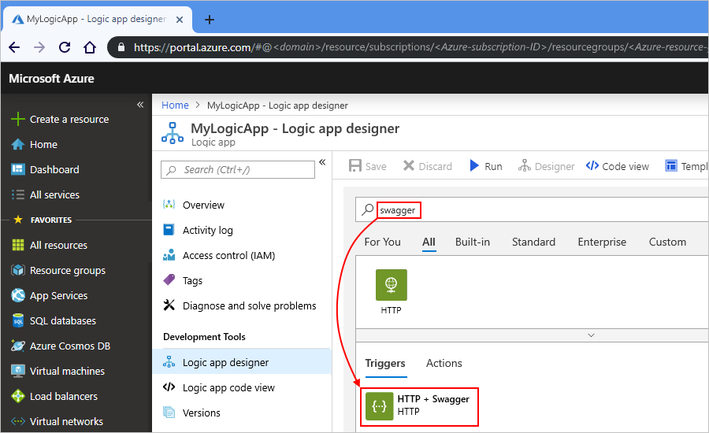
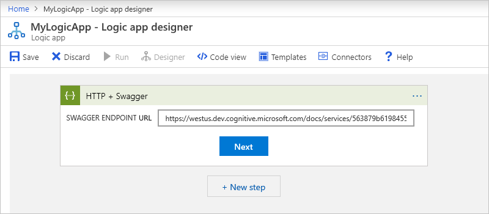

# Call REST endpoints by using Azure Logic Apps

With [Azure Logic Apps](../logic-apps/logic-apps-overview.md) and the HTTP + Swagger connector, you can automate workflows that can call any REST endpoint through a [Swagger document](https://swagger.io) by building logic apps.

The HTTP + Swagger trigger and action work the same as the [HTTP trigger and action](connectors-native-http.md) but provide a better experience in Logic App Designer by exposing the API structure and outputs from the [Swagger metadata](https://swagger.io). To implement a polling trigger, follow the polling pattern that's described in [Create custom APIs to call other APIs, services, and systems from logic apps](../logic-apps/logic-apps-create-api-app.md#polling-triggers).

## Prerequisites

* An Azure subscription. If you don't have an Azure subscription, [sign up for a free Azure account](https://azure.microsoft.com/free/).

* The URL for the Swagger file that describes the target REST endpoint

  Typically, the endpoint must meet this criteria for the connector to work:

  * The Swagger metadata for this endpoint must be hosted on an HTTPS URL that's publicly accessible.
  * The Swagger metadata for this endpoint must have [Cross-Origin Resource Sharing (CORS)](https://docs.microsoft.com/rest/api/storageservices/cross-origin-resource-sharing--cors--support-for-the-azure-storage-services) enabled.

  To reference a Swagger file that's not hosted or that doesn't meet the security and cross-origin requirements, you can [store the Swagger file in Azure Blob Storage](#host-swagger) and enable CORS to reference that file.

  The examples in this topic use the [Azure Cognitive Services Face API](https://docs.microsoft.com/azure/cognitive-services/face/overview).

* Basic knowledge about [how to create logic apps](../logic-apps/quickstart-create-first-logic-app-workflow.md). If you're new to logic apps, review [What is Azure Logic Apps?](../logic-apps/logic-apps-overview.md)

* The logic app from where you want to call the target endpoint To start with the HTTP + Swagger trigger, [create a blank logic app](../logic-apps/quickstart-create-first-logic-app-workflow.md). To use the HTTP + Swagger action, start your logic app with any trigger that you want. This example uses the HTTP + Swagger trigger as the first step.

## Add an HTTP + Swagger trigger

1. Sign in to the [Azure portal](https://portal.azure.com). Open your blank logic app in Logic App Designer.

1. On the designer, in the search box, enter "swagger" as your filter. From the **Triggers** list, select the **HTTP + Swagger** trigger.

   

1. In the **SWAGGER ENDPOINT URL** box, enter the URL for the Swagger file, and select **Next**.

   This example uses the URL for the [Face API Swagger endpoint](https://westus.dev.cognitive.microsoft.com/docs/services/563879b61984550e40cbbe8d/operations/563879b61984550f30395236), located in the West US region:

   `https://westus.dev.cognitive.microsoft.com/docs/services/563879b61984550e40cbbe8d/export?DocumentFormat=Swagger&ApiName=Face%20API%20-%20V1.0`

   

   The designer shows the operations from the Swagger file.

1. Select the operation that you want to use.

1. Add in any parameters that are required for the HTTP call.
   
    

[HTTP trigger parameters](../logic-apps/logic-apps-workflow-actions-triggers.md##http-trigger) 

7. To save and publish your logic app, click **Save** on designer toolbar.

## Add an HTTP + Swagger action

1. Sign in to the [Azure portal](https://portal.azure.com). Open your logic app in Logic App Designer.

1. Under the step where you want to add the HTTP + Swagger action, select **New step**.

   To add an action between steps, move your pointer over the arrow between steps. Select the plus sign (**+**) that appears, and then select **Add an action**.

1. On the designer, in the search box, enter "swagger" as your filter. From the **Triggers** list, select the **HTTP + Swagger** trigger.

1. On the designer, in the search box, enter "http" as your filter. From the **Actions** list, select the **HTTP** action.

    

4. Type the URL for a Swagger document:
   
5. Click **Next** to read and render from the Swagger document.

6. Add in any parameters that are required for the HTTP call.
   
    

[HTTP trigger parameters](../logic-apps/logic-apps-workflow-actions-triggers.md##http-trigger) 

7. To save and publish your logic app, click **Save** on designer toolbar.

## Host Swagger in Azure Storage

You might want to reference a Swagger document that's not hosted, or that doesn't meet the security and cross-origin requirements for the designer. To resolve this issue, you can store the Swagger document in Azure Storage and enable CORS to reference the document.  

Here are the steps to create, configure, and store Swagger documents in Azure Storage:

1. [Create an Azure storage account with Azure Blob storage](../storage/common/storage-create-storage-account.md). 
To perform this step, set permissions to **Public Access**.

2. Enable CORS on the blob. 

   To automatically configure this setting, 
   you can use [this PowerShell script](https://github.com/logicappsio/EnableCORSAzureBlob/blob/master/EnableCORSAzureBlob.ps1).

3. Upload the Swagger file to the blob. 

   You can perform this step from the [Azure portal](https://portal.azure.com) or from a tool like [Azure Storage Explorer](https://storageexplorer.com/).

4. Reference an HTTPS link to the document in Azure Blob storage. 

   The link uses this format:

   `https://*storageAccountName*.blob.core.windows.net/*container*/*filename*`

## Technical details
Following are the details for the triggers and actions that this HTTP + Swagger connector supports.

## HTTP + Swagger triggers
A trigger is an event that can be used to start the workflow that's defined in a logic app. 
The HTTP + Swagger connector has one trigger. [Learn more about triggers](../connectors/apis-list.md).

| Trigger | Description |
| --- | --- |
| HTTP + Swagger |Make an HTTP call and return the response content |

## HTTP + Swagger actions
An action is an operation that's carried out by the workflow that's defined in a logic app. 
The HTTP + Swagger connector has one possible action. [Learn more about actions](../connectors/apis-list.md).

| Action | Description |
| --- | --- |
| HTTP + Swagger |Make an HTTP call and return the response content |

### Action details
The HTTP + Swagger connector comes with one possible action. Following is information about each of the actions, their required and optional input fields, and the corresponding output details that are associated with their usage.

#### HTTP + Swagger
Make an HTTP outbound request with assistance of Swagger metadata.
An asterisk (*) means a required field.

| Display name | Property name | Description |
| --- | --- | --- |
| Method* |method |HTTP verb to use. |
| URI* |uri |URI for the HTTP request. |
| Headers |headers |A JSON object of HTTP headers to include. |
| Body |body |The HTTP request body. |
| Authentication |authentication |Authentication to use for request. For more information about authentication types available for HTTP, see [Authenticate HTTP triggers and actions](../logic-apps/logic-apps-workflow-actions-triggers.md#connector-authentication). |

**Output details**

HTTP response

| Property Name | Data type | Description |
| --- | --- | --- |
| Headers |object |Response headers |
| Body |object |Response object |
| Status Code |int |HTTP status code |

### HTTP responses
When making calls to various actions, you might get certain responses. Following is a table that outlines corresponding responses and descriptions.

| Name | Description |
| --- | --- |
| 200 |OK |
| 202 |Accepted |
| 400 |Bad request |
| 401 |Unauthorized |
| 403 |Forbidden |
| 404 |Not Found |
| 500 |Internal server error. Unknown error occurred. |

## Next steps

* Learn about other [Logic Apps connectors](../connectors/apis-list.md)